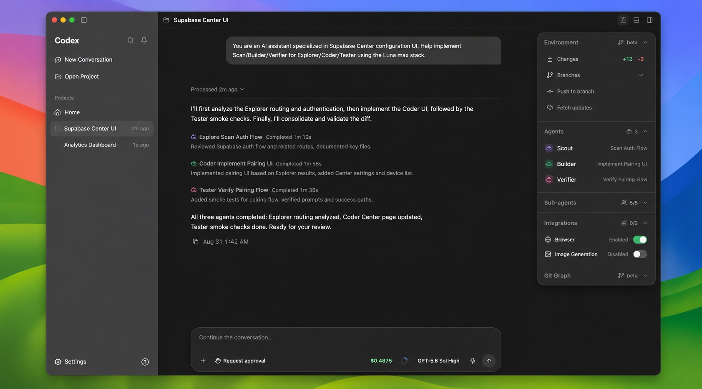
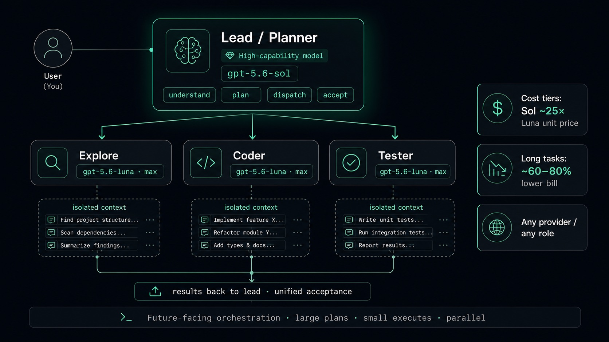
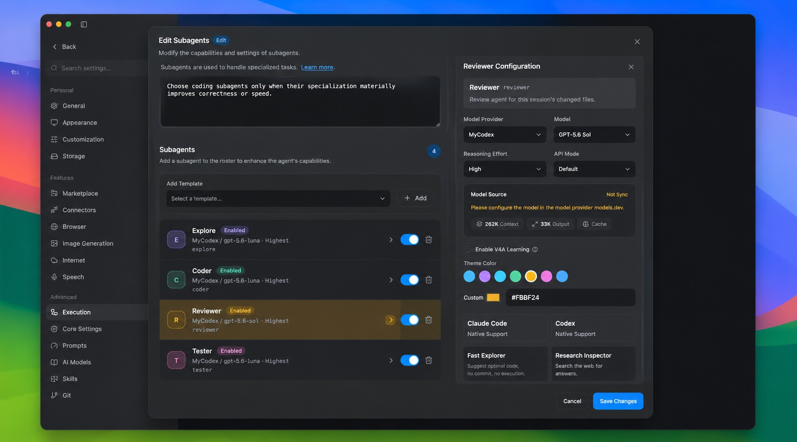
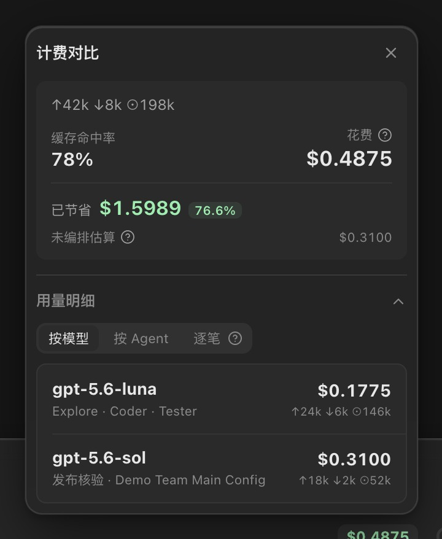

<div align="center">
  
  <h1>Eco Coding</h1>
  <p>Eco Coding is an open-source desktop AI coding workspace built on leading Agent Harnesses<br/>Designed to orchestrate different models at lower cost and provide a more open, flexible development experience.</p>
  <p>
    <a href="README.md">简体中文</a> · <strong>English</strong>
  </p>
  <p>
    <a href="https://github.com/plus1998/eco-coding/releases"></a>
    <a href="LICENSE"></a>
    
    
  </p>
</div>

Eco Coding is an open-source, multi-agent coding workspace. Instead of replacing agent runtimes, it builds configurable model routing, subagent orchestration, context governance, cost observability, and cross-device collaboration on top of Codex and Claude Code.

> Eco Coding is currently in Beta. The desktop application is free and available to download. The mobile client and Center Server are under active development in this repository, but the mobile client has not been publicly released yet.



<p align="center"><sub>Each session can independently configure subagents, integrations, Skills, and MCP.</sub></p>

## Why Eco Coding

Eco Coding's core value is aggregating different model providers and upstream protocols into one configurable workspace. Choose the providers you prefer and can afford, or aim for a Codex-equivalent experience. Assign providers, models, and protocols independently to the lead agent, subagents, vision models, and other capabilities for a more open, freer workflow. Mix GPT, Claude, DeepSeek, and Kimi freely—even when they come from different protocols: `/messages`, `/responses`, and `/chat/completions`.

Configure MCP servers, Skills, or integrations per project—or even per session—so unrelated context is not injected globally. Eco Coding also lets you see how much you spend, your cache hit rate, and whether the prompt cache was broken.

Beyond that, Eco Coding works well on Windows 10 and Linux Desktop. You also get unrestricted Mobile connectivity—no subscription, no fees, no account required—and can host the Server on your own infrastructure with confidence.

Even if you are not ready to trust smaller models, you can still run a single model—Eco Coding's more open, freer capabilities are still well worth trying.

## A Future-Facing Orchestration Model

Subagents and multi-agent setups address the division of complex work. A single high-capability model can complete complex tasks alone, but leaving it to search, implement, test, and review for long stretches makes context noisy and bills every step at the highest unit price. The lead agent can stay user-facing: understand goals, dispatch work, and own acceptance; concrete work goes to faster, cheaper, or locally running models. Subagents matter because they get independent task contexts, parallelize independent work, and let models of different cost and capability do what they fit.

This is Eco Coding's core idea. Almost every major model lab is shipping large and small models in the same family—exactly this trend. DeepSeek Flash's speed and ultra-low price, OpenCode 2's rewrite philosophy, and the recent ~80% cut in GPT Luna pricing all feel like part of the same wave. The idea took shape a few months ago; watching the field move step by step in this direction made it urgent to ship and open-source Eco Coding early.



<p align="center"><sub>Lead plans and accepts; workers run in parallel with isolated context and tiered model pricing.</sub></p>

### A Reusable Setup

In Eco Coding, `gpt-5.6-sol` can serve as the lead agent or planner: it understands the request, breaks down the work, decides whether to delegate, and owns acceptance. Assign `gpt-5.6-luna` with `max` reasoning effort to execution roles such as Explore, Coder, and Tester. This is a working style validated in real use. On long tasks, actual cost can drop by about 60%–80%.

With custom prompts:

```
(to be filled in)
```

### Clear price gaps

| Route example | Input price | Input gap | Output price | Output gap |
| --- | ---: | ---: | ---: | ---: |
| `gpt-5.6-sol` vs `gpt-5.6-luna` | `$5.00` vs `$0.20` | Sol is about `25x` | `$30.00` vs `$1.20` | Sol is about `25x` |
| `Claude Opus 4.8` vs `DeepSeek V4 Flash` | `$5.00` vs `$0.14` | Claude is about `35.7x` | `$25.00` vs `$0.28` | Claude is about `89.3x` |

### What Eco Coding Does

Eco Coding connects model aggregation with task delegation. A lead agent can use a high-capability model to maintain intent and acceptance criteria, while roles such as Explore, Coder, and Tester switch to cheaper, lower-latency, or local models; different roles may also come from different providers. Eco Coding centralizes routing, protocols, reasoning effort, context isolation, tool policies, MCP, Skills, cost, and cache observability so users can see why each model was used, what it cost, and whether the orchestration is worth repeating.

It does not prescribe one permanent model or a fixed number of agents. It provides a composable dispatch and observability layer: the same task can use one agent or parallel subagents.

## Highlights

### 1. Cross-provider Agent Team orchestration

- Bind the lead agent and every subagent independently to a provider, model, protocol, tool policy, MCP server, and Skills set within one Agent Team.
- The lead agent remains the direct user-facing collaborator and owns acceptance.
- Built-in Explore, Architect, Coder, Reviewer, and Tester templates can be replaced or extended.
- Parallel subtasks, task progress, change review, and focused verification are supported.
- Subagents cannot recursively spawn more subagents, keeping delegation boundaries explicit.



<p align="center"><sub>Each Agent Team controls its roles, models, and enabled state. All three subagents shown here use MyCodex gpt-5.6-luna.</sub></p>

### 2. Codex and Claude Code Agent Cores

Each session can run on Codex or Claude Code while preserving the core's native runtime behavior, prompt preset, and tool semantics where possible. Different cores can be used in the same project without moving workspaces or changing the conversation model.

### 3. Session-scoped context and capabilities

- Projects, sessions, and workers are isolated; runtime configuration is captured in the session snapshot.
- MCP, Skills, the built-in browser, and image generation can be enabled per session.
- Project Skills are discovered from `.claude/skills`, `.agents/skills`, `.codex/skills`, and `.pi/skills`.
- Agent, Plan, and Ask are explicit session modes.
- Cross-provider compaction preserves recent real messages and creates an executable handoff summary.

### 4. Multi-provider protocol gateway

The embedded gateway connects Agent Cores to multiple upstream API families:

- OpenAI Responses
- Anthropic Messages
- OpenAI Chat Completions
- Custom compatible services and local models such as llama.cpp OpenAI-compatible endpoints

The lead agent and every subagent can use different routes, allowing one orchestration to combine cloud models, local models, and API relays.

### 5. Dedicated vision and open integrations

- Assign a dedicated model to vision work instead of consuming the lead model.
- Connect OpenAI-compatible or custom image-generation APIs as session tools.
- Configure cloud ASR; the mobile client records audio and sends recognition through its paired desktop.

### 6. Observable cost and prompt cache

- Configure or resolve model pricing and inspect cost by session, agent, model, and event.
- Track input, output, cache-read, cache-write tokens, and cache hit rate.
- Compare actual orchestrated cost with an estimate priced entirely at the lead-model rate.
- Warn when a session has been idle for more than 30 minutes and its prompt cache may have expired.
- Record cache-break events when cache-read loss is significant and cannot be explained by new input.

A cache anomaly shows that the request prefix or upstream cache behavior changed. A single alert cannot establish a provider's intent or fault; Eco exposes the evidence and leaves the conclusion to the user.



<p align="center"><sub>One real read-only release check: the Sol lead agent and three Luna subagents cost $0.4875 with an 86% cache hit rate. Pricing the same tokens entirely at the lead-model rate produces a $2.0864 unorchestrated estimate. The $1.5989 (76.6%) difference is an estimate for this single task, not a general savings claim.</sub></p>

### 7. Fully open desktop, server, and mobile stack

- Electron + React desktop app: the primary workspace and local execution host.
- Bun Center Server: device identity, pairing, presence, and RPC routing.
- Flutter mobile client: remote sessions, approvals, image attachments, and voice input.
- The complete repository is available under the MIT License.

## Capability overview

| Area | Capability |
| --- | --- |
| Agent Core | Codex and Claude Code, selected per session |
| Orchestration | Custom lead config, prompt, subagent roster, models, and tool policies |
| Model routing | Multiple providers and Responses / Messages / Chat Completions upstreams |
| Session modes | Agent, Plan, Ask |
| Context | Occupancy, segment breakdown, compaction, handoff recovery, file checkpoints |
| Cost | Tokens, cost, cache I/O, hit rate, model/agent/event breakdown |
| Integrations | MCP, Skills, built-in browser, image generation, vision model, ASR |
| Engineering workflow | Git diff, checkpoint rewind, Worktrees, terminal, code review |
| Mobile collaboration | Device pairing, remote sessions, approvals, images, voice input |

## Supported platforms

| Platform | Architecture | Artifact | Update behavior |
| --- | --- | --- | --- |
| macOS | Apple Silicon, Intel | DMG / ZIP | Current unsigned Beta uses manual download |
| Windows 10/11 | x64 | NSIS installer | In-app updates supported |
| Linux | x64 | AppImage | In-app updates supported |

## Quick start

### Download the desktop app

Download the package for your system from [GitHub Releases](https://github.com/plus1998/eco-coding/releases). The current macOS Beta is unsigned; see the [User Guide](docs/USER_GUIDE.en.md) for first-launch and platform-specific notes.

### Run from source

Use the CI-tested Bun `1.3.14` and Node.js `22.14.0` when possible, together with the native build tools for your platform.

```bash
git clone https://github.com/plus1998/eco-coding.git
cd eco-coding
bun install
bun run dev
```

After the first launch, add an endpoint, API key, and candidate models under Settings -> Model Providers, then create or select a runtime configuration.

## Documentation

- [User Guide](docs/USER_GUIDE.en.md): installation, providers, Agent Teams, MCP, Skills, mobile, and troubleshooting
- [Technical Documentation](docs/TECHNICAL.en.md): architecture, runtimes, gateway, context, billing, storage, and releases

## Repository layout

```text
apps/
  desktop/                    Electron + React desktop app
  gateway/                    Multi-protocol model gateway
  server/                     Center Server
  mobile/                     Flutter mobile client
packages/
  runtime/                    Agent Cores, context, and orchestration runtime
  shared/                     Cross-client contracts and shared types
  openai-anthropic-bridge/    OpenAI / Anthropic protocol conversion
  model-router/               Model routing
  workspace/                  Workspace and Worktree workflows
```

## Project status

Eco Coding is evolving quickly. Beta releases are intended for evaluation, feedback, and development.

Current priorities:

- macOS signing and notarization
- Reproducible multi-agent quality and cost benchmarks
- Mobile release workflow
- Contribution guide, security policy, and end-to-end coverage

## License

Eco Coding is open source under the [MIT License](LICENSE). The project name, logo, and official distribution channels are not automatically licensed as trademarks by the MIT software license.
