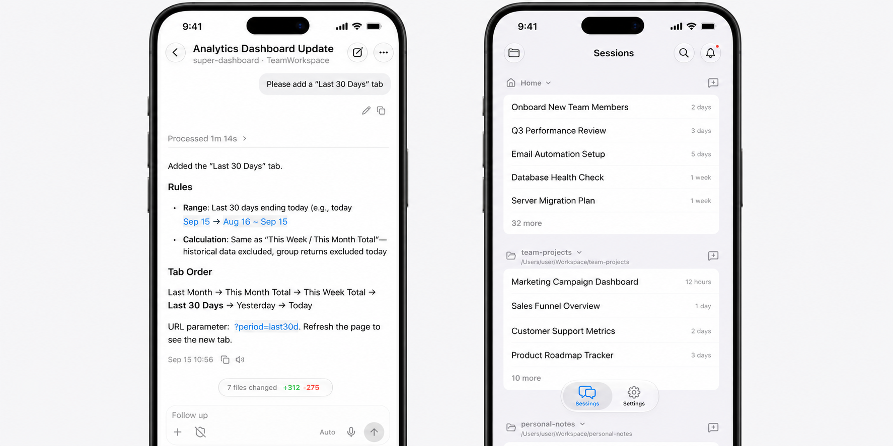

<div align="center">
  
  <h1>Eco Coding</h1>
  <p>Eco Coding 是一个基于顶尖 Agent Harness 的开源桌面 AI 编程工作台<br/>致力于以更低成本编排不同模型，提供更开放、更自由的开发体验。</p>
  <p>
    <strong>简体中文</strong> · <a href="README.en.md">English</a>
  </p>
  <p>
    <a href="https://github.com/plus1998/eco-coding/releases"></a>
    <a href="LICENSE"></a>
    
    
  </p>
</div>

> 当前 Beta：桌面端免费下载；移动端与自建 Supabase Center 在仓库中，移动端尚未公开发布。

基于 Codex、Claude Code 与 PI 的多代理编程工作台，提供模型路由、子代理编排、成本观测与跨设备协同。


<p align="center"><sub>每个会话独立配置子代理、集成工具、Skills 和 MCP。</sub></p>



<p align="center"><sub>手机端浏览 Sessions、跟进任务，并在外出时继续与 Agent 对话。</sub></p>

## 为什么是 Eco Coding

如果你已经在用 Codex 或 Claude Code，Eco Coding 把它们放进同一个工作台，并补上官方客户端通常缺少的能力：

- **混用模型** — GPT、Claude、DeepSeek、Kimi 等可自由组合，Responses / Messages / Chat Completions 都能接
- **分工降本** — 主代理规划验收，子代理并行搜索 / 编码 / 测试，各绑不同价位的模型
- **会话隔离** — MCP、Skills、工具权限按项目或会话配置，无关上下文不全局注入
- **独立视觉** — 支持给所有模型装上独立的「眼睛」（视觉）和「画笔」（创意绘画）
- **费用透明** — 按会话清晰知道自己花了多少钱，并查看缓存命中率
- **Mobile 互联** — 开源 Flutter 客户端：远程看会话、继续对话、处理审批、发图与语音；配对桌面后走自建 Supabase 中继，无需订阅
- **全栈开源** — macOS / Windows / Linux 桌面 + Supabase Center，MIT License

不想上多代理也可以：单模型模式照常可用。

## 快速开始

**[下载桌面端 →](https://github.com/plus1998/eco-coding/releases)**（macOS / Windows / Linux）

从源码运行（建议 Bun `1.4.0` 以上、Node.js `22.14.0` 以上）：

```bash
git clone https://github.com/plus1998/eco-coding.git
cd eco-coding
bun install
bun run dev
```

首次启动后在「设置 → 模型服务商」添加 API，再创建运行配置。macOS Beta 尚未签名，详见[使用指南](docs/USER_GUIDE.md)。

## 功能概览

| 领域 | 能力 |
| --- | --- |
| Agent Core | Codex、Claude Code、PI；每个会话独立选择 |
| 编排 | 自定义主代理、子代理 roster、模型和工具策略 |
| 模型路由 | 多服务商；Responses / Messages / Chat Completions |
| 会话模式 | Agent、Plan、Ask |
| 上下文 | 占用率、自动压缩、交接恢复、文件检查点 |
| 成本 | Token、费用、缓存读写、命中率、明细对比 |
| 扩展 | MCP、Skills、内置浏览器、创意绘画、视觉模型、ASR |
| 工程工作流 | Git diff、检查点回退、Worktree、终端、代码审查 |
| 移动协同 | 设备配对、远程会话、审批、图片附件、语音输入 |

## 支持平台

| 平台 | 架构 | 发布产物 | 更新方式 |
| --- | --- | --- | --- |
| macOS | Apple Silicon、Intel | DMG / ZIP | 当前未签名 Beta 使用手动下载 |
| Windows 10/11 | x64 | NSIS 安装器 | 支持应用内更新 |
| Linux | x64 | AppImage | 支持应用内更新 |

## 特点

- **三 Agent Core**：Codex、Claude Code、PI 按会话选择；同一项目可并行跑不同内核。
- **会话级隔离**：MCP、Skills、浏览器、创意绘画按会话开启；自动发现项目级 Skills。
- **多协议网关**：OpenAI Responses、Anthropic Messages、Chat Completions 及本地兼容接口。
- **独立视觉与集成**：视觉任务单独指定模型；支持创意绘画 API 与移动端 ASR。
- **全栈开源**：Electron 桌面 + 自建 Supabase Center + Flutter 移动端，MIT License。

### 跨供应商 Agent Team

主代理与子代理独立绑定服务商、模型、协议、MCP 和 Skills；内置 Explore / Architect / Coder / Reviewer / Tester 模板。


<p align="center"><sub>主代理与子代理可分别绑定服务商、模型、协议与工具权限。</sub></p>

### 看得见的费用与缓存

按会话 / Agent / 模型追踪成本与缓存；对比编排 vs 未编排估算。


<p align="center"><sub>按会话 / Agent / 模型查看成本、缓存命中率，并对比未编排估算。</sub></p>

## 编排与成本理念

子代理 / 多代理机制本身解决的是复杂任务的分工问题。单个高能力模型可以完成复杂任务，但长时间承担搜索、实现、测试和审查，会让上下文变得嘈杂，也会让每个步骤都按最高模型单价计费。主代理可以继续直接面对用户，理解目标、作出调度并统一验收；具体工作则交给更快、更经济或本地运行的模型。子代理的价值在于独立的任务上下文、并行处理相互独立的工作，并让不同成本和能力等级的模型各司其职。

这是 Eco Coding 的核心理念。几乎每家大模型公司都在推出自己的大小模型，这也完美贴合这一趋势。例如 DeepSeek Flash 的快速与超低价、OpenCode 2 的重构理念，以及最近 GPT Luna 资费下降约 80%，都让人感到这股热浪。这一想法在几个月前已经形成，随后又见证大模型的每一步发展都在朝这个方向演进，这也促使 Eco Coding 提前推出并开源。


<p align="center"><sub>主代理规划与验收；执行角色并行、独立上下文、按模型能力分层计费。</sub></p>

### 一种可复用的配置

在 Eco Coding 中，可以把 `gpt-5.6-sol` 作为主代理或规划者，负责理解需求、拆分任务、决定是否委派并统一验收；把 `gpt-5.6-luna` 配合 `max` reasoning effort 分给 Explore、Coder、Tester 等执行角色。这是一种经过实际测试可用的工作方式。长任务中实际资费降低 60%–80%。

并配上自定义提示词：

```
(等待补充)
```

### 直观的价格差异

| 路由示例 | 输入单价 | 输入价差 | 输出单价 | 输出价差 |
| --- | ---: | ---: | ---: | ---: |
| `gpt-5.6-sol` vs `gpt-5.6-luna` | `$5.00` vs `$0.20` | Sol 约 `25 倍` | `$30.00` vs `$1.20` | Sol 约 `25 倍` |
| `Claude Opus 4.8` vs `DeepSeek V4 Flash` | `$5.00` vs `$0.14` | Claude 约 `35.7 倍` | `$25.00` vs `$0.28` | Claude 约 `89.3 倍` |

### Eco Coding 在其中做什么

Eco Coding 把“模型聚合”和“任务分工”连接起来：主代理可以使用高能力模型保持目标和验收标准，Explore、Coder、Tester 等子代理可以按角色切换到更便宜、低延迟或本地模型；不同角色也可以来自不同服务商。Eco Coding 统一处理路由、协议、reasoning effort、上下文隔离、工具权限、MCP、Skills、费用和缓存观测，让用户能看到每个模型为什么被使用、花了多少钱，以及是否值得继续这样编排。

它不替用户规定“永远用哪个模型”或“必须开多少个代理”。它提供的是一层可组合的调度与观测能力：同一任务可以选择单代理或并行子代理。

缓存异常只能说明请求前缀或上游缓存行为发生变化，不能单凭一次告警判断具体服务商存在问题。Eco 提供证据，判断权留给用户。

## 文档

- [使用指南](docs/USER_GUIDE.md)：安装、模型配置、Agent Team、MCP、Skills、移动端与常见问题
- [技术文档](docs/TECHNICAL.md)：架构、运行时、协议网关、上下文、计费、存储和发布机制
- [Supabase 部署（Cloud）](docs/supabase-deploy.md)：云项目初次部署与增量更新
- [Supabase 自托管](docs/supabase-self-host.md)：Docker 自建栈 + Eco schema/函数（人与 Agent 可执行）

## 仓库结构

```text
apps/
  desktop/                    Electron + React 桌面端
  gateway/                    多协议模型网关（本机）
  mobile/                     Flutter 移动端
supabase/                     用户自建 Supabase：migration + Edge Functions
packages/
  runtime/                    Agent Core、上下文与编排运行时
  shared/                     跨端协议和共享类型
  openai-anthropic-bridge/    OpenAI / Anthropic 协议转换
  model-router/               模型路由
  workspace/                  工作区与 Worktree 工作流
```

## 项目状态

Eco Coding 正在快速迭代。Beta 版本适合体验、反馈和参与开发。

当前优先事项：

- 完成 macOS 签名与公证
- 建立可复现的多代理质量与费用基准
- 完善移动端发布流程
- 补充贡献指南、安全策略和端到端测试

## 开源协议

Eco Coding 基于 [MIT License](LICENSE) 开源。项目名称、Logo 和官方发行渠道不因 MIT 代码授权而自动获得商标授权。
