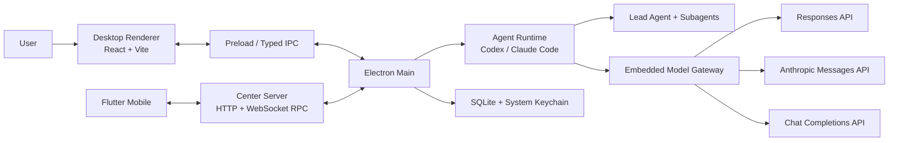
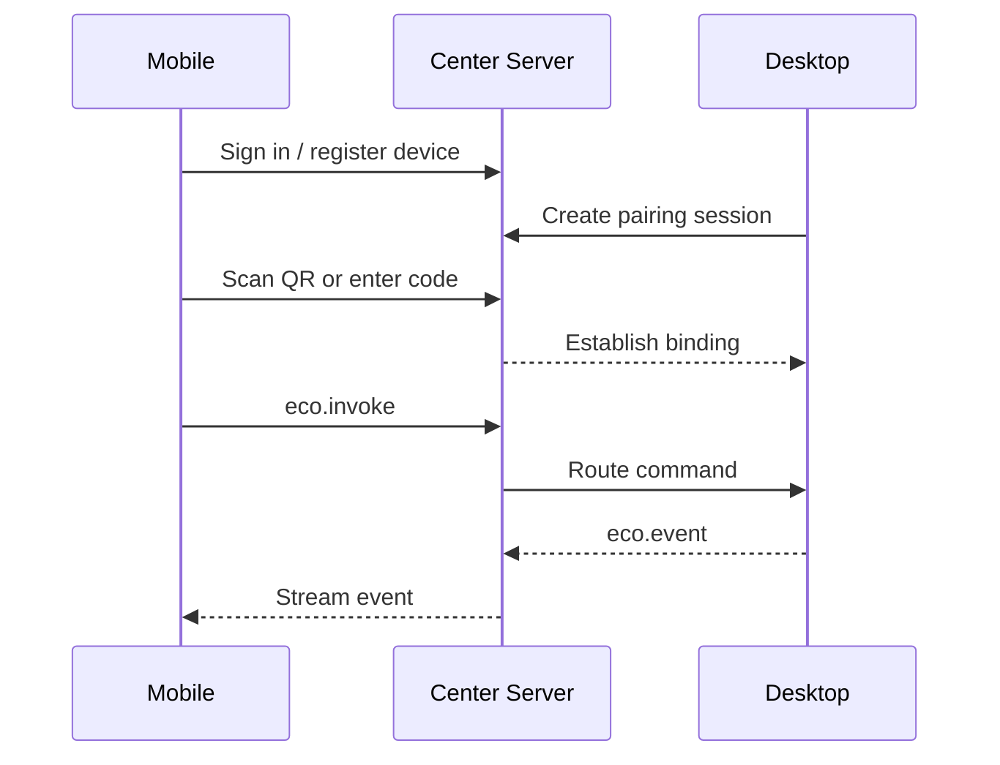

# Eco Coding Technical Documentation

[简体中文](TECHNICAL.md) · **English** · [README](../README.en.md) · [User Guide](USER_GUIDE.en.md)

This document describes the implemented architecture and boundaries of the current Beta for contributors, integrators, and Center Server operators. The code remains the final source of truth.

## 1. System architecture



### Components

| Path | Responsibility |
| --- | --- |
| `apps/desktop` | Electron main, preload, React UI, local agent execution, packaging |
| `apps/gateway` | Routes or converts Agent Core traffic to supported upstream protocols |
| `apps/server` | Identity, devices, pairing, presence, audit metadata, cross-device RPC |
| `apps/mobile` | Flutter remote client; it does not edit code on the phone |
| `packages/runtime` | Core adapters, session modes, context, billing, subagent runtime |
| `packages/shared` | Cross-client protocol constants and shared types |
| `packages/openai-anthropic-bridge` | OpenAI / Anthropic request and stream conversion |
| `packages/model-router` | Model and role routing |
| `packages/workspace` | Git workspace, Worktree, and change workflows |

## 2. Desktop process boundaries

The React Renderer owns projects, conversations, settings, activity feeds, approvals, diffs, and usage views. It does not read secrets or spawn model processes directly. A context-isolated preload exposes typed IPC, and Electron Main owns all privileged operations: Core workers, model routing, Git, terminals, checkpoints, persistence, integrations, device RPC, and updates.

## 3. Agent Cores

`ThreadRuntimeCoordinator` dispatches `claude`, `codex`, and `pi` cores (`CoreKind`). Every conversation persists its own `coreKind`, so one project can contain sessions backed by different runtimes.

**PI (v1) boundary:** in-process `@earendil-works/pi-coding-agent` SDK + Eco Gateway models; Eco Agent-tool subagents from the thread orchestration snapshot (capability=`eco`); tool approval capability=`eco` (`tool_call` → `createThreadToolPermissionHandler`); plan approval remains unsupported; no Eco compact/rewind handoff (PI native `compaction.enabled` owns compact; `pi-smart-compact` is not installed). Skills and MCP are Eco-injected per session (`skills: "eco"` / `mcp: "eco"`): discover `.agents/skills` and `.pi/skills` (plus `~/.agents/skills` / `~/.pi/agent/skills`), filter by thread `skillsEnabled`, and pass paths into the PI `ResourceLoader` with `includeDefaults: false`. MCP uses `pi-mcp-adapter` in-memory `createMcpAdapter({ config })` with Composer-selected servers plus built-in integrations (browser/image) — not merged with ambient `.mcp.json`. Subagents are isolated `AgentSession`s under `pi-agent/<threadId>/subagents/<agentId>/` (empty history, no nesting) using that agent's Gateway model alias with no planner fallback. Each thread owns `ecoDataDir/pi-agent/<threadId>/` (private skill mounts, persisted `sessions/*.jsonl`, auth/models cache); Eco does **not** use the `~/.pi` default session directory. The in-process registry reuses the same `AgentSession` on the hot path; cold start opens the JSONL via `SessionManager.open` when identity + MCP fingerprints match. MCP set or cwd/provider/model/apiCompat/routes changes recreate an empty session and prune that thread's old jsonl files. Deleting a thread removes its `pi-agent/<threadId>` tree; Storage → All PI sessions deletes those Eco chats (they leave the sidebar) and clears `pi-agent/` (running/queued PI threads are skipped). Idle sessions hot-reload skills on the next run via `AgentSession.reload`; running sessions still block config edits. This is **visibility isolation**, not OS filesystem isolation — PI still has `read`/`bash`, so skill files in a shared workspace may remain readable.

The adapter layer describes Agent / Plan / Ask modes, compaction, file rewind, approvals, MCP, Skills, and subagents. Eco preserves native Core behavior where possible and explicitly labels capabilities implemented by Eco or unavailable instead of presenting them as native.

## 4. Multi-agent orchestration

A runtime configuration consists of:

1. `MainAgentConfigResource`: lead model, tools, Skills, and capability policy.
2. `MainAgentPromptResource`: optional appended prompt; the default follows the Core preset.
3. `SubagentOrchestrationResource`: subagent roster, models, MCP, Skills, and guidance.

These resources resolve into a `ResolvedOrchestrationSnapshot` when a session is created or switched. Running sessions use the snapshot so later template edits do not silently change active work.

Built-in templates include Explore, Architect, Coder, Reviewer, and Tester. They are templates, not a forced pipeline. The lead agent delegates according to agent descriptions, and subagents cannot recursively spawn more subagents.

| Mode | Purpose | Behavior |
| --- | --- | --- |
| Agent | Default implementation | Edits allowed; the agent may ask or delegate |
| Plan | Plan before execution | Native planning plus plan approval |
| Ask | Read-only Q&A | Write tools restricted; never inferred from wording |

## 5. Providers and protocol gateway

Provider and agent routes support:

- `anthropic` -> Anthropic Messages
- `openai_responses` -> OpenAI Responses
- `openai_chat_completions` -> OpenAI Chat Completions

The embedded gateway exposes Responses / Messages surfaces to the runtime and routes or converts them to the selected upstream. Chat Completions is a supported upstream protocol, not a separately promised third public gateway surface.

Agent-level protocol settings override provider defaults. `requestPath` is a service prefix such as `/anthropic`, not a complete endpoint. Incompatible protocol/path combinations fail explicitly. The lead agent and every subagent may use a different provider and model. Local servers such as llama.cpp work through compatible Chat Completions endpoints.

## 6. Session isolation, MCP, and Skills

Every thread stores an independent runtime configuration including enabled MCP servers, Skills, built-in integrations, and an orchestration snapshot. Project Skills are discovered from `.claude/skills`, `.agents/skills`, `.codex/skills`, and `.pi/skills`. User Skills are included only when explicitly selected and compatible with the Core.

MCP servers are registered globally and enabled per session or agent template, with optional tool allowlists. This isolation describes Eco's configuration and injection boundary; it is not an operating-system sandbox for third-party MCP processes.

## 7. Context management

Context control has three layers, aligned with Codex semantics but implemented per Core:

### 7.1 Tool-output history pruning (Codex TruncationPolicy)

- **Default limit**: about `10_000` tokens, with a ×`1.2` serialization budget (same as Codex `ContextManager::record_items`).
- **Shape**: middle-truncate plus a `Warning: truncated output…` header (`codex-output-truncation` in `@eco/runtime`).
- **Claude Core**: a `PostToolUse` hook rewrites oversized results via `updatedToolOutput` before they enter the SDK transcript / model context.
- **Bridge defense**: upstream Anthropic `tool_result` blocks (and Responses `function_call_output`) are pruned again for old sessions and non-hook paths.
- **UI previews** (for example Bash 8k-character previews) are separate from model-history pruning and do not share the same budget.

### 7.2 Semantic compaction (owned by each Core)

Eco **does not run semantic compact**. Each Core uses its own local auto-compaction. Eco only projects occupancy and compact events, and blocks upstream cloud compact APIs that custom models do not implement.

| Core | Auto-compact | Eco's role |
|---|---|---|
| Claude | Agent SDK `autoCompactEnabled` + `autoCompactWindow=min(model, global)`: in-process summary + `compact_boundary`, same session | Enable the flag and write the effective window; `[1m]` aliases also follow the effective window; strip `compact_20260112`; Bridge does not forward `/v1/responses/compact` |
| Codex | app-server local compact (custom provider name, not remote `/responses/compact`) | Catalog `context_window` already mins the global cap; project `contextCompaction`; Gateway translates summary requests to third-party models |
| PI | SDK native `compaction.enabled`; trigger is `contextTokens > contextWindow - reserveTokens` | `Model.contextWindow = min(model, global)`; does not install `pi-smart-compact` |

The manual compact control is removed. The occupancy meter displays Core-reported occupied/limit; Eco no longer schedules compaction at an 85% threshold.

### 7.3 Upstream compact shields

- **Anthropic cloud compact**: strip `compact_20260112` / `compaction` edits from `context_management` before the request is sent.
- **Responses remote compact**: Eco Bridge intercepts `POST /v1/responses/compact`, returns a non-fatal stub, and does not forward to Gateway/upstream. Codex defaults to local compact and does not depend on that endpoint.

**Tool-history truncation** (§7.1) stays separate from semantic compact and is still applied by Eco TruncationPolicy / PostToolUse.

Claude Agent SDK wiring (single-message streaming prompt, Query teardown, reserved `streamInput`) is documented in [claude-core-baseline.md](./claude-core-baseline.md).

## 8. Usage, cost, and cache

The ledger records provider, model, agent, input/output tokens, cache reads/writes, reported cost, and cost calculated from configured pricing. The unorchestrated comparison prices relevant work at the lead-model rate; it is an estimate, not an invoice or a quality-equivalence claim.

Default cache-break detection requires at least 8,000 billed prompt tokens, a previous hit rate of at least 35%, a drop of at least 25 percentage points, and unexplained cache-read loss of at least 15% of the current prompt. The UI also warns after 30 minutes of inactivity. These signals expose anomalies but cannot identify whether expiration, prefix changes, a relay, or the upstream caused them.

## 9. Vision, image generation, and ASR

- A dedicated vision model may be selected; otherwise vision follows the lead model.
- Image generation supports multiple provider profiles and requires confirmation per tool invocation.
- ASR supports compatible `audio/transcriptions` and Chat Completions APIs.
- Mobile records audio while the paired Desktop owns recognition configuration and requests, avoiding duplicate provider secrets on the phone.

## 10. Center Server and Mobile

Center Server runs on Bun. MongoDB stores users, devices, bindings, tokens, pairing sessions, and audit metadata. Redis stores presence, TTL state, and cross-instance RPC routing.



The Server handles identity and routing only. Files, model calls, Git, and terminals remain on Desktop. Full event payload history is not persisted by the Server; only audit metadata is stored.

## 11. Storage and security boundaries

- SQLite stores conversations, events, usage, configuration, and compaction archives.
- Sensitive values such as API keys use system secure storage / Keychain when available.
- The Renderer does not receive raw secret values directly.
- MCP, terminal, browser, writes, and image generation follow their approval and tool policies.
- Production Center Server deployments require an `ECO_SERVER_TOKEN_SECRET` of at least 32 characters and should sit behind a TLS reverse proxy.
- Signing certificates, App Store Connect keys, production `.env` files, and real API keys must never enter the repository.

## 12. Build and release

The repository is a Bun workspace:

```bash
bun install
bun run dev
bun run build
bun run test
bun run typecheck
bun run lint
```

Tags matching `v*` trigger validation and parallel macOS arm64, macOS x64, Windows x64, and Linux x64 builds. The publish job assembles assets, merges macOS metadata, validates the manifest, and generates `SHA256SUMS`. Beta tags must originate from `beta`; stable tags must originate from `main`.

The current macOS Beta is unsigned and uses manual updates. Windows and Linux generate automatic-update metadata.

## 13. Known limitations

- No public reproducible benchmark currently validates the proposed 65% savings figure.
- macOS artifacts are not yet signed or notarized.
- Mobile has not been publicly released.
- Center Server requires MongoDB and Redis.
- Protocol conversion covers common text, tool, and streaming paths; provider-specific extensions need explicit compatibility work.
- Cache-break alerts cannot establish provider intent or root cause.

## 14. Further reading

- [User Guide](USER_GUIDE.en.md)
- [Center Server README](../apps/server/README.md)
- [Mobile README](../apps/mobile/README.md)
- [Gateway README](../apps/gateway/README.md)
