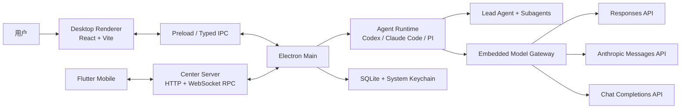
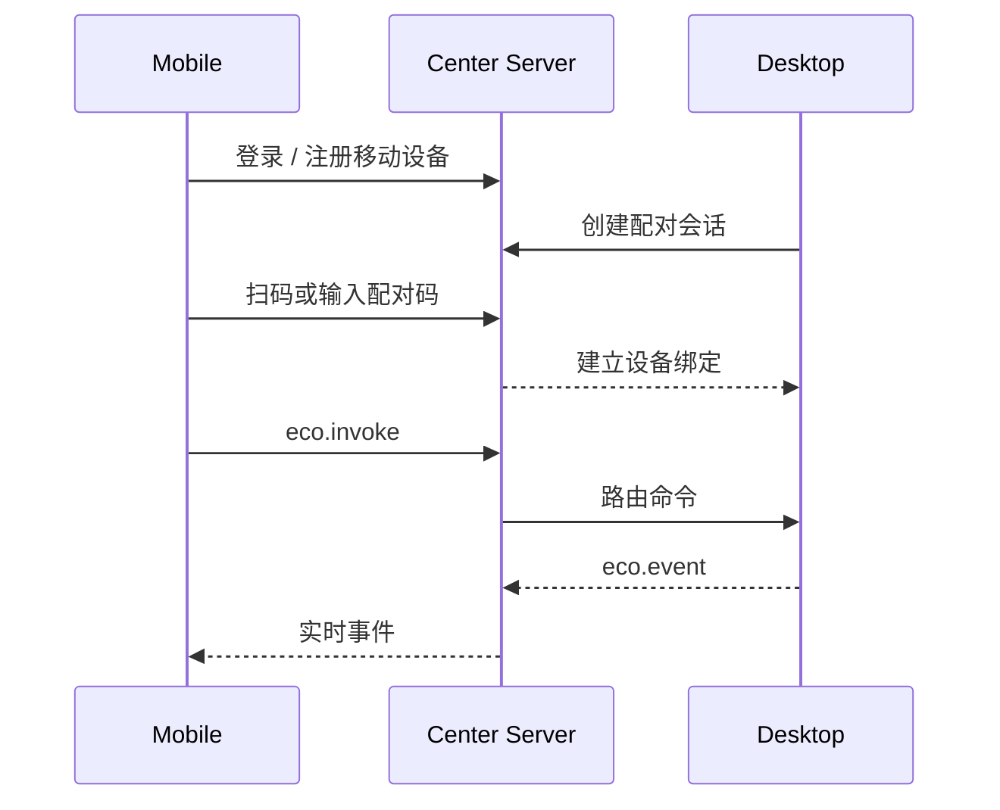

# Eco Coding 技术文档

**简体中文** · [English](TECHNICAL.en.md) · [返回 README](../README.md) · [使用指南](USER_GUIDE.md)

本文面向贡献者、二次开发者和需要自托管 Center Server 的用户，描述当前 Beta 版本已经实现的架构与边界。代码始终是最终事实来源。

## 1. 系统架构



### 主要组件

| 路径 | 职责 |
| --- | --- |
| `apps/desktop` | Electron 主进程、Preload、React 界面、本地 Agent 执行与桌面打包 |
| `apps/gateway` | 把 Agent Core 请求路由或转换到不同上游协议 |
| `apps/server` | 用户、设备、配对、在线状态、审计元数据和跨设备 RPC 路由 |
| `apps/mobile` | Flutter 远程客户端，不在手机上执行代码修改 |
| `packages/runtime` | Codex/Claude Core 适配、会话模式、上下文、计费和子代理运行时 |
| `packages/shared` | Desktop、Server、Mobile 之间的协议常量和共享类型 |
| `packages/openai-anthropic-bridge` | Responses、Chat Completions 与 Anthropic 消息形态转换 |
| `packages/model-router` | 模型与角色路由 |
| `packages/workspace` | Git 工作区、Worktree 与变更工作流 |

## 2. 桌面进程边界

### Renderer

React Renderer 负责项目、会话、设置、活动流、审批、代码差异和用量界面。Renderer 不直接读取密钥或启动模型进程，所有高权限操作通过 typed IPC 进入主进程。

### Preload

Preload 使用 Electron context bridge 暴露受控 API，保持 Renderer 与 Node/Electron 权限隔离。

### Main

主进程拥有以下能力：

- 每个 Thread 的 Worker 与 Agent Core 生命周期
- 模型供应商、路由和嵌入式网关
- Git、终端、文件检查点和系统集成
- SQLite 持久化与系统 Keychain 密钥访问
- MCP、Skills、浏览器、图片创建和 ASR 配置
- Center Server 设备连接和移动端 RPC
- Desktop 更新策略

## 3. Agent Core

产品运行时通过 `ThreadRuntimeCoordinator` 分发 `claude`、`codex`、`pi` 三种 Core（`CoreKind`）。每个会话持久化自己的 `coreKind`，因此同一个项目可以同时存在不同内核的会话。

**PI（v1）边界：** 进程内 `@earendil-works/pi-coding-agent` SDK + Eco Gateway 模型；经 Eco Agent 工具接入线程编排快照中的子代理（capability=`eco`）；不接工具/计划审批；无 Eco compact/rewind handoff（compact 由 PI native `compaction.enabled` 负责，不装 pi-smart-compact）。Skills 与 MCP 由 Eco 按会话注入（`skills: "eco"` / `mcp: "eco"`）：Skills 发现 `.agents/skills` 与 `.pi/skills`（及 `~/.agents/skills` / `~/.pi/agent/skills`），经线程 `skillsEnabled` 过滤后传入 PI `ResourceLoader`（`includeDefaults: false`）。MCP 经 `pi-mcp-adapter` 的 in-memory `createMcpAdapter({ config })` 注入，只含 Composer 选中项与内置集成（浏览器/图片），不合并 ambient `.mcp.json`。子代理为独立 `AgentSession`（`pi-agent/<threadId>/subagents/<agentId>/`，空 history，禁止嵌套），模型走该 agent 的 Gateway alias，不回落主模型。每线程 Eco 拥有目录 `ecoDataDir/pi-agent/<threadId>/`（私有 Skills 挂载、`sessions/*.jsonl` 持久化会话、auth/models 缓存）；**不**使用 `~/.pi` 默认会话目录。进程内 registry 热路径复用同一 `AgentSession`；冷启动在 identity + MCP fingerprint 匹配时 `SessionManager.open` 续跑。MCP 集合或 cwd/provider/model/apiCompat/routes 变更会重建空会话并清理该线程旧 jsonl。删线程会整树删除 `pi-agent/<threadId>`；存储面板「全部 PI 会话」会删除对应 Eco 对话（侧边栏不可再打开）并清理 `pi-agent/`（进行中的 PI 对话会跳过）。改 Skills 后 idle 会话可在下次 run 热更新（`AgentSession.reload`）；运行中仍禁止改配置。这是**可见性隔离**，不是 OS 级文件系统隔离——PI 仍有 `read`/`bash`，共享 workspace 内的 skill 文件其他会话进程仍可能读到。

Core 适配层统一描述以下能力：

- Agent / Plan / Ask 会话模式
- 上下文压缩
- 文件回退
- 工具与计划审批
- MCP、Skills 和子代理

实现会优先保留 Core 原生行为；某项能力由 Eco 补齐或暂不支持时，通过 capability descriptor 显式表达，不静默伪装为原生能力。

## 4. 多代理编排

### 配置模型

一套运行配置由三个独立资源组成：

1. `MainAgentConfigResource`：主代理模型、工具、Skills 和能力策略。
2. `MainAgentPromptResource`：可选的追加提示词；默认跟随 Core 内置提示词。
3. `SubagentOrchestrationResource`：子代理 roster、模型、MCP、Skills 和调度说明。

配置在创建或切换会话时解析为 `ResolvedOrchestrationSnapshot`。活动会话使用快照，避免用户修改全局模板后无意中改变正在执行的任务。

### 内置角色

| 角色 | 默认职责 | 默认权限特征 |
| --- | --- | --- |
| Explore | 定位文件、符号和关系 | 只读，无 Bash、无网络 |
| Architect | 架构分析和任务拆分 | 只读，可使用网络工具 |
| Coder | 聚焦实现 | 工作区读写与 Bash |
| Reviewer | 审查当前变更 | 只读，可运行检查命令 |
| Tester | 执行验证 | 工作区读写与 Bash |

这些是模板而不是强制流水线。主代理根据 Agent description 自主决定何时委派；子代理不能嵌套调用其他子代理。

### 会话模式

| 模式 | 用途 | 行为 |
| --- | --- | --- |
| Agent | 默认实现模式 | 允许编辑，必要时询问用户或委派 |
| Plan | 先规划后执行 | 使用 Core 的计划模式并经过计划审批 |
| Ask | 只读问答 | 限制写入工具，不根据提示词自动推断进入 |

## 5. 模型供应商与协议网关

供应商和 Agent 路由支持三种 `apiCompat`：

- `anthropic` -> Anthropic Messages（Gateway `POST /v1/messages`）
- `openai_responses` -> OpenAI Responses（Gateway `POST /v1/responses`）
- `openai_chat_completions` -> OpenAI Chat Completions（Gateway `POST /v1/chat/completions` 原格式透传）

嵌入式网关对 Agent Runtime 提供 Messages / Responses / Chat Completions 入口，再根据路由把请求直通或转换到真实上游。PI 按 `apiCompat` 选择对应客户端面，不得把 Chat 伪装成 Anthropic/Responses。

关键规则：

- Agent 级协议覆盖优先于 Provider 默认协议。
- `requestPath` 只表示服务前缀，例如 `/anthropic`，不要填写完整 `/v1/messages`。
- Anthropic-only 路径与 OpenAI 协议组合会硬失败，不会静默改写到可能错误的端点。
- 路由可为主代理和每个子代理选择不同 Provider / Model。
- llama.cpp 等服务只要暴露兼容的 Chat Completions 接口即可接入。

## 6. 会话隔离、MCP 与 Skills

每个 Thread 保存独立运行配置，其中包含启用的 MCP、Skills、内置集成和 Agent 编排快照。项目级 Skills 从以下目录发现：

- `.claude/skills`
- `.agents/skills`
- `.codex/skills`
- `.pi/skills`

个人 Skills 不会整棵目录无条件注入；只有显式选择且满足 Core 约束的 Skills 会进入会话。MCP 在全局设置中登记，在 Composer 或 Agent 模板中按会话启用，并可以配置工具 allowlist。

“隔离”表示 Eco 控制的会话配置与注入边界，不代表第三方 MCP 进程自身具备操作系统级沙箱。第三方工具仍应按其实际权限审查。对 PI 而言，Skills 注入同样是可见性边界：共享 workspace 内的 skill 文件仍可能被 `read`/`bash` 读到。

## 7. 上下文管理

上下文占用控制分为三层，语义上对齐 Codex，但实现路径因 Core 不同：

### 7.1 Tool 输出入 history 剪枝（Codex TruncationPolicy）

- **默认上限**：约 `10_000` tokens，序列化预算 ×`1.2`（与 Codex `ContextManager::record_items` 一致）。
- **截断方式**：中间截断，并带 `Warning: truncated output…` 头（见 `@eco/runtime` 的 `codex-output-truncation`）。
- **Claude Core**：`PostToolUse` 通过 `updatedToolOutput` 在写入 SDK transcript / 模型上下文前剪枝。
- **Bridge 兜底**：上行 Anthropic `tool_result`（及 Responses `function_call_output`）再次剪枝，覆盖旧 session 与非 hook 路径。
- **UI 预览**（如 Bash 8k 字符预览）与模型 history 剪枝职责分离，不共用同一常量。

### 7.2 语义压缩（各 Core 自管）

Eco **不再做语义 compact**。各 Core 用自己的 local 自动压缩；Eco 只投影占用与 compact 事件，并屏蔽上游云端 compact 接口（自定义模型不支持）。

| Core | 自动压缩 | Eco 做什么 |
|---|---|---|
| Claude | Agent SDK `autoCompactEnabled` + `autoCompactWindow=min(模型, 全局)`：进程内摘要 + `compact_boundary`，同一 session | 打开开关并写入有效窗口；1M 别名 `[1m]` 也按有效窗口；剥 `compact_20260112`；Bridge 不转发 `/v1/responses/compact` |
| Codex | app-server 内部 local compact（自定义 provider 名，不打 remote `/responses/compact`） | catalog `context_window` 已 min 全局；投影 `contextCompaction`；Gateway 把摘要请求转到第三方模型 |
| PI | SDK native `compaction.enabled`，触发为 `contextTokens > contextWindow - reserveTokens` | `Model.contextWindow = min(模型, 全局)`；不装 `pi-smart-compact` |

手动压缩入口已移除。占用条只展示 Core 上报的 occupied/limit，Eco 不再用 85% 阈值去调度压缩。

### 7.3 上游 compact 屏蔽

- **Anthropic 云端 compact**：请求发出前剥掉 `context_management` 里的 `compact_20260112` / `compaction`。
- **Responses remote compact**：Eco Bridge 拦截 `POST /v1/responses/compact`，返回非致命假成功，不转发 Gateway/上游。Codex 默认走 local compact，不依赖该接口。

**Tool 入史剪枝**（§7.1）与语义 compact 分离，仍然由 Eco TruncationPolicy / PostToolUse 处理。

Claude Agent SDK 接线约定（streaming 单消息 prompt、Query teardown、`streamInput` 预留）见 [claude-core-baseline.md](./claude-core-baseline.md)。

## 8. 用量、费用与缓存

### 计费数据

Ledger 记录模型、Provider、Agent、输入/输出 Token、cache read、cache write、报告费用和 Eco 按价格表计算的费用。价格可以来自模型元数据或手动配置。

“未编排估算”使用主模型价格估算相关工作量，用于观察模型分工的可能影响，不是账单，也不是质量等价证明。

### 缓存告警

当前默认 cache-break 检测条件包括：

- 本轮计费 Prompt Token 至少 `8,000`
- 上一轮缓存命中率至少 `35%`
- 命中率下降至少 `25` 个百分点
- 排除新增未缓存输入后，无法解释的 cache-read 损失至少占本轮 Prompt 的 `15%`

此外，Renderer 在会话闲置 `30` 分钟后提示缓存可能失效。缓存告警用于暴露异常，不负责判断异常来自正常过期、请求前缀变化、中转层还是上游服务。

## 9. 图片、视觉与 ASR

- 主代理配置可以指定独立视觉模型；未设置时跟随主模型。
- 图片创建支持多个 Provider profile、模型与 API Key，通过会话工具调用，每次调用需要用户确认。
- ASR 支持 `audio/transcriptions` 与 Chat Completions 形态的兼容服务。
- Mobile 负责录音；识别配置和请求由配对的 Desktop 管理，从而避免在移动端重复保存供应商密钥。

## 10. Center Server 与 Mobile

Center Server 使用 Bun，MongoDB 保存用户、设备、绑定、Token、配对和审计记录；Redis 保存在线状态、TTL 和跨实例 RPC 路由。



Server 只负责身份和路由，代码读取、模型调用、Git 与终端操作仍发生在 Desktop。完整事件正文不在 Server 持久化，Server 只保存审计元数据。

## 11. 存储与安全边界

- 会话、事件、用量、配置和压缩归档使用 SQLite。
- API Key 等敏感值优先保存到系统安全存储 / Keychain。
- Renderer 不直接获取明文密钥。
- MCP、终端、浏览器、文件写入和图片创建遵循各自审批与工具策略。
- Center Server 生产部署必须设置至少 32 字符的 `ECO_SERVER_TOKEN_SECRET`，并应置于 TLS 反向代理之后。
- 仓库不得提交签名证书、App Store Connect Key、生产 `.env` 或真实 API Key。

## 12. 构建与发布

根目录使用 Bun workspace。主要命令：

```bash
bun install
bun run dev
bun run build
bun run test
bun run typecheck
bun run lint
```

Release workflow 由 `v*` 标签触发，校验标签来源后并行构建：

- macOS arm64
- macOS x64
- Windows x64
- Linux x64

正式发布前会统一整理资产、合并 macOS 更新元数据、验证文件清单并生成 `SHA256SUMS`。Beta 标签必须来自 `beta` 分支，正式标签必须来自 `main` 分支。

当前 macOS Beta 未签名，使用手动更新；Windows 和 Linux 生成自动更新元数据。

## 13. 已知限制

- 尚无经过公开复现的“节省 65%”质量/费用基准。
- macOS 包尚未签名和公证。
- Mobile 尚未公开发布。
- Center Server 需要 MongoDB 与 Redis，不是无状态单进程服务。
- 协议转换覆盖常用文本、工具与流式路径，但供应商私有扩展仍需逐项兼容。
- Cache-break 告警不能证明服务商行为或故障原因。

## 14. 延伸阅读

- [使用指南](USER_GUIDE.md)
- [Center Server README](../apps/server/README.md)
- [Mobile README](../apps/mobile/README.md)
- [Gateway README](../apps/gateway/README.md)
