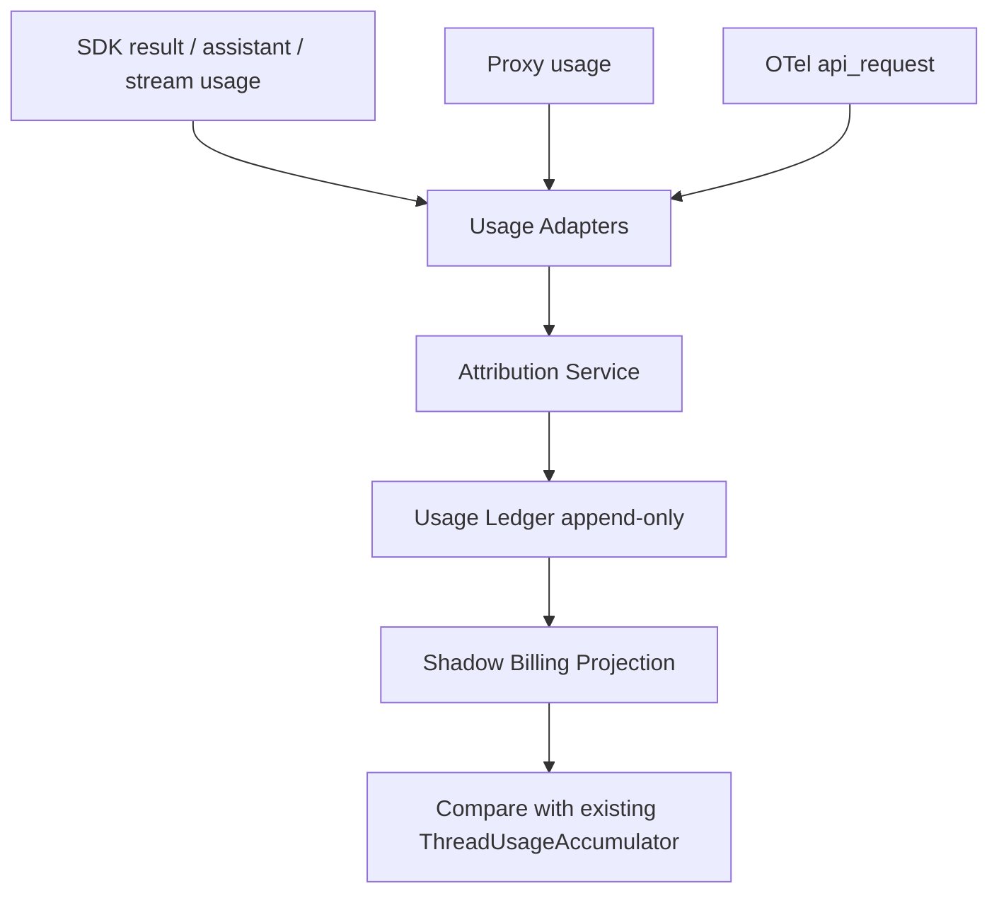

# Agent Billing Refactor Plan

本文档记录 Agent 编排、SubAgent 生命周期、Token 统计、成本归集与结算链路的重构计划。后续实施必须按本文档推进；如需调整顺序，先更新本文档，再改代码。

## 目标

核心目标是把 Agent 编排、Token 统计、成本计算、结算展示从“多处状态累加 + 启发式归因”推进到“统一领域事件 + 可审计投影”。

最终系统必须满足：

- 每一笔 Token 消耗都能追溯到具体来源、请求、模型、运行尝试和 Agent。
- 每一笔成本只能在同一个投影中结算一次。
- SubAgent 父子关系、生命周期、计费归属不能依赖单槽 pending 状态。
- SDK、Proxy、OTel 只能作为观测来源，不能各自成为最终账本。
- UI 展示必须来自投影结果，而不是直接拼接多个来源的临时快照。

## 已完成

第一批 P0 硬化已完成：

- SubAgent `tool_use -> agentId` 从单槽 pending 改成 role-aware 队列。
- SDK PreToolUse attribution 会传递 SubAgent role。
- SDK stream `tool.started` 也会补充 role 作为兜底。
- SubAgent metrics 增加 `agentId + role + requestKey + modelId` 幂等键。
- SubAgent session pending launch 改成按 role 消费，避免 mission/todo 串号。
- 账单 Token 明细展示回归已修复。
- 新增并发归因、跨角色交错启动、重复计费幂等、session pending 消费、runtime hook role 传递测试。

当前验证基线：

- `bun test`: 通过，`797 pass / 14 skip / 0 fail`
- `bun run typecheck`: 仍失败，剩余为项目既有 TypeScript 基线问题；本次新增 ledger、adapter、shadow write、reconciliation、lifecycle、billing projector、projector reconciliation、stream partial/context audit、lifecycle recovery settlement、usage ledger coordinator、usage billing artifacts、usage billing effects、SDK final billing effects、SDK stream partial effects、SDK run attribution、SubAgent usage attribution、SubAgent context observation、SubAgent metrics projection summary、SubAgent metrics persistence port、SubAgent metrics persistence mapper、SubAgent tool use index、SubAgent agent resolver、SubAgent metrics state、SubAgent legacy usage tracker、Thread run attempt orchestration、Thread runtime route/proxy attempt、Thread run outcome、SDK run event loop、SDK run input、usage observation dedupe、ledger billing snapshot projection、ledger billing selection gate、billing snapshot selection policy、active run billing state、active run runtime state、legacy billing accumulator adapter、usage context effects、usage context service、thread metrics runtime、context lifecycle service、compaction audit service、OTel usage billing resolver、Proxy usage billing resolver、SDK event usage billing resolver、SDK final run billing resolver、single usage billing orchestration、stream partial billing orchestration、billing runtime environment、telemetry billing role normalization 近端类型错误已清理。

第二批 Usage Ledger foundation 已完成：

- 新增 `RunAttempt`、`AgentInstance`、`UsageLedgerEvent`、`UsageAttribution` 领域类型。
- 新增 `InMemoryUsageLedger`，支持 run attempt、agent instance、usage event 的最小闭环。
- 新增 append-only usage event 幂等写入语义，重复 idempotency key 不会重复插入。
- 幂等键不包含 `agentId`，避免同一 usage event 先未归因、后补齐归因时被重复计费。
- 新增 `projectUsageLedger` shadow projection，先支持 total、byRole、byAgent、byModel、unattributed events。
- 在 `ConversationStore` 增加 shadow tables：`thread_run_attempts`、`thread_agent_instances`、`thread_usage_ledger_events`。
- 新增 SQLite store API：`upsertRunAttempt`、`upsertAgentInstance`、`appendUsageLedgerEvent`、对应 list/clear 方法。
- 新增测试覆盖：内存 ledger 幂等、projection 聚合、未归因保留、同源多模型分离、补归因不改幂等键、SQLite 幂等持久化。

当前边界：

- 新 shadow projection 不驱动 UI、不替代旧 `ThreadUsageAccumulator`。
- SQLite 持久化测试在当前运行环境因 `node:sqlite` 不可用被跳过；测试代码已保留，具备 SQLite 的环境会执行。
- Foundation 阶段不驱动 UI；run attempt 与 ledger event 的 `runAttemptId` 接入见第五批 Agent Lifecycle shadow 状态机。

第三批 Usage Ledger adapter + shadow write 已完成：

- 新增 `usage-ledger-adapters`，把已解析的 SDK/Proxy/OTel usage 转为统一 `UsageLedgerEvent`。
- SDK result 支持多模型拆行；仅在单模型或 per-model cost 存在时写 `reportedCostUsd`，避免把 request total 重复复制到每个模型行。
- SDK assistant fallback 以 `assistant_fallback` 记录，保留 `sdkMessageId`、`parentToolUseId`、`requestKey`。
- Proxy usage 记录 `providerRequestId`、source event id、request key、模型和 SubAgent 归因。
- OTel usage 通过旧 `processUsageBilling` 旁路写入 ledger，保留 dedup id 元数据。
- 旁路写入为 best-effort，写账本失败只记录 stderr，不影响旧 accumulator、UI、SubAgent metrics。
- 新增 adapter 测试覆盖：多模型成本不重复、单模型 total cost、补归因幂等、source audit 字段、assistant fallback 身份。

第四批 Usage Ledger shadow reconciliation 已完成：

- 新增 `usage-ledger-reconciliation`，按 SDK/Proxy/OTel source 对比 ledger 与旧 `ThreadUsageAccumulator` sourceBreakdown。
- reconciliation 会显式报告：billing source 缺失、ledger source 缺失、Token 差异、reported cost 差异、未归因 usage。
- SDK 多模型 request total 只按 request 计一次；如果存在 per-model cost，则优先使用 per-model cost，避免 request total 与模型成本混加。
- 主进程在旧 billing snapshot 生成后做 best-effort shadow compare，仅写 `eco-diag`，不驱动 UI、不抛错、不改变旧结算。
- 当前会暴露旧链路的 synthetic SDK primary 差异，例如 proxy subagent usage 被旧 accumulator 复制到 SDK source 时，新 ledger 不伪造 SDK 来源。
- 新增 reconciliation 测试覆盖：source token 对齐、token mismatch、SDK total cost 一次性归集、per-model cost 优先、缺失 source、未归因 usage。

第五批 Agent Lifecycle shadow 状态机已完成：

- 新增 `AgentLifecycleService`，集中维护 `RunAttempt` 与 `AgentInstance` 的 shadow 生命周期。
- `runThreadRequestWithAutoRetry` 每次 request attempt 都会 start/finalize 一个 `RunAttempt`；retry 会产生新的 attempt，失败、取消、成功路径都进入统一 finalizer。
- Planner 被建模为虚拟 `AgentInstance`：`planner:${attemptId}`，作为 SubAgent 的显式 `parentAgentId`。
- Task/Agent tool use 使用 role-aware pending 队列；SubAgent start 会写入 `runAttemptId`、`parentAgentId`、`parentToolUseId`、`missionKey`、`todoId`。
- SubAgent stop 会显式转为 `stopped`；run finalizer 会把仍 active 的 SubAgent 转为 `abandoned`，避免退出时留下未结算生命周期。
- SDK、Proxy、OTel、SDK assistant fallback 写入 ledger event 时会携带当前或最近完成的 `runAttemptId`；planner usage 会归属到 planner agent，而不是 SDK session id。
- 新增 lifecycle 测试覆盖：run attempt/planner 生命周期、跨角色交错 SubAgent 父 tool use 归属、失败 finalizer abandoned、显式 stop、late usage attribution。
- `usage-ledger-adapters` 测试补充 `runAttemptId` 传播断言，防止审计链路被后续改动截断。

第六批 BillingProjector shadow 已完成：

- 新增 `billing-projector`，从 `UsageLedgerEvent` 派生兼容 `ThreadBillingSnapshot` 的 source、byRole、byModel、subagent shadow 账单视图。
- projector 同时输出 `byAgent`、`byRunAttempt`、`unattributedEvents`、`unresolvedEventCount`，用于审计“Token 是否能追溯到具体 Agent / attempt”。
- ledger event metadata 新增 `computedBilling`，写入本地费率计算出的 `ecoCostUsd`、`plannerTokenCostUsd`、cost breakdown 与 `pricingResolved`，避免 projector 反向依赖旧 accumulator。
- 对缺少 `computedBilling` 的历史或测试事件，projector 支持显式 `resolveRates` 回填成本；无法解析时会标记 unresolved，不静默混入 0 成本成功态。
- SDK 多模型 request total 在 projector 中按 request 计一次；per-model `reportedCostUsd` 仍按模型行归集。
- 主进程 shadow reconciliation mismatch 日志会附带 projector 摘要，便于观察新旧账单投影差异；不驱动 UI、不改变结算。
- 新增 projector 测试覆盖：SDK primary、request total 不重复、byAgent/subagent/runAttempt、unattributed/unresolved、rate resolver fallback。

第七批 BillingProjector shadow reconciliation 已完成：

- 新增 `billing-projector-reconciliation`，对比 ledger projector 与旧 `ThreadUsageAccumulator` billing snapshot。
- 对账覆盖 primary source、总 Token、Eco 成本、planner baseline 成本、reported/OTel 成本、SubAgent metrics Token/成本。
- 已知兼容差异 `synthetic_sdk_primary` 被标记为 `info`，不会误判为新账本错误，但会在诊断中保留。
- 真正风险如 primary source mismatch、Token/cost drift、SubAgent metrics 缺失、未归因 usage、未解析费率会标记为 `error`。
- 主进程 shadow 日志拆分为 `sourceReconciliation`、`projection`、`projectionReconciliation`，避免 source ok 掩盖 projector mismatch。
- 新增测试覆盖：完全对齐、synthetic SDK primary 兼容说明、SubAgent metrics token drift。

第八批 SubAgent metrics ledger projection 已完成：

- 新增 `subagent-metrics-projection`，把 `BillingProjector` 的 `byAgent` 账单投影转换为兼容现有 UI 的 `SubagentMetricsEntry`。
- `enrichBillingSnapshot` 的 `billing.subagents` 账单字段优先来自 ledger projection；旧 `SubagentMetricsRegistry` 继续提供 status、context occupancy、context limit、last request key 等非账单兼容信息。
- 当线程没有 ledger event 或 projection 失败时，仍回退到旧 SubAgent metrics，避免 UI 入口出现半切换状态。
- projection 会保留没有 ledger usage 的既有 active 行，避免运行中的 SubAgent 因尚未产生账单事件而从 UI 消失。
- 新增测试覆盖：ledger billing 覆盖旧累计账单、保留 context/status/model/last request 兼容信息、无 ledger usage 时保留旧 active 行。

第九批 Streaming / Compaction 审计与 fallback gating 已完成：

- SDK `message_delta` stream usage 不再只刷新 context；现在会写入 `UsageLedgerEvent(usageKind=request_partial)`，保留 thread、role、model、agent、runAttempt、本地费率计算结果和 partial settlement metadata。
- `BillingProjector` 明确把 `request_partial` 与 `context` 事件分流到审计数组，不进入 thread total、byRole、byAgent、byModel 或 SubAgent billing，避免流式中间值和压缩事件重复结算。
- 新增 `compaction-ledger-events`，把 PreCompact 归档和 SDK `compact_boundary` 转成 `UsageLedgerEvent(usageKind=context)`；completed 事件会尽量合并 trigger、sessionId、archiveId、preTokens、postTokens 和原始 compact metadata。
- `ContextSnapshotScheduler` 在内部执行 `/compact` 时也会把 compact boundary 回调给主进程写账本，避免 scheduler 私有消费事件导致审计缺口。
- SDK compact boundary 映射保留 `session_id`，用于把 PreCompact before context 与 boundary after context 关联。
- assistant fallback gating 从 run 级 `otelTokenBilled` 布尔值改为 `UsageBillingObservation` 列表；只有同 role、同 agent、同 token 指纹的权威 SDK/Proxy/OTel observation 会阻止 fallback。
- 未归因 OTel 不再压掉已明确归因的 SubAgent assistant fallback，避免并发 SubAgent 或跨角色请求被漏计。
- 新增测试覆盖：fallback observation gating、未归因 OTel 不误伤、partial/context 不进入 billable projection、compaction ledger event 元数据、compact boundary session 保留。

第十批 Lifecycle recovery settlement 已完成：

- `AgentLifecycleService` 新增 `settleRecoveredThread`，从持久化 `RunAttempt` / `AgentInstance` 记录中结算异常残留状态。
- 对 persisted `RunAttempt(status=running)` 会写入终态 `failed` 并补齐 `endedAt`，避免重启后 run attempt 永久悬挂。
- 对 persisted `AgentInstance(status=active|launching)` 会写入 `abandoned` 并补齐 `endedAt/updatedAt`，避免 SubAgent 退出时未结算生命周期。
- 启动恢复 `recoverOrphanedRunningThreads` 会先执行 lifecycle settlement，再把 UI thread 从 `running/queued` 恢复到 `idle`。
- 非 running attempt 与已 stopped agent 不会被 recovery settlement 改写，避免破坏已完成审计历史。
- 新增测试覆盖：running attempt 结算、active agent abandoned、已完成/已停止记录不被改写。

第十一批 Interrupted stream partial settlement 已完成：

- 新增 `usage-ledger-settlement`，对 failed/cancelled run attempt 下尚未结算的 `request_partial` 追加 append-only `request_final` settlement event。
- settlement event 保留 partial event 的 thread、role、agent、parentToolUse、model、token、computedBilling metadata，并记录 `settledFromEventId`、`settledFromSourceEventId`、`runStatus`。
- 正常 completed run 不会把 partial 转成 final，避免 SDK result / Proxy / OTel final 已存在时重复结算。
- `runThreadRequestWithAutoRetry` 在 failed/cancelled attempt 结束时入队 settlement，`flushUsageUpdates` 等待异步 usage 写入完成后再追加 settlement final。
- 启动恢复时，被 lifecycle recovery 标记为 failed/cancelled 的 persisted run attempt 也会触发 partial settlement，避免重启后 partial 永久悬挂。
- settlement 构造具备幂等判断；已存在 `settledFromEventId` 的 partial 不会重复生成 final event。
- 新增测试覆盖：partial 转 final、computedBilling 保留、按 runAttempt 过滤、重复 settlement 跳过。

第十二批 Usage Ledger Coordinator 拆分已完成：

- 新增 `usage-ledger-coordinator`，集中管理 pending usage promise、interrupted stream partial settlement 队列、append-only ledger 写入、SubAgent billing projection enrichment、shadow reconciliation。
- `index.ts` 不再直接持有 `pendingUsageUpdates` / `pendingInterruptedStreamSettlements`，也不再直接调用 ledger projector/reconciliation 细节；主进程只通过 coordinator 的公开方法接入。
- coordinator 通过 `UsageLedgerCoordinatorStore` 与 `UsageLedgerCoordinatorMetrics` 接口读取 ledger、agent instances 和旧 metrics，避免领域服务反向耦合 Electron 主进程。
- `appendEvents`、`enrichBillingSnapshot`、`reconcileShadow`、`flushUsageUpdates`、`queueInterruptedStreamSettlement` 的行为保持与旧 helper 一致，仍为 best-effort shadow 路径。
- 新增测试覆盖：异步 partial ledger 写入在 flush 后才 settlement、重复 flush 不重复 settlement、ledger projection 继续生成 SubAgent billing 行。

第十三批 Usage Billing Artifacts 拆分已完成：

- 新增 `usage-billing-artifacts`，把 runtime routes、pricing lookup、费率计算、请求成本、账本事件和 context update 参数构造成可单测的领域 artifact。
- `processUsageBilling` 不再手写 route/rate lookup、request billing、assistant fallback ledger event、context update 目标解析；主进程只执行 append、context update、legacy accumulator、UI event 等副作用。
- SDK stream partial 路径改为通过 artifact 生成 `request_partial` ledger event 和 context update 参数，移除重复的 `updateContextFromSdkUsage` route lookup helper。
- SDK result 路径的多模型 rate / computed billing 解析移入 artifact，主进程保留 SubAgent 归因、legacy metrics、context 更新和账本 append。
- 新增测试覆盖：assistant fallback ledger artifact、stream partial artifact、SDK result model rate/computed billing artifact。

第十四批 Usage Billing Effects 拆分已完成：

- 新增 `usage-billing-effects`，集中执行单次 usage（Proxy / OTel / assistant fallback）的副作用链：ledger append、context update、legacy accumulator、SDK primary fill、SubAgent metrics、usage_updated event、metrics persist 和 live context emit。
- `processUsageBilling` 现在只负责生成 `SingleUsageBillingArtifacts`、计算是否更新 context、调用 effects 服务并返回上游计费日志。
- SDK primary fill 的兼容逻辑保留在 effects 服务中，仍按 `sdk:proxy-subagent:${requestKey}` 幂等键避免重复写 legacy SDK primary。
- Effects 服务通过显式接口依赖 context monitor、ledger coordinator、legacy accumulator、SubAgent metrics 和 UI event emitter，可在无 Electron 主进程环境中单测。
- 新增测试覆盖：单次 usage 副作用完整链路、context update、legacy SDK primary fill、SubAgent metrics、usage_updated event 和持久化调度。

第十五批 SDK final billing effects 拆分已完成：

- `applySdkRunBillingEffects` 集中执行 SDK result final 的副作用链：ledger append、context update、SubAgent metrics、legacy run accumulator、shadow projection enrichment、shadow reconciliation、usage_updated event、metrics persist 和 live context emit。
- `processSdkRunBilling` 现在只保留 SDK final 解析后的 SubAgent 归因、context usage 选择和 context update artifact 组装，然后交给 effects 服务执行副作用。
- SDK final ledger event 仍通过 `buildSdkUsageLedgerEvents` 生成，metadata path 保持 `processSdkRunBilling`，保证既有审计字段和影子对账日志可连续追踪。
- Effects 服务接口显式声明 `recordRunUsage` 依赖，SDK 多模型输入在调用旧 accumulator 前复制为可变数组，避免把旧实现的可变类型泄漏到调用方。
- 新增测试覆盖：SDK final effects 对 ledger、context update、SubAgent metrics、legacy billing、usage_updated payload 的完整副作用链路。

第十六批 SDK stream partial effects 拆分已完成：

- 新增 `applySdkStreamPartialBillingEffects`，集中执行 SDK stream `request_partial` 的副作用链：ledger append、可解析 route 下的 context update、live context emit。
- `processSdkStreamPartialUsage` 现在只负责等待 pricing catalog、解析 runtime route、构造 `SdkStreamPartialBillingArtifacts`，不再直接访问 ledger/context scheduler。
- partial usage 仍不进入 legacy accumulator、不更新 SubAgent billing metrics、不发 `thread.usage_updated`、不触发 metrics persist；这些约束由测试里的抛错 stub 固化，避免后续把流式中间值误结算。
- context update 保留 SubAgent `agentId` 归属，并补齐 `manualSpec` 透传能力；没有 route 时只写审计 ledger event，不触发 context/live。
- 新增测试覆盖：stream partial ledger append、context update、live context emit、无 route 的 audit-only 行为，以及禁止误触 legacy billing 副作用。

第十七批 SDK run attribution 拆分已完成：

- 新增 `sdk-run-billing-attribution`，把 SDK result 的 `billingRole`、`resolvedSubagentId`、`ledgerAgentId` 和 planner-only 判定抽成纯函数。
- 新模块只依赖最小 `resolveAgentId/roleForAgentId` resolver 接口，不直接访问 `SubagentMetricsRegistry` 内部状态，降低主进程与 SubAgent metrics registry 的耦合。
- `processSdkRunBilling` 现在只调用归因结果，再执行 observation、context usage 选择和 effects 调用；父 tool use 映射、显式 SubAgent、registry role 回填、planner agent 回退不再散在主流程里。
- 归因逻辑保留关键安全边界：只有 SubAgent role 能覆盖 billing role；非 planner 且无法解析 agent 时保持 unattributed，不把成本静默归到 planner。
- 新增测试覆盖：parent tool use 解析、显式 SubAgent 绕过二次解析、registry role 回填、planner-only ledger agent fallback、非 SubAgent role 不覆盖、非 planner 未归因保持显式缺口。

第十八批 SubAgent usage attribution 拆分已完成：

- 新增 `subagent-usage-attribution`，把 proxy 与 SDK event 前置用量归因抽成纯函数，统一输出 `billingRole`、`subagentAgentId` 和是否尝试解析。
- 新模块保持保守策略：只有原始 role 已是 SubAgent、存在显式 SubAgent agentId、或存在 parent tool use 时才调用 resolver；普通 planner/OTel API request 不做无来源 agent fallback。
- `emitProxyUsage` 改为通过归因模块解析 SubAgent agent，并保留原 requestKey 维度，避免改变幂等键。
- `recordSdkUsageFromEvent` 改为通过归因模块处理 explicitSubagentId、parentToolUseId 和 registry role 回填，减少与 `SubagentMetricsRegistry` 的直接耦合。
- 归因逻辑继续禁止非 SubAgent registry role 覆盖 billing role；解析失败保持显式未归因，而不是回退到 planner。
- 新增测试覆盖：planner 跳过、SubAgent role 解析、显式 agent、parent tool use、非 SubAgent role 不覆盖、解析失败保持未归因。

第十九批 Usage observation dedupe 拆分已完成：

- 新增 `usage-billing-observations`，把 assistant fallback gating 使用的 observation key 和 append 去重逻辑从 `index.ts` 抽成纯函数。
- `noteUsageBillingObservation` 仍把 observation 存在 active run 上，但去重规则不再隐藏在主进程流程中，后续可以迁移到专门 registry。
- observation key 明确包含 source、role、agentId、requestKey、modelId 和四类 token totals，避免不同 Agent、模型、请求或 token 指纹互相压掉。
- unattributed observation 使用 `unknown-agent` key，与已归因 observation 保持独立，不会再误伤明确归因的 SubAgent assistant fallback。
- 新增测试覆盖：重复 observation 幂等、agent/request/model/token 指纹分离、未归因与已归因 observation 分离。

第二十批 Ledger billing snapshot projection API 已完成：

- `UsageLedgerCoordinator.projectBillingSnapshot` 现在可以从 append-only ledger projection 生成完整 `ThreadBillingSnapshot`，作为后续线程总账切换的单一 coordinator 入口。
- `listSubagentBillingEntries` 改为复用 coordinator 内部 `projectBilling` helper，避免 SubAgent billing enrichment 和完整 snapshot projection 各自读取 ledger、各自调用 projector。
- 当线程没有 ledger event 时，projection API 返回 `undefined`；当 projection 异常时，coordinator 只记录错误并回退旧路径，避免半切换状态破坏现有 UI。
- projection API 保留 `plannerModelLabel` 透传能力，确保后续从 legacy accumulator 切换总账时不丢失展示兼容字段。
- 新增测试覆盖：完整 snapshot 的 `primarySource`、`plannerModelLabel`、`totalTokens`、`sourceBreakdown`、`byRole`、`byModel` 和 `subagents` 投影。

第二十一批 Ledger billing selection gate 已完成：

- `UsageLedgerCoordinator.resolveBillingSnapshot` 成为 usage effects 获取账单快照的统一入口，默认仍返回 legacy accumulator 快照并保留 ledger subagent enrichment。
- 新入口支持显式 `useLedgerProjection`，只有 ledger projection 与 legacy-enriched 快照对账通过时才返回 ledger snapshot。
- 当 projection 缺失、抛错或出现 `error` 级对账差异时，gate 保留 legacy snapshot，并把 ledger snapshot 与 reconciliation 结果挂到返回值用于审计。
- selection 返回值显式携带 `legacySnapshot`，`usage-billing-effects` 继续用 legacy 快照做 shadow reconcile，避免未来 opt-in 后出现 ledger 与自身对账的假阳性。
- gate 对账使用 projection 生成的 SubAgent billing entries，避免由于旧 registry 记录时序导致“可展示的 ledger subagent 行”被误判为不能切换总账。
- `usage-billing-effects` 不再直接调用 `enrichBillingSnapshot`，改为通过 `resolveBillingSnapshot` 获取 billing；默认参数不启用 ledger 主快照，因此现有 UI 行为不变。
- 新增测试覆盖：opt-in 且对账通过时选择 ledger、Token 漂移时回退 legacy 并记录 `usage_ledger.billing_selection_rejected`。

第二十二批 Legacy billing accumulator adapter 已完成：

- 新增 `usage-legacy-billing`，把旧 `ThreadUsageAccumulator` 的单次 usage、SDK result run usage、synthetic SDK primary 兼容写入封装到一个 adapter。
- `usage-billing-effects` 不再直接拼 legacy `recordUsage` / `recordRunUsage` 参数，也不再直接构造 `sdk:proxy-subagent:*` 兼容 request key。
- `recordLegacySingleUsageBilling` 返回 legacy snapshot 与是否填充 synthetic SDK primary，后续移除旧 primary fill 时有明确切点。
- `recordLegacySdkRunBilling` 在 adapter 内复制 readonly models 给旧 accumulator，避免旧实现的可变数组要求泄漏到 effects。
- synthetic SDK primary request key 由 `buildSyntheticSdkPrimaryRequestKey` 统一生成，避免不同路径拼接规则漂移。
- 新增测试覆盖：SubAgent proxy usage 填充 synthetic SDK primary、非 SubAgent 不填充、SDK result 通过 legacy accumulator 记录 reported cost 与 byModel。

第二十三批 Usage context effects 已完成：

- 新增 `usage-context-effects`，把 `UsageBillingContextUpdate` 到 `ContextWindowMonitor.updateFromUsage` 参数的映射集中到一个模块。
- `applyUsageContextUpdate` 统一执行 context update，并显式返回是否更新，stream partial 路径仍只在真实 context update 后 emit live context。
- `usage-billing-effects` 不再重复拼接 role、agentId、modelId、providerBaseUrl、modelsDevMapping、manualSpec、messageId 等 context 参数。
- helper 使用严格 optional 传参，避免在 `exactOptionalPropertyTypes` 下把 `undefined` 显式写入 context update 输入。
- 新增测试覆盖：context update options 构造、forward 到 context monitor、缺失 contextUpdate 或禁用 updateContext 时不触发更新。

第二十四批 OTel usage billing resolver 已完成：

- 新增 `otel-usage-billing`，集中生成 OTel usage 的 role normalization、run-scoped dedup id、request key、parsed usage、assistant fallback observation 和 `processUsageBilling` 输入。
- `emitOtelUsage` 不再手写 Token fingerprint、requestKey、observation 或 billing input，只负责读取 active run/lifecycle 上下文、更新 `otelRequestSeq` / `otelTokenBilled`，再调度用量计费。
- `normalizeTelemetryBillingRole` 替代主进程本地 `normalizeBillingRole`，Proxy usage 与 SDK event 前置归因也复用同一 telemetry role normalization 规则。
- cost-only OTel record 不生成 observation，但仍生成 reconciliation-only billing input，避免没有 Token 的成本观测误挡 assistant fallback。
- 新增测试覆盖：telemetry role normalization、OTel dedup/requestKey、observation/billingInput 构造、cost-only record 观测跳过。

第二十五批 Proxy usage billing resolver 已完成：

- 新增 `proxy-usage-billing`，集中生成 Proxy usage 的 request 序号、requestKey、context occupancy、SubAgent 归因、assistant fallback observation 和 `processUsageBilling` 输入。
- `emitProxyUsage` 不再手写 requestKey、parsed usage、SubAgent attribution、observation 或 billing input，只负责 active run 状态写入、observation 记录、异步 billing task tracking 和错误处理。
- 新增 `telemetry-billing-role`，把 system/thinking/tool/unknown 到 planner 的 telemetry role normalization 从 OTel 模块提升为通用规则；OTel、Proxy、SDK event 前置归因共享同一入口。
- Proxy requestKey 继续使用原始 proxy role 和 provider request id / run-scoped seq，避免改变旧 accumulator 与 ledger 的幂等键；billing role 仍可由 SubAgent registry 回填为真实 SubAgent role。
- 新增测试覆盖：provider request id 与 seq fallback requestKey、context occupancy、observation/billingInput 构造、registry role 覆盖、planner proxy usage 不做 SubAgent fallback。

第二十六批 SDK event usage billing resolver 已完成：

- 新增 `sdk-event-usage-billing`，集中解析 `usage.recorded` payload，并把 SDK event 分流为 `none`、assistant fallback、stream partial、SDK final run 三类计费路径。
- `recordSdkUsageFromEvent` 不再直接调用 SDK usage parser、不再手写 messageId / parent tool use / explicit SubAgent 读取、不再手写 assistant fallback gating、stream 判定或 final requestKey。
- assistant fallback billing input 由 resolver 统一生成，继续要求 messageId、明确 SubAgent agentId，并用 authoritative observation gating 避免 SDK/Proxy/OTel 已观测请求被重复计费。
- stream partial input 由 resolver 统一生成，保留 subagent model context usage 选择、runAttempt/plannerAgent/parentToolUse 传播和现有错误日志路径。
- SDK final input 由 resolver 统一生成，并输出 usage diag / usage miss diagnostic；主进程只负责把 diagnostic 写入 `eco-diag` 和调度 `processSdkRunBilling`。
- 新增测试覆盖：无 billable usage、assistant fallback 计费、authoritative observation 跳过 fallback、stream partial input、SDK final run input 与 miss diagnostic。

第二十七批 SDK final run billing resolver 已完成：

- 新增 `sdk-run-billing-resolution`，集中处理 SDK final run 的 model pricing、SubAgent / planner agent attribution、authoritative observation 构造、context usage 选择、context update 和 effects input 构造。
- `processSdkRunBilling` 不再直接调用 `resolveSdkRunBillingModels`、`resolveSdkRunBillingAttribution`、`parseSdkContextUsage` 或 `resolveUsageRoute`，只负责等待 pricing catalog、读取 runtime routes、写 observation、调用 effects。
- resolver 会为已解析 SubAgent 的 SDK final model rows 生成 authoritative observation，用于阻止 assistant fallback 重复计费；未解析 SubAgent 不生成 observation，保留显式缺口。
- planner-only SDK final rows 继续归属到 planner agent，SubAgent rows 继续优先归属真实 SubAgent agentId，ledgerAgentId 选择规则由测试固化。
- 新增测试覆盖：SubAgent final observation/effects input、subagent model context usage、planner-only ledgerAgentId、context update 和 planner model label 传播。

第二十八批 Single usage billing orchestration 已完成：

- 新增 `single-usage-billing-orchestration`，集中处理 OTel / Proxy / assistant fallback 共用 single usage 的 zero-filter、delta 构造、pricing artifact 解析、context update 默认判定和 effects input 构造。
- `processUsageBilling` 不再直接构造 `ParsedUsage`、不再手写 zero-token 跳过逻辑、不再直接调用 `resolveSingleUsageBillingArtifacts` 或 `shouldUpdateContextFromUsageSource`，只负责等待 pricing catalog、读取 runtime routes、调用 effects。
- cost-only OTel record 仍不会被 zero-filter 丢弃；无 Token 且无 reported cost 的 record 继续跳过，避免产生无意义账本事件。
- `updateContext` 显式入参继续优先于 source 默认规则；Proxy SubAgent 默认更新 context，OTel reconciliation-only 默认不更新 context。
- 新增测试覆盖：zero-token skip、cost-only OTel、默认 context update、显式 updateContext override、reconciliation / synthetic SDK primary 标志透传。

第二十九批 Stream partial billing orchestration 已完成：

- 新增 `sdk-stream-partial-billing-orchestration`，集中处理 SDK stream partial 的 runtime route、pricing artifact 解析和 effects input 构造。
- `processSdkStreamPartialUsage` 不再直接调用 `resolveSdkStreamPartialBillingArtifacts`，只负责等待 pricing catalog、读取线程 runtime routes、调用 orchestration 和 effects。
- partial usage 继续保持审计语义：只写 `request_partial` ledger/context live，不进入 legacy accumulator、不更新 SubAgent billing metrics、不发 `thread.usage_updated`。
- 无 route 时仍生成 audit-only ledger event，不生成 context update，避免把无法解析模型的流式中间值静默混入 context 或账单。
- 新增测试覆盖：SubAgent partial effects input、agent/runAttempt/parentToolUse 传播、无 route audit-only 行为。

第三十批 Billing runtime environment 已完成：

- 新增 `billing-runtime-environment`，把 pricing readiness、线程 runtime routes 和 pricing lookup 组合成显式运行时上下文。
- `processUsageBilling`、`processSdkStreamPartialUsage`、`processSdkRunBilling` 不再各自直接等待 `pricingCatalogReady` 或直接传入 `lookupUsageBillingPricing`，统一通过 `resolveBillingRuntimeContext` 获取计费编排依赖。
- `index.ts` 仍保留 provider store / pricing cache 的实际拥有权，但计费编排入口只依赖 runtime environment，后续可以继续把 billing orchestration services 从主进程剥离。
- 设置页和 IPC 的价格/能力查询仍直接等待 pricing catalog；这些是配置查询入口，不属于 usage billing 编排路径。
- 新增测试覆盖：ready-before-routes 顺序、pricing readiness 失败时不解析 routes，防止运行时依赖半初始化后继续计费。

第三十一批 Usage context service 已完成：

- 在 `usage-context-effects` 中新增 `UsageContextService`，把 usage context update、context snapshot 读取和 live context emit 合成一个上下文领域接口。
- `usage-billing-effects` 不再直接依赖 `ContextWindowMonitor` 或 `emitLiveContext` 回调，只通过 `services.context.applyUpdate/getSnapshot/emitLive` 访问 context 能力。
- 主进程装配层用 `createUsageContextService` 组合 `ContextWindowMonitor` 与 `ContextSnapshotScheduler.emitLiveFromMonitor`，保持现有 context 行为不变。
- SDK stream partial 仍只在真实 context update 后 emit live context；无 route audit-only partial 不触发 live context。
- 新增测试覆盖：context service 的 update/snapshot/live 边界、single usage、SDK final、stream partial 通过新 context service 继续执行原副作用。

第三十二批 Thread metrics runtime 已完成：

- 新增 `thread-metrics-runtime`，集中处理线程 metrics 的 restore、persist snapshot 构造和 flush 线程集合决策。
- `loadThreadMetricsFromStore` 不再直接遍历 `thread_metrics_snapshots`、恢复 accumulator/context snapshot 或反灌 SubAgent context；主进程只装配 store、accumulator、context snapshot、SubAgent metrics 和 context monitor。
- `persistThreadMetricsNow` 不再直接拼 `accumulator/context` 保存对象，统一通过 `persistThreadMetrics` 保持保存格式和 `ConversationStore.saveThreadMetrics` 的兼容语义。
- `flushAllThreadMetrics` 仍保留 timer 清理在主进程，但 persisted/live thread id 收集、是否有 metrics 可保存的判断已移到 `flushThreadMetrics`。
- SubAgent context hydration 保留既有 best-effort 行为：只要 `contextOccupied > 0` 或 `usage.inputTokens > 0` 才回灌 context monitor，update 失败仍吞掉，不阻塞启动。
- 新增测试覆盖：accumulator/context restore、SubAgent context hydration、空 SubAgent 跳过、persist snapshot 形状、flush persisted/live thread 集合。

第三十三批 Context lifecycle service 已完成：

- 新增 `context-lifecycle-service`，集中处理 run 结束后的 live context refresh、post-run compaction 判断、SDK context usage、SDK compact boundary、compact in-flight 与 OTel compacting 标记。
- `afterRunContextRefresh` 不再直接读取线程状态、解析 worktree path、调用 `contextMonitor.shouldCompact` 或调度 post-run compaction；主进程只委托 `contextLifecycle.afterRunRefresh`。
- SDK `usage.recorded` 的 `sdk_context_usage` 事件仍会被 context lifecycle 消费并阻止后续 billing 解析；compact boundary 和 compacting status 仍不会阻止 billing 解析，保持原行为。
- `emitSdkStreamActivity` 不再计算无用 worktree path；`onSdkUsageRecordedEvent` 的调用点也不再传递未使用的 cwd/executionCwd。
- `archiveThreadContextBeforeCompaction` 与 OTel compact activity 不再直接调用 monitor 的 compact 状态方法，统一通过 context lifecycle service。
- 新增测试覆盖：post-run compaction 触发/跳过、SDK context usage 消费、compact boundary completed、compacting status、in-flight 与 OTel compact 标记。

第三十四批 Compaction audit service 已完成：

- 新增 `compaction-audit-service`，集中处理 compaction archive payload、pending audit map、started/completed ledger event append。
- `archiveThreadContextBeforeCompaction` 和 `recordCompactionLedgerBoundary` 不再拼归档 payload、不再维护 pending audit、不再直接构造 compaction ledger event，只委托 service。
- pending audit 的 thread/session fallback、started/completed `sourceEventId` 规则、archive id / preTokens / postTokens 合并逻辑统一收口，避免手动压缩、自动压缩和 SDK compact boundary 走出不同审计路径。
- runAttempt 与 planner agent 仍通过注入 getter 补充到账本事件；`ConversationStore.saveCompactionArchive` 与 `UsageLedgerCoordinator.appendEvents` 的拥有权仍在主进程装配层。
- archive 失败保持 best-effort：只写 stderr，不阻塞实际 compaction；compaction ledger event 继续只记录 context 审计元数据，不把 context occupancy 当作 billable Token。
- 新增测试覆盖：归档 payload、started ledger、completed boundary 关联 pending archive、无 pending 时用 metadata 和生成 sourceEventId。

第三十五批 Billing snapshot selection policy 已完成：

- 新增 `billing-snapshot-selection-policy`，把是否请求 ledger projection 主快照从隐式调用参数变成明确策略，默认启用 verified ledger projection。
- `applySingleUsageBillingEffects` 与 `applySdkRunBillingEffects` 调用 `UsageLedgerCoordinator.resolveBillingSnapshot` 时默认传入 `useLedgerProjection: true`，并透传 planner model label。
- 实际切换仍由 coordinator gate 控制：只有 ledger projection 与 legacy-enriched 快照对账通过时才返回 ledger snapshot；漂移、缺失、未归因或 unresolved usage 继续自动回退 legacy 并保留诊断。
- 已稳定匹配的 proxy SubAgent 路径会返回真实 `primarySource: "proxy"`，不再把旧兼容 synthetic SDK source 作为主快照；sourceBreakdown 因此只表达真实观测来源。
- 新增测试覆盖：默认策略、显式关闭策略、single usage effects 和 SDK final effects 均请求 verified ledger projection、匹配 proxy SubAgent 路径切到真实 source。

第三十六批 Active run billing state 已完成：

- 新增 `active-run-billing-state`，把 run-scoped 计费状态从 `ActiveThreadRun` 中拆出，集中管理 OTel request seq、Proxy request seq、Proxy context cache 和 authoritative usage observations。
- `ActiveThreadRun` 现在只保留运行控制字段：`AbortController`、worktree plan、worktree ready；不再混入 Token/计费去重状态。
- 新增 `startActiveRun` / `finishActiveRun` helper，所有 run 创建都会同步启动 billing state，所有 run 结束都会同步清理 billing state，避免跨 run 残留 observation 或 request seq。
- `emitOtelUsage`、`emitProxyUsage`、SDK assistant fallback gating、count_tokens proxy context stub 都改为通过 `activeRunBillingState` 读写 run-scoped 计费状态。
- 旧 `otelTokenBilled` / `proxyTokenBilled` 只写不读，本批没有搬迁，直接删除，避免把无意义隐式状态带入新模块。
- 新增测试覆盖：未 start 不记录 observation、observation 去重、OTel/Proxy seq 推进、Proxy context cache、restart 后状态清空。

第三十七批 Active run runtime state 已完成：

- 新增 `active-run-runtime-state`，把 run-scoped 运行控制状态从 `index.ts` 拆出，集中管理 `AbortController` 与 worktree plan。
- `index.ts` 不再直接持有 `activeRuns` map；所有 run 创建和结束统一通过 `startActiveRun` / `finishActiveRun` 同步维护 runtime state 与 billing state，避免运行控制状态和计费状态生命周期漂移。
- plan approval、retry/recover、context scheduler、thread running 判断等路径改为通过 `activeRunRuntimeState.hasRun` 读取运行态。
- cancel 与 dismiss pending plan 改为通过 `abortRun` 触发 controller 中止，避免跨模块直接取出 controller 再操作内部实现。
- changed files scope、worktree path hint 等 worktree 读取路径改为通过 `worktreePlan` / `setWorktreePlan` 访问，worktree plan 的拥有权从主进程散落变量收口到 runtime state store。
- 旧 `worktreeReady` 只写不读，本批直接删除，避免把无审计意义的隐式状态带入新 runtime 模块。
- 新增测试覆盖：active run start/finish、worktree plan 设置和读取、abort 幂等、restart 后 runtime state 清空。

第三十八批 SubAgent context observation 已完成：

- `SubagentMetricsRegistry` 新增 `recordContextObservation`，把 SubAgent context/status/model/last request 兼容记录与 usage/cost 累计拆开。
- `applySingleUsageBillingEffects` 与 `applySdkRunBillingEffects` 的正常路径不再通过 `recordSdkUsage` 累计 SubAgent Token/成本；账单事实先写 usage ledger，再由 ledger projection 生成 `billing.subagents`。
- 当 ledger projection 不存在或显式关闭时，effects 才调用旧 `recordSdkUsage` 作为 legacy fallback，并重新生成一次 legacy-enriched billing snapshot，避免账本故障时降低现有 UI 兼容能力。
- context observation 不写 `seenUsageKeys`，不会污染 legacy fallback 的 request/model 幂等键；后续删除旧 fallback 时有明确切点。
- SDK stream partial 路径继续禁止更新 SubAgent metrics，保持 partial 只审计和更新 context，不进入 SubAgent 结算。
- 新增测试覆盖：context observation 不写 usage/cost、正常 ledger projection 路径不调用旧累计、ledger projection 缺失时 fallback 保留 SubAgent billing、stream partial 禁止 metrics 副作用。

第三十九批 SubAgent metrics projection summary 已完成：

- 新增 `subagent-metrics-summary`，把 `SubagentMetricsEntry` 到 IPC `ThreadSubagentMetricsSummary` 的映射从主进程 handler 中抽出，避免展示层继续手写字段拼接。
- `thread:subagent-metrics-list` IPC 不再直接读取 `ConversationStore.listSubagentMetrics`；改为通过 `UsageLedgerCoordinator.listSubagentBillingEntries` 获取 ledger-projected SubAgent billing，再映射成 renderer summary。
- 当 usage ledger projection 存在时，SubAgent metrics IPC 与 `billing.subagents` 使用同一投影来源；registry 中只有 context/status 的 entry 也会被 ledger Token/成本覆盖。
- 当 projection 不存在或失败时，coordinator 仍回退 registry entries，保留 legacy UI 兼容。
- 新增测试覆盖：registry 只有 context、ledger 有 usage 时，summary 返回 ledger Token/成本并保留 context occupancy/context limit。

第四十批 SubAgent metrics persistence port 已完成：

- 新增 `subagent-metrics-persistence`，定义 `SubagentMetricsPersistenceStore`、persisted record 和 upsert input 的最小接口。
- `SubagentMetricsRegistry` 构造函数不再依赖完整 `ConversationStore` 类型，只依赖 `listSubagentMetrics`、`upsertSubagentMetrics`、`clearSubagentMetrics` 三个 persistence port 方法。
- `ConversationStore` 继续以结构化方式装配到 registry，数据库行为不变；测试 stub 改为显式实现最小 port，避免后续又把 registry 测试耦合回完整 store。
- 该 port 是后续拆出 context/status persistence service 的切点；旧 `recordSdkUsage` fallback 仍保留，但不再要求 registry 知道 SQLite store 的完整 API。
- 新增/更新测试覆盖：SubAgent metrics registry、activity agent id、usage effects、thread metrics runtime 均通过最小 port stub 运行。

第四十一批 SubAgent metrics persistence mapper 已完成：

- `subagent-metrics-persistence` 继续接管 persisted record 与 runtime `SubagentMetricsEntry` 的双向映射。
- legacy fallback 的 `agentId + role + requestKey + modelId` usage contribution key 从 registry 内部函数迁出为 `buildSubagentUsageContributionKey`，避免幂等键规则隐藏在状态机里。
- `SubagentMetricsRegistry.restoreFromStore` 不再手写数据库 row 到 entry 的字段转换；只负责把恢复出的 entry 放回内存状态、active role set 和 seen usage key set。
- `SubagentMetricsRegistry.persistEntry` 不再手写 upsert payload；只委托 mapper 构造 persistence input。
- 新增测试覆盖：persistence record/entry/upsert input 往返映射、usage contribution key 的模型选择规则。

第四十二批 SubAgent tool use index 已完成：

- 新增 `subagent-tool-use-index`，集中维护 `parent tool_use_id -> agentId` 映射和 pending tool use 队列。
- `SubagentMetricsRegistry` 不再直接持有 `toolUseToAgentId` / `pendingToolUses` 两套结构；启动、显式 link、父 tool use 解析和诊断计数均通过 `SubagentToolUseIndex`。
- role-aware pending 消费规则从 registry 内部 helper 移入可单测索引：优先匹配同 role pending，其次消费未标注 role 的 pending。
- 已映射的 tool use 再次 note 时不会重新进入 pending 队列，避免父子映射被重复启动污染。
- 新增测试覆盖：同角色启动顺序、跨角色优先匹配、显式 link 移除 pending、registry/activity/usage attribution 现有路径保持一致。

第四十三批 SubAgent agent resolver 已完成：

- 新增 `subagent-agent-resolver`，把 `SubagentMetricsRegistry.resolveAgentId` 中的显式 agent、父 tool use 映射、active role fallback、stopped fallback 和 miss reason 判定抽成纯函数。
- `SubagentMetricsRegistry` 现在只负责收集 thread state、tool use link、active/stopped agent 列表并记录 `subagent.resolve_miss` 诊断；解析规则不再隐藏在 registry 状态机内部。
- 解析器保留原行为边界：显式 agent 优先，已映射父 tool use 可跨 planner 事件解析；普通 planner 事件没有父子上下文时不触发 SubAgent fallback。
- 多 active SubAgent 不会静默归属；带 parent tool use 时报告 `parent_tool_use_unmapped`，否则报告 `ambiguous_multiple_active`，继续把无法审计的用量留作显式缺口。
- 新增测试覆盖：显式 agent、父 tool use、非 SubAgent role 跳过、无线程状态、唯一 active、多 active、stopped fallback、无 active fallback。

第四十四批 SubAgent metrics state 已完成：

- 新增 `subagent-metrics-state`，集中维护 SubAgent metrics entry、active role 索引、agent role 查询、start/stop、context observation、restore 和 list 排序。
- `SubagentMetricsRegistry` 不再直接持有 `activeByRole` / `byAgentId`，生命周期日志、agent 解析和 context observation 都通过状态模块读取或更新状态。
- `recordContextObservation` 的 context/status 更新从 registry 内部字段赋值移入状态模块；该路径仍不累计 Token/成本，保持 ledger projection 为正常账单来源。
- `restoreFromStore` 不再在 registry 中手写 active role set 重建；恢复 entry 后由状态模块统一维护 active 索引。
- 新增测试覆盖：start/stop active 索引、context 更新不改变 billing usage、restore 后 active/list 排序、registry/projection/coordinator/effects 兼容路径保持一致。

第四十五批 SubAgent legacy usage tracker 已完成：

- 新增 `subagent-legacy-usage`，把旧 `recordSdkUsage` fallback 的 `agentId + role + requestKey + modelId` 幂等、usage/cost 累加、context/model/requestKey 更新收口到独立 tracker。
- `SubagentMetricsRegistry.recordSdkUsage` 现在只负责解析 SubAgent agent、调用 tracker、记录 `subagent.usage_dedupe` 诊断和持久化 entry，不再手写 Token/成本合并。
- registry 不再持有 `seenUsageKeys`；从持久化恢复时通过 tracker 恢复 contribution key，避免恢复路径和运行时路径的幂等规则漂移。
- cost breakdown 合并复用 runtime `mergeCostBreakdowns`；usage token 合并保持旧 SubAgent metrics 语义，不把 `usage.modelId` 写入累计 usage。
- 新增测试覆盖：首次 legacy usage 累计、同 agent/role/request/model 幂等、不同模型分开累计、恢复 contribution key 后重放不重复计费。

第四十六批 Thread run attempt orchestration 已完成：

- 新增 `thread-run-attempt`，把线程 request attempt 的生命周期 start/finish、retry index 递增、失败/取消状态映射和 interrupted stream settlement 入队从 `index.ts` 抽成可单测编排模块。
- `index.ts` 的 `runThreadRequestWithAutoRetry` 现在只注入 `agentLifecycle`、`usageLedgerCoordinator`、`runOnce` 和 UI retry banner 回调，不再手写 attempt finalizer。
- `runAttemptStatusFromResult` 成为纯函数，统一把 SDK request result 映射为 `completed`、`failed`、`cancelled`，避免主流程里重复推断状态。
- thrown error 路径会根据 `AbortSignal` 明确区分 cancelled 与 failed，并在 finish 前先入队 interrupted stream settlement，保证失败/取消 attempt 的 partial usage 后续可结算。
- 新增测试覆盖：成功 attempt 结算、失败后 retry 的 retryIndex 与终态序列、abort throw 标记 cancelled、result status 映射。

第四十七批 Thread runtime route/proxy attempt 已完成：

- 新增 `thread-runtime-routes`，把 thread runtime route 校验、runtime route 到 route fingerprint 的反向映射、SDK proxy alias driver routes 和 runtime upstream model driver routes 构造抽成共享纯函数。
- 新增 `thread-runtime-proxy-attempt`，把单次 request attempt 内的 runtime config refresh、route fingerprint 记录、proxy 启动、driver routes 构造、planner route 暴露和 proxy close 收口到可测试 helper。
- `runQuestionThread`、autonomous planning/execution、plan approval continuation、manual execution、thread continue 两条 continuation 主路径已改为通过 proxy attempt helper 进入 SDK driver；SDK event 消费、pending plan 保存、todo tracker、取消/失败处理仍保留在原业务分支。
- helper 保留可扩展 `RequestAttemptResult`，不会丢失 `planCaptured` 等 run-specific 成功字段；config 失败时不会启动 proxy，run 抛错时仍保证 proxy close。
- 新增测试覆盖：完整 role route 校验、缺失/禁用 provider 报错、proxy alias vs upstream model driver routes 差异、config 失败跳过 proxy、成功 attempt 的 record/start/ready/run/close 顺序、run 抛错仍 close。

第四十八批 SDK run event loop 已完成：

- 新增 `sdk-run-event-loop`，统一消费 SDK driver event stream，把 `usage.recorded` failure 提取、usage 回调、session/file checkpoint capture、业务自定义事件处理、activity emit 和 run 终态映射收口到可测试 helper。
- `index.ts` 不再直接依赖 `extractSdkRunFailure`，也不再在每个 run 分支手写 usage/session/activity 循环。
- question、planning、autonomous execution、manual execution、plan approval continuation、thread continue 主路径都改为通过 `consumeSdkRunEvents` 处理 SDK event stream。
- pending plan capture 和 todo progress 仍通过显式 `onEvent` 留在业务分支，保持 UI glue 与 run 状态机不被隐藏到通用 helper 中。
- 新增测试覆盖：usage.recorded failure 不发 activity、session capture -> custom handler -> activity 的顺序、stream 后 signal aborted 映射为 cancelled。

第四十九批 SDK run input 已完成：

- 新增 `sdk-run-input`，统一构造 `AgentRuntimeRunInput`，把 thread、prompt、workspace/worktree、routes、signal、SDK session、resume、resumable SubAgent 和 execution prompt override 字段收口到可测试纯函数。
- question、planning、autonomous execution、manual execution、plan approval continuation、thread continuation 和 rewind checkpoint 路径都改为通过 `buildSdkRunInput` 进入 runtime driver。
- continuation 的 mode -> `SubagentRunPhase` 映射改为 `sdkRunPhaseFromMode`，避免在主流程保留第二套手写 phase 规则。
- helper 保持旧行为：没有 optional 字段时不显式写 `undefined`，空 `resumableSubagents` 数组仍会保留，空 execution prompt override 不写入 driver input。
- 新增测试覆盖：required driver 字段、optional audit/resume 字段、空 resumable refs 保留、空 prompt override 省略、mode 到 SubAgent phase 映射。

第五十批 Thread run outcome 已完成：

- 新增 `thread-run-outcome`，把 request attempt result 到 `cancelled` / `failed` / `awaiting_plan` / `completed` / `idle` 的状态判定抽成纯函数。
- question、autonomous execution、planning、approval continuation、manual execution、autonomous continuation 和普通 continuation 路径都改为先解析 decision，再执行原有副作用。
- `index.ts` 不再本地维护 aborted 判定和 thread mode -> run attempt phase 映射；这些规则统一由 outcome 模块暴露。
- helper 只输出决策，不直接调用 `updateThread`、`markThreadInterrupted`、`handleRunCancelled`、`restoreAfterExecutionFailure` 或 title summary，避免隐藏副作用和改变恢复顺序。
- continuation 成功状态按 mode 明确区分：execution -> completed run，question -> completed answer，planning -> awaiting/idle。
- 新增测试覆盖：cancelled/failed/completed、autonomous pending plan、planning idle、execution completed、continuation mode-specific success、shared phase/aborted helper。

当前边界：

- Agent lifecycle 仍为 shadow 写入，不驱动 UI、不替代旧 activity 展示；`activeRuns` 已拆成 runtime state / billing state，run attempt lifecycle/retry settlement 编排已抽到 `thread-run-attempt`，run outcome 判定已抽到 `thread-run-outcome`，thread runtime route/proxy attempt 生命周期已抽到 `thread-runtime-routes` / `thread-runtime-proxy-attempt`，SDK event stream 消费已抽到 `sdk-run-event-loop`，SDK driver input 构造已抽到 `sdk-run-input`，SubAgent 父 tool use 队列已抽到 `subagent-tool-use-index`，active/stopped agent 解析规则已抽到 `subagent-agent-resolver`，SubAgent metrics entry/status/context 状态已抽到 `subagent-metrics-state`，legacy usage fallback 已抽到 `subagent-legacy-usage`；`SubagentMetricsRegistry` 仍保留 persistence facade、tool use linkage 和 resolve miss/dedupe logging。
- 进程重启后的 persisted lifecycle 残留会被 settlement 到终态；当前不会把旧 lifecycle 重新 hydrate 成可继续运行的内存态。
- BillingProjector 已开始驱动 `billing.subagents` 账单行和 `thread:subagent-metrics-list` IPC；`UsageLedgerCoordinator` 已提供完整 `ThreadBillingSnapshot` 投影入口和 opt-in selection gate；线程 `usage_updated` payload 的 total/source/byModel 默认仍由旧 accumulator 驱动，projection mismatch 继续通过 shadow diag 观察。
- projector 的 subagent 快照目前只表达 billing usage，不替代 context occupancy；context 归属仍需在 context-domain/settlement 阶段接入。
- 旧 `SubagentMetricsRegistry.recordSdkUsage` 仍保留为 ledger projection 缺失或显式关闭时的 legacy fallback；正常计费路径只通过 `recordContextObservation` 保存 context/status 兼容信息，账单由 ledger projection 派生。
- completed run 的 `request_partial` 仍只进入审计；failed/cancelled run 的 `request_partial` 会追加 final settlement event 并进入账单投影。
- compaction ledger event 目前记录 before/after context 元数据，不改变 context monitor 的现有行为，也不把 context occupancy 计入 Token billing。
- `processUsageBilling`、`processSdkRunBilling`、`processSdkStreamPartialUsage` 的用量副作用已抽到 `usage-billing-effects`；旧 accumulator 兼容写入已抽到 `usage-legacy-billing`；context update 参数构造和 usage context service 已抽到 `usage-context-effects`；SubAgent context observation 与旧账单累计 fallback 已在 `SubagentMetricsRegistry` 中分离；SubAgent metrics IPC summary 已通过 coordinator projection 输出；SubAgent metrics persistence port、row/entry mapper、legacy usage key 已收缩到 `subagent-metrics-persistence`；SubAgent 父 tool use 队列已抽到 `subagent-tool-use-index`；SubAgent agent 解析规则已抽到 `subagent-agent-resolver`；SubAgent metrics entry/status/context 状态已抽到 `subagent-metrics-state`；SubAgent legacy usage fallback 已抽到 `subagent-legacy-usage`；线程 metrics restore/persist/flush 已抽到 `thread-metrics-runtime`；context lifecycle/post-run compaction/SDK compact 状态已抽到 `context-lifecycle-service`；compaction archive/pending audit/ledger append 已抽到 `compaction-audit-service`；run-scoped billing state 已抽到 `active-run-billing-state`；run-scoped controller/worktree state 已抽到 `active-run-runtime-state`；run attempt lifecycle/retry/partial settlement 编排已抽到 `thread-run-attempt`；run outcome 判定已抽到 `thread-run-outcome`；thread runtime route/proxy attempt 已抽到 `thread-runtime-routes` / `thread-runtime-proxy-attempt`；SDK run event loop 已抽到 `sdk-run-event-loop`；SDK driver input 构造已抽到 `sdk-run-input`；SDK run 计费归因已抽到 `sdk-run-billing-attribution`；proxy 与 SDK event 前置 SubAgent 归因已抽到 `subagent-usage-attribution`；assistant fallback gating observation 去重已抽到 `usage-billing-observations`；OTel usage billing 解析已抽到 `otel-usage-billing`；Proxy usage billing 解析已抽到 `proxy-usage-billing`；SDK event usage 分流已抽到 `sdk-event-usage-billing`；SDK final run billing 编排已抽到 `sdk-run-billing-resolution`；single usage billing 编排已抽到 `single-usage-billing-orchestration`；stream partial billing 编排已抽到 `sdk-stream-partial-billing-orchestration`；billing runtime 依赖已收口到 `billing-runtime-environment`；账单快照选择已收口到 coordinator gate，并通过 `billing-snapshot-selection-policy` 默认请求 verified ledger projection；`index.ts` 仍保留 pending plan/todo UI glue、run outcome 副作用执行、pricing cache/provider store 拥有权，下一批继续拆 run branch side-effects 或 SubAgent metrics facade。

## 不做事项

为了避免半成品，以下事项不得提前散装实现：

- 不直接把 UI 切到新账本，除非 shadow projection 已与旧快照对账。
- 不新增“看起来像账本”但没有幂等、投影、测试的表。
- 不在 `index.ts` 继续堆新的计费分支，除非只是把 raw event 交给新 adapter。
- 不用 role fallback 作为最终结算依据；无法归因时必须显式标记为 unattributed。
- 不把 context occupancy 当作 billing usage。

## 阶段 1：Usage Ledger Shadow Write

目标：新增统一账本的最小闭环，但不改变现有 UI 和结算展示。

要新增的领域实体：

- `RunAttempt`: 一次线程运行尝试，包含 `threadId`、`attemptId`、`phase`、`retryIndex`、`status`、开始/结束时间。
- `AgentInstance`: 一个 Agent 或 SubAgent 实例，包含 `agentId`、`role`、`parentAgentId`、`parentToolUseId`、`runAttemptId`、状态、任务标识。
- `UsageLedgerEvent`: 不可变 Token/成本观测事件，包含 source、source event id、request id、agent id、model id、tokens、reported cost、observed time。
- `UsageAttribution`: 归因结果，成功时指向 `agentId`，失败时必须保存明确原因。

数据流：

验收标准：

- SDK result、Proxy usage、OTel usage 都能写入 ledger。
- 每条 ledger event 有稳定幂等键。
- 重复 event append 不会重复写入。
- 旧 `ThreadUsageAccumulator` 输出不变。
- 新 shadow projection 只记录比较日志或测试断言，不驱动 UI。
- 覆盖测试包含：SDK result 重放、Proxy/OTel 重复来源、SubAgent 明确归因、无法归因记录。

## 阶段 2：Agent Lifecycle Domain

目标：让 Agent 父子关系和生命周期成为一等领域状态。

工作项：

- 建立 `AgentLifecycleService`，统一处理 Agent tool use、SubagentStart、SubagentStop、取消、失败、恢复。
- 用 `parentToolUseId` 和 `parentAgentId` 建立显式父子关系。
- run 结束时统一 finalizer：仍 active 的 SubAgent 必须转为 `abandoned` 或 `stopped`。
- route change、fresh session、clear SDK session 时，session、metrics、context 的清理必须通过统一 lifecycle API。

验收标准：

- 并发同角色 SubAgent 不依赖 activeByRole fallback 完成结算。
- 跨角色交错启动不会串 mission、todo、toolUseId。
- cancel/fail 路径不会留下 active SubAgent。
- 持久化恢复后，Agent 状态与账本投影一致。

## 阶段 3：Billing Projection

目标：最终账单从 ledger 派生，旧 accumulator 退化为兼容层。

工作项：

- 实现 `BillingProjector`：从 ledger 生成 thread total、byRole、byAgent、byModel。
- 实现 source reconciliation：列出 SDK、Proxy、OTel 的差异、重复、缺失、未归因。
- SubAgent metrics 改为 ledger projection，而不是独立累计源。
- UI 在 shadow 对账稳定后切到新 projection。

验收标准：

- 同一 billable request 在同一 projection 中只结算一次。
- 每个 SubAgent 卡片的 Token 和成本来自同一 projection。
- UI 显示的总成本等于账本投影总成本。
- 未归因 Token 不会静默混入 planner 或 role fallback。

## 阶段 4：Retry、Streaming、Compaction

目标：补齐长期反复出现的隐藏逻辑缺口。

工作项：

- retry 必须产生新的 `RunAttempt`，失败尝试和成功尝试可分别审计。
- streaming usage 必须支持 partial/final 状态；中断时记录 partial event 和结算状态。
- compaction 必须写入 `CompactionEvent`，记录 before/after context 和触发来源。
- assistant fallback 的 gating 不能再用 run-level `otelTokenBilled`，必须按 request/source/agent 粒度判断。

验收标准：

- retry 后能解释每次 attempt 的 Token 和成本。
- 流式中断不会静默丢失已观测 usage。
- compaction 前后 context 变化与 billing ledger 可关联但不混用。
- assistant usage fallback 不会因为同一 run 有其他 OTel 事件而漏记 SubAgent。

## 阶段 5：模块拆分

目标：降低 `apps/desktop/src/main/index.ts` 的职责密度。

目标模块：

- `runtime-adapters`: SDK、Proxy、OTel raw event 标准化。
- `agent-lifecycle`: AgentInstance 状态机和父子关系。
- `usage-ledger`: append-only ledger、幂等、持久化。
- `billing-projector`: 账单投影和 reconciliation。
- `context-domain`: context window、compaction event。
- `settlement-service`: run finalization、开放账目结算。

验收标准：

- `index.ts` 只负责 orchestration 和 IPC glue。
- billing、context、lifecycle 不互相直接读写内部状态。
- 关键业务逻辑可以通过单元测试和集成测试覆盖。

## 近期执行顺序

下一批实现按以下顺序推进：

1. 继续拆 run flow 的 side-effect executor，把取消、失败、完成、awaiting_plan 的副作用调用顺序收口到可测试 helper。
2. 收缩 `SubagentMetricsRegistry` 的 persistence/logging facade，降低对 effects/coordinator 的类型耦合。
3. 在更多真实路径对账稳定后，逐步删除 legacy synthetic SDK primary 兼容写入与 `recordSdkUsage` fallback。

## 每批提交必须满足

- 有明确影响范围说明。
- 有覆盖本批行为的测试。
- `bun test` 必须通过。
- 如果 `bun run typecheck` 仍因既有问题失败，必须说明剩余错误是否与本批改动相关。
- 不允许把未接入、未测试、不可回滚的半成品留在主路径。
