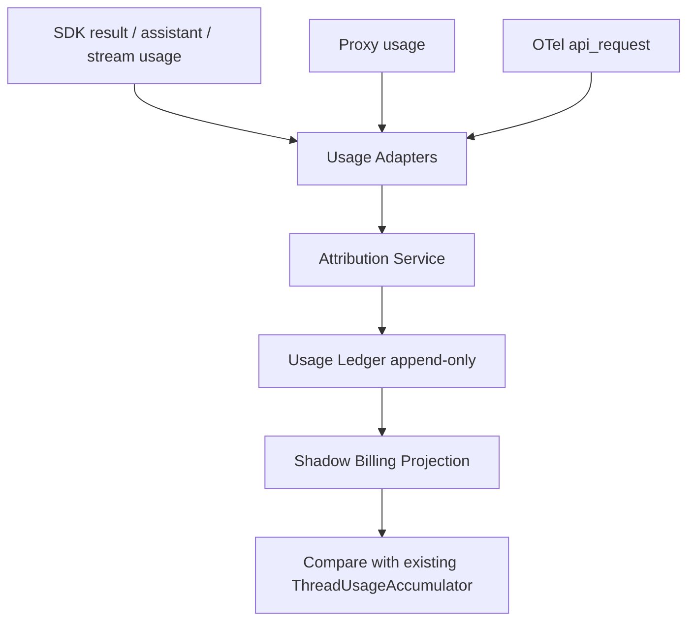

# Agent Billing Refactor Plan

本文档记录 Agent 编排、SubAgent 生命周期、Token 统计、成本归集与结算链路的重构计划。后续实施必须按本文档推进；如需调整顺序，先更新本文档，再改代码。

## 目标

核心目标是把 Agent 编排、Token 统计、成本计算、结算展示从“多处状态累加 + 启发式归因”推进到“统一领域事件 + 可审计投影”。

最终系统必须满足：

- 每一笔 Token 消耗都能追溯到具体来源、请求、模型、运行尝试和 Agent。
- 每一笔成本只能在同一个投影中结算一次。
- SubAgent 父子关系、生命周期、计费归属不能依赖单槽 pending 状态。
- SDK、Proxy、OTel 只能作为观测来源，不能各自成为最终账本。
- UI 展示必须来自投影结果，而不是直接拼接多个来源的临时快照。

## 已完成

第一批 P0 硬化已完成：

- SubAgent `tool_use -> agentId` 从单槽 pending 改成 role-aware 队列。
- SDK PreToolUse attribution 会传递 SubAgent role。
- SDK stream `tool.started` 也会补充 role 作为兜底。
- SubAgent metrics 增加 `agentId + role + requestKey + modelId` 幂等键。
- SubAgent session pending launch 改成按 role 消费，避免 mission/todo 串号。
- 账单 Token 明细展示回归已修复。
- 新增并发归因、跨角色交错启动、重复计费幂等、session pending 消费、runtime hook role 传递测试。

当前验证基线：

- `bun test`: 通过，`650 pass / 14 skip / 0 fail`
- `bun run typecheck`: 仍失败，剩余为项目既有 TypeScript 基线问题；本次新增 ledger、adapter、shadow write 近端类型错误已清理。

第二批 Usage Ledger foundation 已完成：

- 新增 `RunAttempt`、`AgentInstance`、`UsageLedgerEvent`、`UsageAttribution` 领域类型。
- 新增 `InMemoryUsageLedger`，支持 run attempt、agent instance、usage event 的最小闭环。
- 新增 append-only usage event 幂等写入语义，重复 idempotency key 不会重复插入。
- 幂等键不包含 `agentId`，避免同一 usage event 先未归因、后补齐归因时被重复计费。
- 新增 `projectUsageLedger` shadow projection，先支持 total、byRole、byAgent、byModel、unattributed events。
- 在 `ConversationStore` 增加 shadow tables：`thread_run_attempts`、`thread_agent_instances`、`thread_usage_ledger_events`。
- 新增 SQLite store API：`upsertRunAttempt`、`upsertAgentInstance`、`appendUsageLedgerEvent`、对应 list/clear 方法。
- 新增测试覆盖：内存 ledger 幂等、projection 聚合、未归因保留、同源多模型分离、补归因不改幂等键、SQLite 幂等持久化。

当前边界：

- 新 shadow projection 不驱动 UI、不替代旧 `ThreadUsageAccumulator`。
- SQLite 持久化测试在当前运行环境因 `node:sqlite` 不可用被跳过；测试代码已保留，具备 SQLite 的环境会执行。
- 当前 run attempt 还没有接入运行状态机；ledger event 的 `runAttemptId` 暂时为空，必须在 Agent Lifecycle Domain 阶段补齐。

第三批 Usage Ledger adapter + shadow write 已完成：

- 新增 `usage-ledger-adapters`，把已解析的 SDK/Proxy/OTel usage 转为统一 `UsageLedgerEvent`。
- SDK result 支持多模型拆行；仅在单模型或 per-model cost 存在时写 `reportedCostUsd`，避免把 request total 重复复制到每个模型行。
- SDK assistant fallback 以 `assistant_fallback` 记录，保留 `sdkMessageId`、`parentToolUseId`、`requestKey`。
- Proxy usage 记录 `providerRequestId`、source event id、request key、模型和 SubAgent 归因。
- OTel usage 通过旧 `processUsageBilling` 旁路写入 ledger，保留 dedup id 元数据。
- 旁路写入为 best-effort，写账本失败只记录 stderr，不影响旧 accumulator、UI、SubAgent metrics。
- 新增 adapter 测试覆盖：多模型成本不重复、单模型 total cost、补归因幂等、source audit 字段、assistant fallback 身份。

## 不做事项

为了避免半成品，以下事项不得提前散装实现：

- 不直接把 UI 切到新账本，除非 shadow projection 已与旧快照对账。
- 不新增“看起来像账本”但没有幂等、投影、测试的表。
- 不在 `index.ts` 继续堆新的计费分支，除非只是把 raw event 交给新 adapter。
- 不用 role fallback 作为最终结算依据；无法归因时必须显式标记为 unattributed。
- 不把 context occupancy 当作 billing usage。

## 阶段 1：Usage Ledger Shadow Write

目标：新增统一账本的最小闭环，但不改变现有 UI 和结算展示。

要新增的领域实体：

- `RunAttempt`: 一次线程运行尝试，包含 `threadId`、`attemptId`、`phase`、`retryIndex`、`status`、开始/结束时间。
- `AgentInstance`: 一个 Agent 或 SubAgent 实例，包含 `agentId`、`role`、`parentAgentId`、`parentToolUseId`、`runAttemptId`、状态、任务标识。
- `UsageLedgerEvent`: 不可变 Token/成本观测事件，包含 source、source event id、request id、agent id、model id、tokens、reported cost、observed time。
- `UsageAttribution`: 归因结果，成功时指向 `agentId`，失败时必须保存明确原因。

数据流：

验收标准：

- SDK result、Proxy usage、OTel usage 都能写入 ledger。
- 每条 ledger event 有稳定幂等键。
- 重复 event append 不会重复写入。
- 旧 `ThreadUsageAccumulator` 输出不变。
- 新 shadow projection 只记录比较日志或测试断言，不驱动 UI。
- 覆盖测试包含：SDK result 重放、Proxy/OTel 重复来源、SubAgent 明确归因、无法归因记录。

## 阶段 2：Agent Lifecycle Domain

目标：让 Agent 父子关系和生命周期成为一等领域状态。

工作项：

- 建立 `AgentLifecycleService`，统一处理 Agent tool use、SubagentStart、SubagentStop、取消、失败、恢复。
- 用 `parentToolUseId` 和 `parentAgentId` 建立显式父子关系。
- run 结束时统一 finalizer：仍 active 的 SubAgent 必须转为 `abandoned` 或 `stopped`。
- route change、fresh session、clear SDK session 时，session、metrics、context 的清理必须通过统一 lifecycle API。

验收标准：

- 并发同角色 SubAgent 不依赖 activeByRole fallback 完成结算。
- 跨角色交错启动不会串 mission、todo、toolUseId。
- cancel/fail 路径不会留下 active SubAgent。
- 持久化恢复后，Agent 状态与账本投影一致。

## 阶段 3：Billing Projection

目标：最终账单从 ledger 派生，旧 accumulator 退化为兼容层。

工作项：

- 实现 `BillingProjector`：从 ledger 生成 thread total、byRole、byAgent、byModel。
- 实现 source reconciliation：列出 SDK、Proxy、OTel 的差异、重复、缺失、未归因。
- SubAgent metrics 改为 ledger projection，而不是独立累计源。
- UI 在 shadow 对账稳定后切到新 projection。

验收标准：

- 同一 billable request 在同一 projection 中只结算一次。
- 每个 SubAgent 卡片的 Token 和成本来自同一 projection。
- UI 显示的总成本等于账本投影总成本。
- 未归因 Token 不会静默混入 planner 或 role fallback。

## 阶段 4：Retry、Streaming、Compaction

目标：补齐长期反复出现的隐藏逻辑缺口。

工作项：

- retry 必须产生新的 `RunAttempt`，失败尝试和成功尝试可分别审计。
- streaming usage 必须支持 partial/final 状态；中断时记录 partial event 和结算状态。
- compaction 必须写入 `CompactionEvent`，记录 before/after context 和触发来源。
- assistant fallback 的 gating 不能再用 run-level `otelTokenBilled`，必须按 request/source/agent 粒度判断。

验收标准：

- retry 后能解释每次 attempt 的 Token 和成本。
- 流式中断不会静默丢失已观测 usage。
- compaction 前后 context 变化与 billing ledger 可关联但不混用。
- assistant usage fallback 不会因为同一 run 有其他 OTel 事件而漏记 SubAgent。

## 阶段 5：模块拆分

目标：降低 `apps/desktop/src/main/index.ts` 的职责密度。

目标模块：

- `runtime-adapters`: SDK、Proxy、OTel raw event 标准化。
- `agent-lifecycle`: AgentInstance 状态机和父子关系。
- `usage-ledger`: append-only ledger、幂等、持久化。
- `billing-projector`: 账单投影和 reconciliation。
- `context-domain`: context window、compaction event。
- `settlement-service`: run finalization、开放账目结算。

验收标准：

- `index.ts` 只负责 orchestration 和 IPC glue。
- billing、context、lifecycle 不互相直接读写内部状态。
- 关键业务逻辑可以通过单元测试和集成测试覆盖。

## 近期执行顺序

下一批实现按以下顺序推进：

1. 写 shadow projector reconciliation，对比旧 billing snapshot 和 ledger projection。
2. 增加运行时 shadow compare 日志或测试断言，不驱动 UI。
3. 加并发、重复、retry、unattributed 测试。
4. 接入 run attempt/lifecycle 状态机，为 ledger event 补 `runAttemptId`。
5. shadow 对账稳定后，再进入 UI/metrics 切换。

## 每批提交必须满足

- 有明确影响范围说明。
- 有覆盖本批行为的测试。
- `bun test` 必须通过。
- 如果 `bun run typecheck` 仍因既有问题失败，必须说明剩余错误是否与本批改动相关。
- 不允许把未接入、未测试、不可回滚的半成品留在主路径。
