# Billing Proxy-First Ledger Plan

本文档记录「用量明细完全清晰、归属可审计」的三阶段推进计划。目标是把 request 级计费从「多源累加 + 启发式反推 role/model」收敛到 **Proxy 权威 + Ledger 投影 + SDK/OTel 仅校验**。

前置背景与已完成底座见 [`docs/agent-billing-refactor-plan.md`](agent-billing-refactor-plan.md)。该文档中的 Usage Ledger、BillingProjector、Coordinator gate、SubAgent attribution 拆分等已完成批次，是本计划的依赖，不在此重复列举。

## 问题陈述

当前仍会出现「模型 ID 配错角色」或明细来源不一致，根因不是 Proxy 算不准，而是：

1. **展示 primary 仍以 SDK 为主**（`sdk > proxy > otel`），跑完后明细常来自 SDK telemetry。
2. **Proxy 事件标记 `reconciliationOnly`**，与 SDK synthetic primary fill 并存，形成双轨。
3. **`resolveUsageRoute` 用 modelId 反推 role**，会覆盖子代理归属或覆盖 Proxy 已知的 route。
4. **UI 跨 source 合并**（`collectDisplayByRole` / `collectDisplayByModel`），role 与 model 可能来自不同 source。
5. **Ledger drift 时回退 legacy**，错误侧数据可能继续驱动展示。
6. **`/v1/models` 同时暴露 alias 与 upstream id**，SDK 可能选用裸 upstream id，触发多 role 共用 model 的启发式解析。
7. **SubAgent 第一次 HTTP 与 `onSubagentStart` 竞态**，route 已清楚但 agentId 尚未登记。

## 总目标

每一笔 billable usage 必须能唯一回答：

| 维度 | 要求 |
|------|------|
| 哪次请求 | `providerRequestId` / ledger event id / stable `requestKey` |
| 谁用的 | `agentId` + `billingRole`（非事后猜测） |
| 什么模型 | upstream `modelId` + `providerId`（来自 Proxy route，非 SDK 反推） |
| 多少钱 | `computedBilling` + 可选 `reportedCostUsd`（两列分开展示） |

最终状态：

- **Proxy 是 request 级计费的唯一 primary**（有 proxy event 时）。
- **SDK / OTel 只做校验与 reported cost**，不参与 byRole/byModel 归属聚合。
- **UI 只读 Ledger 投影**，不再混拼 legacy accumulator 与多 source 补洞。
- **无法归因进 explicit unattributed 桶**，带 reason，禁止 role fallback 静默结算。

## 已确认优先项（纳入 Phase 1 / 2）

以下两项已与实现对齐讨论，**写入计划、优先落地**：

| 项 | 阶段 | 摘要 |
|----|------|------|
| **`/v1/models` 只返回 alias** | Phase 1（1.0，最先） | 本地 Proxy 已 hook `GET /v1/models`；收紧 `buildModelsListResponse`，不向 SDK 暴露裸 upstream id / 上游 models 列表，减少裸 id 请求。 |
| **Proxy usage pending → `onSubagentStart` 回填** | Phase 2（2.0，优先） | `emitProxyUsage` 立即记 route/token；`agentId` 先 pending；`onSubagentStart` 结算归属；超时进 unattributed。 |

## 不做事项

- 不在 Phase 1–3 中途把 UI 切到 ledger，若 shadow 对账未通过（沿用现有 gate，Phase 3 才改 gate 策略）。
- 不删除 legacy accumulator，直到 Phase 3 验收完成；先降级为 shadow / diagnostics。
- 不用 `resolveUsageRoute` 的 modelId 启发式作为 Proxy 事件的最终 role 依据。
- 不把 context occupancy 计入 billing usage。
- 不回填历史线程 ledger；旧线程继续 legacy / best-effort 展示。
- **`count_tokens` 不计入 billable**（保持本地 stub，不对 SDK 返回硬错误，见边界 B07）。

## 阶段总览

```mermaid
flowchart LR
  subgraph P1 [Phase 1: 信任 Proxy]
    A0["/v1/models 仅 alias"]
    A1[Proxy 跳过 role 重映射]
    A2[primary 优先 proxy]
    A3[去掉 synthetic SDK fill]
    A4[跑完后 display 走 ledger/proxy]
    A5[SDK/OTel 仅校验]
  end
  subgraph P2 [Phase 2: 归属前置]
    B0[pending usage 回填 agentId]
    B1[dispatch 注入 agentId]
    B2[ledger routeRole 等字段]
    B3[归属单一路径]
  end
  subgraph P3 [Phase 3: 展示收敛]
    C1[UI 只读 ledger]
    C2[drift 告警不回退 legacy]
    C3[逐笔 + unattributed 桶]
    C4[legacy 退出展示]
  end
  P1 --> P2 --> P3
```

---

## 计费与归属边界清单

Phase 1–3 完成后，在本表 **「状态」** 列把已消除项标为 `Resolved`，仍存在的标为 `Open` 或 `Accepted`。  
**维护约定：** 每阶段验收时更新此表；不要删除行，只改状态与「解决阶段/备注」。

| ID | 边界 | 现象 / 根因 | 目标 Phase | 状态 | 解决阶段 / 备注 |
|----|------|-------------|------------|------|-----------------|
| **B01** | SDK primary 覆盖 Proxy 明细 | 跑完后 `primarySource=sdk`，明细来自 telemetry | Phase 1 | **Resolved** | 1.2 primary 优先 proxy；1.4 display 收敛 |
| **B02** | `resolveUsageRoute` 改写 Proxy role | Proxy 已知 route，artifact 层用 modelId 反推成别的 role | Phase 1 | **Resolved** | 1.1 Proxy 路径跳过 role 重映射 |
| **B03** | Synthetic SDK primary fill | proxy 用量复制到 sdk source，双轨 primary | Phase 1 | **Resolved** | 1.3 默认停止 synthetic fill；显式请求仍保留 compatibility 写入 |
| **B04** | UI 跨 source 合并 byRole/byModel | primary 与 supplemental 混拼，role/model 来源不一致 | Phase 3 | **Resolved** | 3.1 只读 primary 投影 |
| **B05** | Ledger drift 回退 legacy 展示 | 对账失败时 UI 仍用 legacy，可能更错 | Phase 3 | **Resolved** | 3.2 drift 告警但不回退 ledger |
| **B06** | `/v1/models` 暴露裸 upstream id | SDK 从 models 列表选 `gpt-5.4-mini` 而非 `eco-coder-xxx` | Phase 1 | **Resolved** | **1.0 仅返回 alias** |
| **B07** | `count_tokens` 非 billable | SDK 频繁调 stub，无 upstream 推理费用；与明细无关 | — | **Accepted** | 设计如此：stub 服务 SDK context meter，权威计量来自 `usage.recorded`；不纳入 Phase 1–3 消除目标 |
| **B08** | HTTP 早于 `onSubagentStart` | 第一次 Proxy 用量时 registry 无 active agent → `no_active_subagent` | Phase 2 | **Resolved** | **2.0 pending → onSubagentStart 回填** |
| **B09** | `parent_tool_use` 尚未 link | SDK/OTel 带 `parent_tool_use_id` 但 tool_use→agent 映射未建立 → `parent_tool_use_unmapped` | Phase 2 | **Partial** | 2.0 pending 结算 + 既有 `linkNextPendingForRole`；极端 race 仍可能短暂 pending |
| **B10** | 同 role 并发 SubAgent | 共用 `eco-coder-xxx` alias，Proxy 无法靠 model 区分 agent_a / agent_b | Phase 2 | **Partial** | 2.0 FIFO pending 按 role 消费；agent 级靠启动顺序 |
| **B11** | 多 role 共用 upstream + 裸 id 请求 | `resolveProxyRoute` 对裸 id 按 explore>coder 优先级猜测 | Phase 1 | **Resolved** | **1.0 仅 alias** 消除主路径；非 Proxy 路径见 B14 |
| **B12** | SDK/OTel 与 Proxy token 不一致 | 平行观测管道，model/role 字段不可靠 | Phase 1 | **Resolved** | 1.5 projector 去重；校验差异仍可在 diagnostics 看到 |
| **B13** | Eco 估算 vs reported 两套价 | `computedBilling` 与 `reportedCostUsd` 可不同 | Phase 3 | **Open** | 3.5 双列展示；**Accepted** 为业务上永远可并存，仅要求 UI 不混为一列 |
| **B14** | `buildDriverRoutesFromRuntime` 裸 upstream id | `ensureContextHeadroom` 等路径不用 alias | — | **Open** | Phase 1–3 不强制；若该路径经 Proxy 发 LLM 仍可能触发 B11 |
| **B15** | 跑途中修改 Agent Profile / route | 同一 thread 前后 route 不一致，历史 event 与当前配置混淆 | — | **Open** | 超出 Phase 1–3；见文末「后续」 |
| **B16** | SDK 内置 model id 未在 Eco 配置 | Proxy `route-miss` → 400，请求不发 | — | **Accepted** | 显式失败，不静默归因；非明细错乱 |
| **B17** | 无 Proxy 的 LLM 调用（配置错误） | baseUrl 未指向本地 Proxy | — | **Open** | 依赖配置；仅 OTel/SDK 观测 → unattributed / diagnostic |
| **B18** | 历史线程无 ledger | 旧数据 legacy / best-effort | — | **Accepted** | 不回填；新线程走新路径 |

### 边界状态图例

| 状态 | 含义 |
|------|------|
| **Open** | Phase 1–3 计划消除或缓解，尚未验收 |
| **Resolved** | 对应 Phase 工作项已验收，边界在主线场景不再出现 |
| **Accepted** | 已知限制或产品定义，不追求「消除」，只要求行为可解释 |

---

## Phase 1：信任 Proxy（primary 与 role 不再被 SDK 覆盖）

**状态：** Done（2026-06-11；billing 相关测试全通过；git workspace 测试与 Phase 1 无关）

**目标：** 有 Proxy 观测时，计费归属与模型配对以 Proxy 为准；SDK 不再「抢 primary」或改写 Proxy 已确定的 role/model。

**预期收益：** 运行中与跑完后的 byRole/byModel 一致；消除「Proxy 对了但明细显示 SDK 猜错」的主路径；消除裸 upstream id 选路（B06、B11 主路径）。

### 工作项

#### 1.0 `/v1/models` 只返回 eco alias（已确认优先）

- [x] 修改 `buildModelsListResponse`：**仅** push 各 route 的 `aliasModelId`（display_name 仍可含 upstream 可读信息）。
- [x] **不再** push `route.modelId`（裸 upstream id）到 models 列表。
- [x] **不再**合并 `loadUpstreamModelsForRoutes` 拉取的上游 provider models（或仅用于 Eco 设置页，不进 SDK 可见列表）。
- [x] 新增测试：`GET /v1/models` 响应 ids 仅为 `eco-{role}-*` 形式；不含与多 role 共用的裸 upstream id。
- [x] 回归：SDK run 仍能通过 alias 正常解析 route；`resolveProxyRoute(alias)` 不变。
- [x] 验收边界：**B06** → Resolved；**B11** 主路径 → Resolved（裸 id 请求在正常运行中应消失）。
- [ ] 相关文件：
  - `apps/desktop/src/main/anthropic-proxy.ts`（`buildModelsListResponse`、models list handler）
  - `apps/desktop/test/anthropic-proxy.test.ts`

#### 1.1 Proxy 路径跳过 `resolveUsageRoute` 改 role

- [x] 在 `resolveSingleUsageBillingArtifacts`（或等价入口）中，当 `source === "proxy"` 时：
  - `billingRole` 直接使用输入 role（已由 `resolveProxyUsageBilling` / 子代理归因确定）。
  - `resolvedModelId` 直接使用 Proxy 上报的 upstream `modelId`。
  - 仍用 **该 role 的 route** 查价（`routes.find(r => r.role === billingRole)`），但**不用 modelId 反推另一个 role**。
- [x] 新增测试：Proxy event 为 `billingRole=reviewer` + `modelId=haiku(coder route)` 时，ledger 仍记 reviewer，不被改回 coder。
- [x] 验收边界：**B02** → Resolved。
- [ ] 相关文件：
  - `apps/desktop/src/main/usage-billing-artifacts.ts`
  - `apps/desktop/test/usage-billing-artifacts.test.ts`
  - `apps/desktop/test/proxy-usage-billing.test.ts`

#### 1.2 调整 primary source 优先级

- [x] `billing-projector.ts` / `thread-usage-accumulator.ts` 中的 `BILLING_SOURCE_PRIORITY` 改为可配置；**有 proxy billable events 时**使用 `["proxy", "sdk", "otel"]`。
- [x] `projectBillingFromUsageLedger` 的 `primarySourcePriority` 与 legacy accumulator 对齐。
- [x] 新增测试：仅有 proxy events 时 `primarySource === "proxy"`；proxy + sdk 并存且 token 对齐时 primary 仍为 proxy。
- [x] 验收边界：**B01** → Resolved。
- [ ] 相关文件：
  - `apps/desktop/src/main/billing-projector.ts`
  - `apps/desktop/src/main/thread-usage-accumulator.ts`
  - `apps/desktop/test/billing-projector.test.ts`

#### 1.3 移除 synthetic SDK primary fill

- [x] 在 Proxy 覆盖完整的 SubAgent 路径上，停止调用 `resolveSyntheticSdkPrimaryFill` / `recordLegacySingleUsageBilling` 的 SDK 复制写入。
- [x] 保留 `resolveSyntheticSdkPrimaryFill` 与 reason 枚举，改为 **diag-only** 或 feature flag 关闭，便于回滚。
- [x] 确认 `hasMatchingAuthoritativeUsage` 已阻止重复 assistant fallback；补测试覆盖「有 proxy observation 时不写 synthetic sdk」。
- [x] 验收边界：**B03** → Resolved。
- [ ] 相关文件：
  - `apps/desktop/src/main/usage-legacy-billing.ts`
  - `apps/desktop/src/main/usage-billing-effects.ts`
  - `apps/desktop/test/usage-legacy-billing.test.ts`

#### 1.4 跑完后 display 也走 Proxy / Ledger

- [x] 扩展 `resolveBillingDisplaySource`：线程非 running 时，若 ledger/proxy projection 可用且对账通过，仍选 proxy（或 ledger 投影的 primary）。
- [x] 移除 `shouldUseProxyBillingDisplay` 仅 running/queued 的限制，或改为「有 verified proxy projection 即可」。
- [ ] `enrichBillingDisplaySource` 不再从 supplemental source 补 byRole 当 primary 已有完整 proxy 数据（见 Phase 3 彻底移除；Phase 1 可先收紧条件）。
- [ ] 相关文件：
  - `apps/desktop/src/shared/billing-display-source.ts`
  - `apps/desktop/test/billing-display-source.test.ts`
  - `apps/desktop/src/renderer/UsageBreakdownPanel.tsx`（验证行为，尽量少改）

#### 1.5 SDK / OTel 写入降级为校验

- [x] SDK assistant fallback / OTel single usage：若已有 matching proxy observation（同 role/agent/token 指纹），ledger event 标记为 `usageKind` 校验用途或写入 metadata `validationOnly: true`，**不进入 billable projection 聚合**。
- [x] 或在 projector 层过滤：同 `requestKey` / `providerRequestId` 已有 proxy final 时，跳过 sdk/otel 行的 byRole/byModel 累加。
- [x] 验收边界：**B12** → Resolved（billable 路径）；校验差异仍可在 diagnostics 看到。
- [ ] 相关文件：
  - `apps/desktop/src/main/billing-projector.ts`
  - `apps/desktop/src/main/billing-orchestration.ts`
  - `apps/desktop/test/billing-projector-reconciliation.test.ts`

### Phase 1 验收标准

- [ ] 典型多 SubAgent 场景（planner + coder + explore）：跑完后 byRole 的 modelId 与 Proxy route 一致，无 planner model 误挂到子代理。（需手动 E2E 验收）
- [x] `primarySource` 在有 proxy events 时为 `proxy`；`sourceBreakdown.sdk` 不再因 synthetic fill 虚增。
- [x] `GET /v1/models` 不暴露裸 upstream id（1.0）。
- [x] `bun test` billing 相关全通过；新增/更新测试覆盖 1.0–1.5。
- [ ] Shadow reconciliation：proxy-primary 路径 `projectionReconciliation` 无新增 error 级 issue。（需手动 E2E 验收）
- [x] 更新边界表：B01、B02、B03、B06、B11（主路径）、B12 标为 **Resolved**（若未达成则保持 Open 并 blocking Phase 2）。

### Phase 1 建议 PR 顺序

1. **1.0 `/v1/models` 仅 alias**（已确认，最先）
2. 1.1 Proxy 跳过 role 重映射
3. 1.2 primary 优先级
4. 1.3 去掉 synthetic SDK fill
5. 1.4 display source
6. 1.5 SDK/OTel 校验降级

---

## Phase 2：归属前置（agentId 与 route 在账本中对齐）

**状态：** Done（2026-06-11；2.0–2.4 核心已落地；2.2 dispatch stamp、2.5 动态 alias 未做）

**目标：** 在 Proxy 发出请求时或紧随其后，将 **agentId** 与 **route** 绑定；消除 HTTP ↔ `onSubagentStart` 竞态及并发同 role 歧义（在可达成范围内）。

**依赖：** Phase 1 完成（尤其 1.0 alias、1.1 Proxy 不重映射 role）。

### 工作项

#### 2.0 Proxy usage pending → `onSubagentStart` 回填（已确认优先）

**原则：** Token/费用 **立即入账**（HTTP 已完成）；**agentId** 可 pending，不可丢账。

- [x] `emitProxyUsage` / ledger adapter：SubAgent 路径下若 `resolveSubagentUsageAttribution` 无 `agentId`，写入 `attribution.status = "pending"`（或等价 metadata），并记录 `routeRole`、`requestKey`、`providerRequestId`、token、modelId。
- [x] 新增 **pending 队列**（按 threadId）：待结算的 proxy ledger event id / requestKey 列表；**不**阻塞 `processUsageBilling` 写 token。
- [x] `onSubagentStart`（`SubagentMetricsRegistry` / `subagent-session-hooks`）：按 **role + 时间序**（及已有 `linkNextPendingForRole` 的 parent tool_use）匹配 pending 事件，回填 `agentId`，将 attribution 改为 `attributed`。
- [x] 同 role **并发** pending：优先消费 **最早 unmatched pending** + `parentToolUseId` 映射（与 `SubagentToolUseIndex` 一致）；无法匹配则保留 pending 直至 stop 或 run 结束。
- [x] Run 结束 finalizer：仍未回填的 pending → `unattributed` + reason `pending_agent_settlement_timeout`（或细分 reason）。
- [ ] SDK/OTel 路径上 **`parent_tool_use_unmapped`**：若 proxy pending 已存在同 token 指纹，优先合并到 proxy 行，不重复记 billable。
- [x] 新增测试：① 模拟 usage 先于 `onSubagentStart` → pending → start 后 attributed；② 双 coder 并发 → 各背各 agentId；③ run 结束仍未 start → unattributed。
- [x] 验收边界：**B08** → Resolved；**B09** → Partial（视并发测试而定）。
- [ ] 相关文件：
  - `apps/desktop/src/main/proxy-usage-billing.ts`
  - `apps/desktop/src/main/usage-billing-effects.ts`
  - `apps/desktop/src/main/usage-ledger-adapters.ts`
  - `apps/desktop/src/main/subagent-metrics-registry.ts`
  - `apps/desktop/src/main/subagent-session-hooks.ts`
  - `apps/desktop/test/proxy-usage-billing.test.ts`
  - `apps/desktop/test/subagent-metrics-registry.test.ts`

#### 2.1 扩展 UsageLedgerEvent 归属字段

- [x] 在 `UsageLedgerEvent` metadata 增加：`routeRole`、`billingRole`、`aliasModelId`、`providerId`（forward-compatible，无强制 SQLite 新列）。
- [x] `usage-ledger-adapters` / `buildSingleUsageLedgerEvent` 写入上述字段；旧事件缺字段时 projector 回退现有逻辑。
- [x] `usage-ledger-view.ts` + IPC `thread:usage-ledger-events-list` 暴露逐笔视图。
- [ ] 相关文件：
  - `apps/desktop/src/main/usage-ledger.ts`
  - `apps/desktop/src/main/usage-ledger-adapters.ts`
  - `apps/desktop/src/main/conversation-store.ts`
  - `apps/desktop/test/billing-projector.test.ts`

#### 2.2 Dispatch 时注入 agentId / billingRole（stamp）

- [x] `ProxyBillingStampRegistry`：`onSubagentStart` 注册 stamp，`onSubagentStop` / run 结束清除。
- [x] 支持 `x-eco-agent-id` 等请求头（Proxy 入站读取）；`emitProxyUsage` 优先 stamp，缺失时 fallback registry + pending。
- [x] `buildProxyUsageRequestKey` 文档化：key 含 `routeRole`；billing 聚合用 `billingRole`（metadata）。
- [ ] 相关文件：
  - `apps/desktop/src/main/proxy-usage-billing.ts`
  - `apps/desktop/src/main/anthropic-proxy.ts`
  - `apps/desktop/src/main/bridge-upstream.ts`
  - `apps/desktop/test/proxy-usage-billing.test.ts`

#### 2.3 子代理归属单一路径

- [x] 统一 Proxy 与 SDK run 的归属入口：`subagent-usage-attribution` 接受 `stampedAgentId` / `stampedBillingRole` / `explicitSubagentId`。
- [x] `resolveSdkRunBillingAttribution` 改为调用 `resolveSubagentUsageAttribution`。
- [x] Planner proxy 请求不做 SubAgent fallback（保持现有行为）。
- [ ] 相关文件：
  - `apps/desktop/src/main/subagent-usage-attribution.ts`
  - `apps/desktop/src/main/sdk-run-billing-attribution.ts`

#### 2.4 byModel 聚合改用 routeRole

- [x] `billing-projector`：`byModel.roles[]` 来自 `routeRole`（缺省 `billingRole`）。
- [x] `roleModelIds` 仅在 event 有 `agentId` 时更新（避免无归属 event 覆盖）。
- [ ] 相关文件：
  - `apps/desktop/src/main/billing-projector.ts`
  - `apps/desktop/src/shared/billing-token-breakdown.ts`

#### 2.5 可选增强：agentId 动态 alias（未确认，不 blocking）

- [ ] 若 2.0 + 2.2 仍无法稳定区分极高并发同 role：评估 `onSubagentStart` 注册 `eco-{role}-{shortAgentId}` 动态 route。
- [ ] 依赖 SDK 是否能在 SubAgent 侧使用 per-instance model 字符串；**未确认前不实施**。
- [ ] 若实施可缓解 **B10** 至 Resolved；否则 B10 可能仍为 **Partial**（role 级合计正确，agent 级靠 pending 顺序）。

### Phase 2 验收标准

- [ ] 单次 SubAgent：第一次 HTTP 在 `onSubagentStart` 前到达 → pending → 启动后 agentId 正确（B08）。
- [ ] 双 coder 并发：两 agent 卡片 token 与 ledger byAgent 一致，无交叉（B10 至少 Partial）。
- [ ] parent tool_use 在 link 前到达的 SDK 行：不重复 billable，或与 proxy pending 合并（B09）。
- [ ] SQLite 持久化 + 重启后 attribution 不变。
- [ ] 更新边界表：B08、B09 标 Resolved；B10 标 Resolved 或 Partial。

### Phase 2 建议 PR 顺序

1. **2.0 pending → onSubagentStart 回填**（已确认，最先）
2. 2.1 schema 扩展（可与 2.0 同 PR 或紧跟）
3. 2.2 dispatch stamp
4. 2.3 归属单一路径
5. 2.4 byModel / roleModelIds
6. 2.5 动态 alias（可选）

---

## Phase 3：展示收敛（UI = Ledger，drift 可见但不回退）

**状态：** Done（3.1–3.5 已落地；E2E 手动验收待跑）

**目标：** 用户看到的用量明细与账本投影一致；legacy 仅 shadow；对账失败显式告警；未解决边界在 UI 可见。

**依赖：** Phase 1–2 完成；`UsageLedgerCoordinator.resolveBillingSnapshot` gate 在主要场景稳定通过。

### 工作项

#### 3.1 UI 只读 Ledger 投影

- [x] `usage-billing-effects` / `usage_updated` 默认 `useLedgerProjection: true`（已有 policy）。
- [x] `buildBillingTokenBreakdown` 移除跨 source 补洞，只读 primary `byRole`/`byModel`。
- [x] `ThreadInfoPanel` 展示 ledger 归因 diagnostics（pending/unattributed）；`UsageBreakdownPanel` 支持「待归属」标签。
- [x] 验收边界：**B04** → Resolved。
- [ ] 相关文件：
  - `apps/desktop/src/shared/billing-token-breakdown.ts`
  - `apps/desktop/src/renderer/UsageBreakdownPanel.tsx`
  - `apps/desktop/src/renderer/ThreadInfoPanel.tsx`

#### 3.2 改 drift gate：告警但不回退 legacy

- [x] 对账失败时仍返回 ledger snapshot + diagnostics；legacy 仅 shadow compare。
- [x] 验收边界：**B05** → Resolved。
- [ ] 相关文件：
  - `apps/desktop/src/main/usage-ledger-coordinator.ts`
  - `apps/desktop/test/usage-ledger-coordinator.test.ts`

#### 3.3 逐笔明细与 unattributed 桶

- [x] IPC：`thread:usage-ledger-events-list` 含 routeRole、billingRole、agentId、attribution reason、pending 状态。
- [x] UI：`UsageBreakdownPanel`「逐笔」默认仅主账（Proxy）事件，底部合计与顶部一致；SDK/OTel 折叠在「校验源」。
- [x] **Open 边界**（B14–B17）在 diagnostic 面板可读说明（`billing-open-boundaries.ts`）。

#### 3.4 Legacy accumulator 退出展示路径

- [x] Legacy 仅 shadow；normal path `recordSdkUsage` recordCount = 0（`subagent-legacy-metrics-fallback-effects`）。
- [x] `threadGetUsageSnapshot` 经 `resolveBillingSnapshot` 展示，不再裸读 legacy accumulator。

#### 3.5 成本双列展示（推荐）

- [x] `ecoCostUsd` 与 `reportedCostUsd` 分列（模型视图 + `BillingSourceRows`）；无 reported 不显示 0。
- [x] 验收边界：**B13** → **Accepted**（双列可解释，不追求数值合一）。

### Phase 3 验收标准

- [ ] UI 总 token / 成本 = ledger = 逐笔之和（ attributed 部分）。
- [ ] unattributed / pending 在 UI 可见，与边界表一致。
- [ ] 更新边界表：B04、B05、B13（Accepted）；复查 B10、B14–B17 状态。

### Phase 3 建议 PR 顺序

1. 3.2 drift gate
2. 3.1 UI ledger-only
3. 3.3 逐笔 + unattributed
4. 3.4 legacy 退出展示
5. 3.5 成本双列

---

## 跨阶段测试矩阵

| 场景 | Phase 1 | Phase 2 | Phase 3 |
|------|---------|---------|---------|
| planner + coder 不同 model，SDK 报 planner model | primary=proxy | pending/stamp | 逐笔可核对 |
| 同 role 并发两 SubAgent | 不重复计费 | 2.0 回填 agentId | 两 agent 行明细 |
| SDK 只见到 alias models 列表 | **1.0** | — | — |
| 第一次 HTTP 早于 onSubagentStart | — | **2.0 pending→回填** | pending 行可见 |
| explore 用 haiku，SDK role=planner | resolveUsageRoute 不覆盖 proxy | routeRole=explore | byModel 正确 |
| Proxy 有、SDK 无 | proxy primary | — | 仅 proxy 行 |
| SDK 有、Proxy 无（异常） | diagnostic | reason | 未归属桶 |
| retry 两次 attempt | 两次 proxy 事件 | runAttemptId | 按 attempt 筛 |

---

## 进度跟踪

| 阶段 | 状态 | 开始日期 | 完成日期 | 备注 |
|------|------|----------|----------|------|
| Phase 1 | Done | | | 1.0–1.5 + B01/B02/B03/B06/B11/B12 |
| Phase 2 | Done | | | 2.0–2.4；2.5 动态 alias 未做 |
| Phase 3 | Done | | | 3.1–3.5；E2E 待跑 |
| 边界清单 | B04/B05/B08/B11/B12/B13 Resolved/Accepted | | | B09/B10 Partial；B14–B17 Open/Accepted |

## 每批提交检查清单

- [ ] 只改本阶段工作项，不扩散到无关 refactor。
- [ ] 新增/更新测试覆盖本批行为。
- [ ] `bun test` 通过。
- [ ] Shadow reconciliation 无新增未预期 error（或已在 PR 说明中解释）。
- [ ] 若改变 UI 默认展示，在 PR 说明中附 before/after 截图或 token 明细样例。
- [ ] 更新本文档：**工作项 checkbox**、**进度表**、**边界清单状态**。

## 相关代码索引

| 主题 | 主要文件 |
|------|----------|
| Proxy 计费入口 | `apps/desktop/src/main/proxy-usage-billing.ts`, `emitProxyUsage` in `index.ts` |
| `/v1/models` | `apps/desktop/src/main/anthropic-proxy.ts`（`buildModelsListResponse`） |
| 单次计费 artifact | `apps/desktop/src/main/usage-billing-artifacts.ts` |
| Role/model 启发式 | `apps/desktop/src/main/billing-resolver.ts` |
| Ledger 投影 | `apps/desktop/src/main/billing-projector.ts` |
| 快照选择 gate | `apps/desktop/src/main/usage-ledger-coordinator.ts` |
| 展示 source | `apps/desktop/src/shared/billing-display-source.ts` |
| 明细 UI | `apps/desktop/src/shared/billing-token-breakdown.ts`, `UsageBreakdownPanel.tsx` |
| SubAgent start / pending | `subagent-session-hooks.ts`, `subagent-metrics-registry.ts`, `subagent-tool-use-index.ts` |
| Legacy 兼容 | `usage-legacy-billing.ts`, `thread-usage-accumulator.ts` |

## 后续（超出 Phase 1–3，边界表 B15 等）

- Provider 账单 API 对齐 → 第三列「vendor reported」。
- Run 中途切换 Agent Profile → request 级 route 快照（B15）。
- agentId 动态 alias（B10 完全消除，见 2.5）。
- `buildDriverRoutesFromRuntime` 全路径改 alias（B14）。
- 导出 CSV / 审计报告（按 ledger event 扁平化）。

---

**维护约定：** 实现某工作项时勾选 checkbox；阶段完成时更新进度表并 **逐条更新边界清单「状态」列**（Resolved / Open / Accepted / Partial）。若范围变更，先改本文档再改代码。
