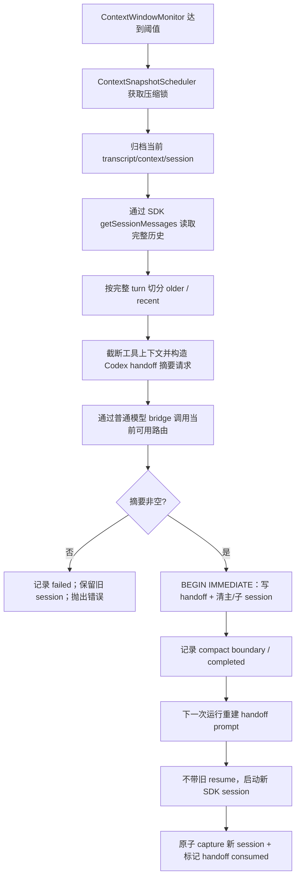

# Eco 跨平台上下文压缩调研与实现方案

> 调研与实现日期：2026-07-10
> 目标：让 Eco 在 Anthropic、OpenAI、OpenAI-compatible、llama.cpp 等不同上游之间保持一致、可审计、明确失败的上下文压缩语义，不把正确性建立在某个 provider 的可选端点或 Claude Agent SDK 的内部压缩事件上。

## 1. 结论摘要

### 1.1 Claude Agent SDK 的压缩不是单纯的“云端压缩”

当前项目安装的是：

- `@anthropic-ai/claude-agent-sdk@0.3.205`
- 包内声明的 Claude Code 版本：`2.1.205`
- 调研时 npm `latest`：`0.3.206`

Agent SDK 实际启动 Claude Code 本地进程。根据官方 Agent Loop 文档、已安装类型和二进制证据，Claude Code 本地负责：

1. 计算/维护会话上下文占用和自动压缩阈值；
2. 决定何时自动压缩；
3. 触发 `PreCompact` / `PostCompact`；
4. 产生 `compact_boundary`；
5. 保存、读取和重连本地 JSONL transcript；
6. 用压缩摘要替换或重连旧历史。

但摘要不是本地无模型算法生成的。摘要生成仍需要一次模型推理，会经过当前配置的模型 API/代理。因此更准确的描述是：

> **Claude Code 本地进程编排压缩生命周期，上游模型完成摘要推理。**

这和 Anthropic Messages API 的 server-side compaction 不是同一个功能。

### 1.2 Anthropic server-side compaction 是另一套远端协议

Anthropic Messages API 支持 `context_management.edits` 中的 `compact_20260112`。达到触发条件后，服务端生成 `compaction` 内容块；调用方必须把返回内容继续带入下一次请求。

它属于 provider-specific API 能力，不等于 Claude Agent SDK 本地 transcript 压缩，也不能假设 OpenAI-compatible 或其他 Anthropic-compatible 服务实现了相同 beta 协议。

### 1.3 不应把跨平台语义压缩完全放进 HTTP 网关

网关适合做：

- 协议转换；
- provider 能力适配；
- `count_tokens` 本地估算或原生 tokenizer adapter；
- 剥离不允许下发的 provider-specific compaction 指令；
- 工具结果清理等无状态/弱状态 request rewrite。

但完整语义压缩还需要：

- 线程原始任务；
- SDK session 和 transcript；
- 完整 user/assistant/tool turn 边界；
- handoff 持久化；
- session 清理和 resume 切换；
- 排队 follow-up 的时序；
- archive、ledger 和失败审计。

这些状态不属于普通 HTTP 转发层。因此最终职责划分是：

> **Eco 应用/会话层统一控制语义压缩；desktop gateway 负责协议约束和可选能力适配。**

不是“Anthropic 一套、OpenAI 一套、llama.cpp 一套”的 provider 分支状态机。

### 1.4 最终实现决策

1. 设置 Claude Agent SDK `autoCompactEnabled: false`；
2. scheduler 不再调用 SDK `/compact`，也不探测 slash command；
3. 所有 provider 统一通过普通模型请求生成 Eco 结构化摘要；
4. provider 原生 count/compact 只作为未来可选优化，不作为正确性依赖；
5. desktop gateway 删除 `compact_20260112` / `compaction` 指令，避免 SDK 或上游再次接管语义压缩；
6. 保留 `clear_tool_uses_20250919`，因为它是工具输出清理，不是对整段语义历史生成摘要；
7. 摘要失败、历史读取失败、路由缺失、摘要为空/结构不完整、无可压缩历史时明确失败；
8. 不生成 deterministic fallback 摘要，不在失败后清理 SDK session；
9. handoff 写入、主 session 清理和子代理 session 清理必须在同一个 SQLite `BEGIN IMMEDIATE` 事务中完成，并用 source session 条件更新阻止过期摘要提交；
10. 压缩后的下一次运行不得恢复旧 session，必须使用原任务 + 摘要 + 保留的近期完整 turn + 当前 follow-up 启动新 session；
11. 摘要请求只发送普通推理所需的 `model`、`max_tokens`、`system`、`messages`，不附加可选的 `thinking` / `temperature`，减少第三方兼容平台对非必要字段的协议要求；
12. 读取 compact handoff 时，JSON 损坏、非数组、条目结构无效、空摘要、版本/代际、token 来源或压缩比例损坏均明确失败，不能把损坏状态静默转换成空近期历史；
13. rolling summary 持久化 `summaryId/schemaVersion/generation/sourceSessionId/sourceStartMessageId/sourceEndMessageId/targetSessionId/consumedAt`，只在当前 session 与上一代 target session 一致时合并上一代摘要；
14. 摘要请求超摘要模型窗口时，按 Codex 方式从 older 最旧消息逐条丢弃直到单次请求可塞入，再只发一次摘要；失败（仍放不下、摘要无效等）不提交 handoff；
15. Provider token counter 使用显式配置模式，不根据 `apiCompat` 猜测；用户选择精确模式后，上游失败直接报错，不静默降级成本地 heuristic。

---

## 2. Claude Agent SDK 调研

## 2.1 官方文档能确认什么

Claude Agent SDK 的 Agent Loop 文档把自动上下文压缩列为 SDK/agent loop 的内建处理；Hooks 文档定义了 `PreCompact`，当前已安装 SDK 还提供 `PostCompact`。

当前安装包类型中存在：

- `Settings.autoCompactEnabled?: boolean`
- `Settings.autoCompactWindow?: number`
- `Query.getContextUsage()`
- `PreCompactHookInput`
- `PostCompactHookInput.compact_summary`
- `SDKCompactBoundaryMessage`
- `compact_metadata.trigger/pre_tokens/post_tokens`
- preserved segment/message relink 信息

本地包证据：

- `node_modules/@anthropic-ai/claude-agent-sdk/package.json`
- `node_modules/@anthropic-ai/claude-agent-sdk/manifest.json`
- `node_modules/@anthropic-ai/claude-agent-sdk/sdk.d.ts`
- `node_modules/.bun/@anthropic-ai+claude-agent-sdk-darwin-arm64@0.3.205/.../claude`

Claude Code 二进制中还存在以下明确字符串/实现标记：

- `Compacting conversation`
- `executePreCompactHooks`
- `executePostCompactHooks`
- `isCompactSummary`
- `compact_boundary`
- `autoCompactEnabled`
- `autoCompactWindow`

已安装 `sdk.mjs` 的 session loader 会读取 JSONL，识别 `compact_boundary`，并根据 `preservedMessages` / `preservedSegment` 重连历史。这证明 transcript 的压缩边界、持久化和恢复不是一个纯远端黑盒。

## 2.2 本地编排和远端推理的边界

本地 Claude Code 可以决定“什么时候压缩”和“压缩后 transcript 如何替换”，但无法在没有模型的情况下生成高质量语义摘要。摘要请求仍会使用当前模型路由，因此第三方平台至少需要支持普通推理请求。

风险在于：

- Agent SDK 内部摘要请求形态和时序由 Claude Code 版本控制；
- 第三方 Anthropic-compatible 服务可能只兼容 `/v1/messages` 主路径；
- 不一定兼容 `/count_tokens`、beta header、`context_management`、server-side compaction；
- SDK 版本升级后内部压缩协议可能变化；
- Eco 无法可靠控制摘要 schema、保留 turn、失败后是否继续、审计数据和 session 切换。

因此本项目关闭 SDK auto compact，但保留对意外 `compacting` / `compact_boundary` 事件的解析，作为旧 session 或异常行为诊断，不再把它作为主流程控制信号。

## 2.3 与 Anthropic server-side compaction 的区别

| 维度 | Claude Agent SDK / Claude Code 会话压缩 | Anthropic server-side compaction |
|---|---|---|
| 触发编排 | 本地 Claude Code | Anthropic Messages API 服务端 |
| 摘要推理 | 经配置的上游模型 | Anthropic 服务端 |
| 历史载体 | Claude Code JSONL/session graph | Messages API request/response items |
| 生命周期事件 | `PreCompact`、`PostCompact`、`compact_boundary` | response 中的 `compaction` block/context management 元数据 |
| 第三方兼容性 | 普通推理通常可桥接，但内部请求不稳定 | 必须明确实现 Anthropic beta compaction 协议 |
| Eco 可控性 | 关闭后可由 Eco 接管 | 不采用，网关剥离语义压缩 edit |

---

## 3. Provider 能力矩阵

以下矩阵描述的是“官方当前能力”，不是对任意兼容平台的承诺。

| 平台 | Token count | 原生 semantic compact | Eco 结论 |
|---|---|---|---|
| Anthropic Messages | `POST /v1/messages/count_tokens` | `context_management.edits: compact_20260112` | 两者均为可选原生能力；Eco 不依赖原生 compact |
| OpenAI Responses | `POST /v1/responses/input_tokens` | 自动 `context_management`；独立 `POST /v1/responses/compact` | compact item 是 OpenAI Responses 专用 opaque/encrypted item，不作为跨平台历史格式 |
| llama.cpp server | `POST /tokenize`；`POST /v1/messages/count_tokens`；`POST /v1/responses/input_tokens`；`POST /v1/chat/completions/input_tokens` | 当前 server README 未记录 semantic compact endpoint | 新版本已有多种 token count，但不能据此推导其他第三方也有，更不能推导支持 compact |
| 一般 Anthropic-compatible | 不保证 | 不保证 | 网关本地估算，语义压缩走普通模型请求 |
| 一般 OpenAI-compatible | 不保证 Responses input token count | 不保证 `/responses/compact` | “OpenAI-compatible”不能等价为“完整 Responses/compact compatible” |

### 3.1 对 llama.cpp 的修正

“llama.cpp 肯定没有 `count_tokens`”对当前 master 已经不成立。

调研 commit `8f114a9b573b69035299f9b924047f53c1e22c7e` 的 server README 明确记录：

- `POST /tokenize`
- `POST /apply-template`
- `POST /v1/messages/count_tokens`
- `POST /v1/responses/input_tokens`
- `POST /v1/chat/completions/input_tokens`

但这只是当前 llama.cpp server 的能力。历史版本、不同构建、二次封装和其他本地服务仍可能没有这些端点。README 也没有记录与 Anthropic/OpenAI 等价的 semantic compact endpoint。

### 3.2 为什么不直接透传原生 compact

不同 provider 的 compact 结果不是统一数据模型：

- Anthropic 返回 `compaction` 内容块；
- OpenAI 返回 opaque/encrypted compaction item；
- 第三方可能忽略、拒绝或错误解释这些字段；
- provider-specific item 无法直接进入另一平台的 messages 历史；
- 一旦切换 provider，旧 compact item 可能无法复用。

Eco 需要的是 provider-neutral、可查看、可校验、可持久化的 handoff，而不是把某个平台的 opaque 状态当成跨平台真相。

---

## 4. 开源实现参考

## 4.1 Codex

2026-07-10 最后复核的 GitHub HEAD：`6ad0e943cc727dc836d7c671f3377db30107f4d9`。先前调研 commit `1f0566d3f59298d1bb88820a0d35294f1eeb07ea` 的“两条路径”结论仍成立；当前主干还包含 remote compaction v2、previous-model retry 和 feature-gated token-budget compaction。本文源码链接固定到该 commit，避免 HEAD 后续变化导致结论不可复现。

关键源码：

- `codex-rs/core/src/tasks/compact.rs`
- `codex-rs/core/src/compact.rs`
- `codex-rs/core/src/compact_remote.rs`
- `codex-rs/core/src/compact_remote_request.rs`
- `codex-rs/core/src/compact_remote_v2.rs`
- `codex-rs/core/src/compact_token_budget.rs`
- `codex-rs/core/src/client.rs`
- `codex-rs/model-provider-info/src/lib.rs`
- `codex-rs/prompts/templates/compact/prompt.md`
- `codex-rs/prompts/templates/compact/summary_prefix.md`

### 4.1.1 Codex 不是全部服务端压缩

`CompactTask` 明确按 provider 分流：

1. `supports_remote_compaction() == true`：走 Responses remote compact；
2. 否则：走 `compact.rs` 的普通模型摘要路径；
3. feature-gated `TokenBudget` 模式：不请求模型或 compact endpoint，直接启动新的 context window；这不是语义 handoff 摘要，不适合直接作为 Eco 的默认方案。

当前 `supports_remote_compaction()` 只对 OpenAI provider 或 Azure Responses provider 返回 true。它不是根据“OpenAI-compatible”字符串或 wire API 猜测，因此一般第三方 provider 会进入本地普通模型摘要路径。

远端路径会构造当前历史、instructions、tools 等请求，并调用 `/responses/compact`；remote v2 则期望返回单个 compaction output item。返回的 replacement history 仍由 Codex 本地安装进 session，因此即使摘要内容由服务端生成，会话替换、window 编号、hooks 和历史持久化仍是客户端逻辑。

### 4.1.2 本地压缩提示词是开源的

默认提示词位于 `codex-rs/prompts/templates/compact/prompt.md`，核心要求是把当前会话生成给下一模型使用的 handoff，覆盖：

- 当前进度和关键决策；
- 重要上下文、约束和用户偏好；
- 明确下一步；
- 继续任务所需的关键数据、示例和引用；
- 输出应简洁、结构化，并让下一模型无缝接手。

摘要前缀位于 `summary_prefix.md`，用来明确告诉下一模型：前一个模型已经处理了任务，下面是其交接摘要，并要求基于摘要继续而不是重复工作。

提示词不是硬编码不可改：配置层支持 `compact_prompt`，也能从 `experimental_compact_prompt_file` 读取自定义提示词。

### 4.1.3 本地摘要后的 replacement history

本地路径把 compact prompt 作为合成 user input，使用正常模型 stream 生成 assistant 摘要，然后：

1. 取本次 compact turn 的最后一条 assistant 文本作为摘要；
2. 在摘要前加固定 handoff prefix；
3. 从历史中收集真实 user messages，过滤旧 summary；
4. 按最近优先保留最多约 `20_000` token 的用户消息，边界消息可被截断；
5. 把“保留的用户消息 + summary”安装为 replacement history；
6. 根据 pre-turn/mid-turn 场景重新插入 canonical initial context；
7. 重算 token usage，并推进 compaction window。

这证明 Codex 的本地路径是完整的应用层压缩实现，不依赖 `/responses/compact` 才能工作。

### 4.1.4 可以借鉴与不能照搬的部分

可以借鉴：

- remote compact 必须有明确 provider capability gate；
- 非原生 provider 使用普通模型摘要；
- compact prompt 是可配置的一等配置；
- 用明确 handoff prefix 告诉新模型不要重复工作；
- replacement history、initial context 插入位置和 window 世代由应用层管理；
- 记录 pre/post hooks、window id 和压缩审计。

Eco 历史路径曾改为保留完整 turn（OpenCode 启发）；**现行实现已重新对齐 Codex**：local handoff 摘要 + 近 ~20k 真实用户消息原文（边界可截断）。仍不照搬：

- compact 请求自身超窗时：**已与 Codex 对齐**——从 older 最旧消息开始丢弃后重试，直至单次摘要请求能装入摘要模型窗口；被丢掉的最旧内容不会进入摘要（用日志 `droppedOldest` 记录条数）；
- 摘要文本为空时，Codex replacement builder 可以写入占位文本；Eco 继续把空摘要视为失败；
- token-budget 模式直接开启新 context window，没有语义 handoff，不符合 Eco “清旧 session 前必须有可恢复摘要”的约束；
- remote compact 输出是 provider-specific replacement history，不应作为跨平台 handoff 格式。

因此 Codex 已落地借鉴：「handoff prompt、summary_prefix、摘要 + 近 20k 用户原文、超窗 drop-oldest 单次摘要、replacement history 生命周期」；仍不复制空摘要占位。

## 4.2 OpenCode

2026-07-10 最后复核的 GitHub HEAD：`8a03fc265b6d73c2e15881fcc702c9cb3027dd0e`。本文源码链接固定到该 commit。

关键源码：

- `packages/opencode/src/session/compaction.ts`
- `packages/core/src/session/compaction.ts`
- `packages/core/src/util/token.ts`

关键结论：

1. 应用层判断 overflow、选择待摘要历史并安装 `summary + recent`，不是依赖 provider semantic compact endpoint；
2. session 路径默认尝试保留最近 2 个 turn，近期历史预算默认取可用窗口的 25%，并限制在 2k–8k token；
3. core 路径默认保留约 8k token、预留 20k buffer，并在摘要请求前检查 `prompt + output` 是否能放入模型窗口；
4. 本地 `Token.estimate` 使用约 4 chars/token，不要求 provider token count endpoint；
5. 发送给摘要模型前会移除媒体/序列化附件，并把工具输出限制到约 2,000 字符；
6. 支持读取 previous summary，要求保留仍然成立的事实、删除过期状态并滚动生成下一版摘要；
7. core 路径的结构化模板明确要求 Objective、Important Details、Work State、Next Move、Relevant Files，并保留精确路径、命令、错误和标识符；
8. 若摘要请求自身仍溢出或模型失败，会记录明确的 context overflow/error，而不是伪造成功；
9. 另有独立 tool-output prune，保护近期 turn 后清理更老的工具输出。

对 Eco 的启发：

- 保留 turn，而不是只保留用户消息；
- 本地估算可以作为跨平台最低能力；
- tool result 必须受控，否则摘要请求本身可能溢出；
- previous summary/滚动摘要和压缩失败状态值得继续实现。

---

## 5. 原实现的主要问题

本轮修改前的压缩路径存在以下设计问题：

1. scheduler 在 SDK `/compact`、slash command 能力探测、Eco fallback 之间分支，行为依赖 provider/SDK 版本；
2. 依赖 SDK compact event 才能确认边界，Eco 不能完全控制何时清 session、何时重建 prompt；
3. `count_tokens` 曾可能使用 monitor 中旧占用值回答当前 request，request body 与返回值不一致；
4. handoff 只保留近期用户消息，assistant 回复、工具调用和工具结果可能丢失；
5. 超大近期 turn 可能突破预算；
6. 摘要失败时 deterministic fallback 会制造看似成功但语义不完整的摘要；
7. 摘要失败、archive 失败或结构不完整后仍可能继续后续状态转换；
8. post-run 压缩与排队 follow-up drain 存在竞态；
9. 压缩后如果继续携带旧 `resumeSessionId`，会恢复已经被逻辑替换的旧历史；
10. provider-specific semantic compaction 指令可能穿过 gateway，让上游再次执行不受 Eco 控制的压缩。

核心原则不是“尽量压缩成功”，而是：

> **只有在真实历史被成功摘要、摘要通过结构校验、handoff 成功持久化后，才能声称压缩成功并清理旧 session。**

---

## 6. 最终 Eco 架构



## 6.1 SDK 层

`packages/runtime/src/claude-agent-sdk.ts`

- `applyEcoSdkSettings()` 设置 `autoCompactEnabled: false`；
- 不让 Claude Code 自动接管主线程语义压缩；
- SDK compact 类型和异常事件解析仍保留，供诊断和兼容旧 session。

## 6.2 调度层

`apps/desktop/src/main/context-snapshot-scheduler.ts`

- auto/manual 都只调用 `runEcoCompact`；
- 删除 SDK `/compact` 和 slash command 探测路径；
- `ensureHeadroom()` 返回是否真实发生压缩；
- 自动压缩连续失败 3 次后进入 suspended；
- suspended 且占用仍超过阈值时，明确禁止继续恢复旧 session；
- auto/manual 共用同一压缩锁；
- 失败写入 audit/ledger/status，并继续向需要阻断旧 resume 的调用栈抛出。

## 6.3 历史读取和 turn 保留

`apps/desktop/src/main/sdk-session-activity.ts`

压缩专用读取路径：

- `getSessionMessages` 不存在时抛错；
- SDK session metadata/cwd 缺失时抛错；
- transcript 读取失败时抛错；
- 保留普通 user/assistant 文本；
- 工具调用序列化后最多保留约 2,000 字符；
- 工具结果最多保留约 4,000 字符。

`apps/desktop/src/shared/eco-compact-handoff.ts`

- 对齐 Codex 本地 compact：默认 **约 20,000 token 真实用户消息** 原文保留（`DEFAULT_RECENT_TOKEN_BUDGET`）；
- 仅保留 `role=user` 且非工具结果伪 user 的消息；从最近优先累计，**边界用户消息可截断**（保留尾部）；
- assistant / 工具上下文及窗口外用户消息进入 older，由摘要模型压缩；
- handoff 注入使用 Codex `summary_prefix` + 自由 handoff 正文 + 近期用户原文列表；
- schemaVersion **3** 表示「user-only ~20k + 自由摘要」语义（Codex handoff，无结构化五标题）。

## 6.4 摘要服务

`apps/desktop/src/main/eco-compact-service.ts`

摘要提示词对齐 Codex 开源模板：

- system / 用户指令核心为 `CONTEXT CHECKPOINT COMPACTION` handoff（`codex-rs/prompts/templates/compact/prompt.md`）；
- 注入前缀对齐 `summary_prefix.md`；
- **不强制**固定二级标题；生产验收仅为 **非空自由格式摘要**（Codex compact system prompt）。路径 /「全量测试通过」grounding 仅用于 golden fixture 与 soft log，**不**硬拒压缩。**无 deterministic fallback。**

明确失败条件：

- 线程记录不存在；
- 没有可压缩的 earlier 历史（older 为空）；
- 没有摘要模型路由；
- 路由解析失败；
- 网络或 HTTP 错误；
- 180 秒超时；
- 用户取消；
- 摘要为空；
- handoff 保存失败；
- 摘要 route 的 `context - fixed prompt - safety - output` 在丢尽 older 后仍无法容纳单次摘要请求；
- 压缩收益不足或 post handoff 仍超过安全水位。

摘要请求只依赖普通 bridge 推理字段：`model`、`max_tokens`、`system`、`messages`。实现刻意不发送可选的 `thinking` 和 `temperature`：这些字段并非生成摘要的正确性前提，却可能让能力较窄的 Anthropic-compatible / OpenAI-compatible 第三方平台拒绝请求。

服务不再生成 deterministic fallback。生产路径通过 `commitCompactHandoffAndClearSession()` 在一个 SQLite `BEGIN IMMEDIATE` 事务内写 handoff、清主 session 和清子代理 session；不存在“handoff 已写但旧 session 未清”或相反的半提交状态。

## 6.5 压缩后的运行切换

`apps/desktop/src/main/sdk-run-context-compaction.ts`

pre-run 压缩发生后：

1. 读取刚保存的 handoff；
   - 兼容旧版 `string[]` 近期消息并转换成 user 消息；
   - JSON 损坏、非数组、条目缺字段或为空时直接抛错；
   - 空摘要和无效 `postTokensEstimate` 同样直接抛错；
2. 读取线程原始 prompt；
3. 重建“原任务 + 结构化摘要 + 近期完整对话 + 当前 follow-up”；
4. 删除旧 resume。

post-run 已经完成压缩时，continuation dispatch 会先从 store 读取 handoff 并构建 `agentPrompt`，随后因为旧 session 已清除而启动新 session。

`session.captured` 通过 `captureSdkSessionAndConsumeCompactHandoff()` 在同一事务内保存 replacement session 并标记 handoff consumed；不会删除 latest summary。若捕获到的 target session 与已压缩 source session 相同，事务回滚并明确报错，避免旧上下文被重新安装。

## 6.6 post-run 时序

`apps/desktop/src/main/context-lifecycle-service.ts`
`apps/desktop/src/main/thread-run-cleanup.ts`

- `afterRunRefresh()` 改为 async；
- run cleanup 等待 post-run 压缩尝试结束；
- 之后才允许 drain 排队 follow-up；
- 压缩失败会记录状态和错误，但不会伪装为 completed。

## 6.7 gateway 职责

`apps/desktop/src/main/anthropic-proxy.ts`
`apps/desktop/src/main/provider-token-counter.ts`

- 对 SDK 的 Anthropic `count_tokens` 请求，严格按 Provider 显式配置的 `tokenCountMode` 处理当前 request body；
- 可选择本地 heuristic、Anthropic count endpoint、OpenAI Responses input token endpoint 或 llama.cpp template+tokenize；
- 不再拿旧 monitor occupancy 当成当前 request 的 token count；
- exact/tokenizer 模式失败时直接返回真实错误，不降级；非法 runtime mode 也不会被误当成 `llama_tokenize`；
- 内部保留 `precision` 和 `source`，heuristic 不伪装成 provider exact。

`apps/desktop/src/main/bridge-upstream.ts`

- 在 Anthropic passthrough 和 OpenAI 转换前剥离：
  - `compact_20260112`
  - `compaction`
- 保留 `clear_tool_uses_20250919`；
- 因此上游不会在 Eco 已接管后再次执行 provider semantic compact。

通用 `@eco/openai-anthropic-bridge` 仍保留协议翻译能力；这里只在 desktop gateway 主路径施加产品策略，避免破坏库级兼容用途。

---

## 7. Token count 策略

当前实现不再只有单一本地 stub，而是为每个 Provider 持久化显式 `tokenCountMode`：

| mode | 调用方式 | precision | 失败行为 |
|---|---|---|---|
| `local_heuristic` | 对当前 Anthropic request 的 `system/tools/messages` 做本地估算 | `heuristic` | 本地计算，不发网络请求 |
| `anthropic_messages` | `POST /v1/messages/count_tokens` | `provider_exact` | HTTP/JSON/字段错误直接失败 |
| `openai_responses` | 先按实际 gateway 转换/清理请求，再调用 `POST /v1/responses/input_tokens` | `provider_exact` | HTTP/JSON/字段错误直接失败 |
| `llama_tokenize` | 先调用 `/apply-template` 渲染 chat template，再调用 `/tokenize` | `tokenizer_exact` | 任一端点失败直接失败；带 tools 时拒绝使用该模式 |

核心约束：

1. **不根据 `apiCompat` 猜测能力**。例如 OpenAI-compatible 不等于实现了 Responses input token count；
2. **不静默降级**。显式选择 exact/tokenizer 模式后，404、超时、损坏 JSON 或缺少字段都会返回真实错误；
3. **记录精度与来源**。内部结果统一为 `{ tokens, precision, source }`，不能把 heuristic 标成 exact；
4. **按实际转发形态计数**。OpenAI Responses 和 llama.cpp 路径复用 gateway 的 Anthropic→Responses/Chat 转换及 semantic compact 指令剥离；
5. **默认仍是 `local_heuristic`**，用于不提供计数端点的第三方平台，但 UI 明确显示它只是启发式估算。

`llama_tokenize` 对 tools 采取明确拒绝，而不是省略工具定义后返回偏小结果。当前 llama.cpp master 已提供 `/v1/messages/count_tokens` 和 `/v1/responses/input_tokens`，需要工具精确计数时应显式选择其中一个 provider endpoint 模式。

---

## 8. 为什么禁止 deterministic fallback 摘要

类似“保留最后若干用户消息 + 固定标题”的 deterministic fallback 只能保证格式，不能保证语义：

- 可能丢失已修改文件；
- 可能丢失失败命令和错误文本；
- 可能丢失已作出的架构决策；
- 可能丢失工具调用结果；
- 可能错误声明任务状态；
- 一旦随后清理旧 session，真实历史不可恢复。

因此摘要失败时的正确行为是：

1. 保存失败审计；
2. 保留旧 SDK session；
3. 阻止本次错误压缩被标记 completed；
4. pre-run 场景下禁止错误地恢复一个已被部分处理的 session；
5. 向用户/日志返回真实失败原因。

失败不是摘要，格式完整也不等于语义正确。

---

## 9. 已知限制

1. **本地 heuristic 仍不精确**：不同模型 tokenizer、代码、JSON、中文、图片和特殊 token 的偏差不同；它不能用于精确计费或作为硬窗口证明；
2. **工具上下文会截断**：工具调用 2,000 字符、工具结果 4,000 字符之后的细节不会进入摘要输入；
3. **非文本内容覆盖不足**：当前压缩读取主要提取文本、工具调用和工具结果，图片/二进制附件不能完整进入语义摘要；
4. **摘要超窗 drop-oldest**：与 Codex 相同，无法装入时丢最旧 history 直到单次请求可发；全部丢完仍超窗则失败，不返回部分摘要；不保证最旧细节出现在 handoff 里；
5. **rolling summary 仍可能累积模型语义漂移**：当前用 generation、source message range 和 previous handoff 限定输入，但模型摘要本身仍不是无损编码；
6. **Golden fixture 不是在线模型质量证明**：fixture 可验证 evaluator 对指定事实召回/禁止断言/grounding 的判断；运行时硬拒绝只覆盖 **非空摘要**，grounding 最多 soft log；
7. **依赖 SDK transcript API**：`getSessionMessages` 缺失或读取失败时压缩失败，不使用 UI activity 文本伪装真实 transcript；
8. **provider route 必须能处理普通摘要请求**：尚未单独配置低成本 summary route；当前优先 planner、explore、coder，再使用第一条可用路由；
9. **精确 token capability 目前由用户显式配置**：尚未把 capability probe 结果持久化为可验证证据；配置与上游能力不一致时会明确失败；
10. **`llama_tokenize` 不覆盖 tools**：llama.cpp 文档化 `/apply-template` 只保证 `messages`，所以带工具请求必须改用 llama.cpp 的 provider count endpoint；
11. **server-side compact 优势暂未使用**：即使 Anthropic/OpenAI 原生支持，desktop 主路径仍保持统一 Eco 可读 handoff，牺牲部分 provider 原生效率换取跨平台确定性；
12. **pre/post token 精度可能不同**：压缩前通常来自 SDK context usage，压缩后当前仍是带 2,000 safety buffer 的本地估算；来源会持久化且不会伪装为 exact，但收益门禁不是 tokenizer 级数学证明。

---

## 10. P0 / P1 实施结果

### 10.1 P0：原子状态转换——已完成

- `commitCompactHandoffAndClearSession()` 使用 `BEGIN IMMEDIATE`；
- `UPDATE threads ... WHERE sdk_session_id = sourceSessionId` 防止摘要生成期间 session 已切换；
- 同一事务内写入 handoff、清主 session、清子代理 session；
- 写入失败或 source session 不匹配时整体回滚；
- replacement session capture 与 handoff consumed 使用第二个 `BEGIN IMMEDIATE` 事务，避免崩溃时出现“新 session 已保存但 handoff 仍 pending”；
- target session 与 source session 相同会回滚，不能把已压缩旧上下文重新安装；
- consumed handoff 不删除 latest summary，供下一代 rolling 使用；
- 已用 Node 24 `node:sqlite` smoke 验证新库、legacy migration、两段原子转换和 Provider mode 持久化；Bun 环境不提供 `node:sqlite` 时对应测试明确 skip。

### 10.2 P0：压缩收益校验——已完成

提交前必须同时满足：

- `post < pre`；
- 至少节省 `max(4,000 tokens, pre × 15%)`；
- 有 context limit 时，`post <= (contextTokens - maxOutputTokens) × 70%`；
- handoff 估算额外加入 2,000 token safety buffer；
- pre/post source 和 compression ratio 一并持久化，比例与 token 数不一致视为损坏状态。

### 10.3 P0：摘要质量确定性门禁与 Golden fixture——已完成首版

新增确定性评测覆盖：

- 非空 Codex 自由 handoff；
- 文件路径、命令、错误文本、退出状态、约束、决策、未完成事项召回（fixture `requiredFacts`）；
- 禁止断言，例如输入只证明定向测试时输出“全量测试通过”；
- 摘要文件路径必须能在原任务、实际送入摘要的历史或 previous handoff 中找到依据；
- 连续 rolling generation 保留上一代关键约束和新一代决策。

运行时硬拒绝仅为 **空摘要**（及网络/收益/超窗等基础 fail-closed）。路径 / 全量测试话术 grounding 保留在 evaluator + golden fixture，生产仅 soft log。结构化五标题与 deterministic fallback **已删除**。

### 10.4 P1：版本化 rolling summary——已完成

持久化字段包括：

- `summaryId`、`schemaVersion`、`generation`；
- `sourceSessionId`；
- `sourceStartMessageId`、`sourceEndMessageId`；
- `targetSessionId`、`consumedAt`；
- pre/post token 估算、来源和比例。

只有 `latestSummary.targetSessionId === currentSourceSessionId` 时才把上一代摘要和上一代近期原文送入新一代摘要；同时剥离旧 session 中注入的 handoff envelope，只保留本轮 follow-up，避免把完整旧摘要当普通用户消息重复吸收。

### 10.5 P1：超窗 drop-oldest 单次摘要（Codex 对齐）——已完成

- 根据摘要 route 的 context/max-output、固定 prompt 开销和 2,000 token safety 计算单次摘要是否可装入；
- 小窗口 route 会动态收紧 summary `max_tokens`，为输入侧留出空间；
- **不再**做 hierarchical chunk + merge；older 全部（外加 previous handoff）打成一次 user prompt；
- 若单次 prompt 超窗：从 older 最旧消息逐条丢弃并重估，直到可装入或 older 清空；
- older 清空仍超窗 → `ECOMPACT_SUMMARY_CONTEXT_TOO_SMALL_ERROR`；HTTP / 超时 / 质量失败同样 fail-closed；
- 结果字段 `droppedOldestMessages` 记录丢弃条数；`sourceStart/EndMessageId` 对应该次实际摘要的消息范围。

### 10.6 P1：Provider token counter adapter——已完成

- Provider store 和设置 UI 新增显式 `tokenCountMode`；
- Gateway 的 SDK `/count_tokens` 请求按该模式执行；
- 支持 Anthropic、OpenAI Responses、llama.cpp template+tokenize、本地 heuristic；
- exact 模式无 endpoint fallback；
- mode 非法、响应损坏和 tools 无法精确覆盖时明确失败。

### 10.7 验证结果（2026-07-10）

压缩相关聚合测试：

```text
205 pass
21 skip
0 fail
644 expect() calls
226 tests / 14 files
```

其中 Bun 因不提供 `node:sqlite` 跳过 21 个 SQLite 测试；另外使用 Node `v24.5.0` + `bunx tsx` 完成独立 smoke，验证：

- handoff commit + 主/子 session 清理原子性；
- source session 不能作为 replacement target；
- replacement session capture + handoff consumed 原子性；
- rolling generation 递增；
- handoff 损坏时 capture 事务回滚；
- Provider `tokenCountMode` 持久化与非法 mode 拒绝。

静态验证：

```text
bunx tsc -b --pretty false 通过
git diff --check 通过
```

全量 `bun test` **仍未通过**，本次结果为：

```text
1852 pass
46 skip
39 fail
9 errors
1937 tests / 294 files
```

失败仍集中在与本压缩任务无关的既有区域：Feed drawer/activity grouping、preset import、Center Server 的 MongoDB/Redis 鉴权/集成环境、agent policy，以及 `packages/feed-projector/dist` 找不到 `@eco/feed-protocol`。因此这里只能声明压缩相关聚合测试通过，不能声明全量测试通过。

### 10.8 仍建议后续推进

1. **P1.5：capability probe 证据化**：探测结果应带时间、endpoint、模型和版本，并由用户确认后写入配置，不能仅凭一次成功自动切换；
2. **P2：可选原生 compact adapter**：仅在 provider 身份和 capability 明确、且不跨 provider/session 时使用 opaque item；
3. **P2：Golden Dataset 扩容**：加入中英文混合、图片说明、超长工具结果、状态反转、失败后重试和 5+ generation rolling；
4. **P2：独立 summary route**：允许配置低成本、足窗口且经过质量验证的摘要模型。

---

## 11. 资料来源

### 官方文档

- Claude Agent SDK Agent Loop：<https://code.claude.com/docs/en/agent-sdk/agent-loop>
- Claude Code Hooks：<https://code.claude.com/docs/en/hooks>
- Anthropic server-side compaction：<https://platform.claude.com/docs/en/build-with-claude/compaction>
- Anthropic token counting：<https://platform.claude.com/docs/en/api/messages-count-tokens>
- OpenAI compaction：<https://developers.openai.com/api/docs/guides/compaction>
- OpenAI token counting：<https://developers.openai.com/api/docs/guides/token-counting>

### 开源实现（固定 commit）

- Codex compact dispatch：<https://github.com/openai/codex/blob/6ad0e943cc727dc836d7c671f3377db30107f4d9/codex-rs/core/src/tasks/compact.rs>
- Codex local compact：<https://github.com/openai/codex/blob/6ad0e943cc727dc836d7c671f3377db30107f4d9/codex-rs/core/src/compact.rs>
- Codex remote compact：<https://github.com/openai/codex/blob/6ad0e943cc727dc836d7c671f3377db30107f4d9/codex-rs/core/src/compact_remote.rs>
- Codex remote request：<https://github.com/openai/codex/blob/6ad0e943cc727dc836d7c671f3377db30107f4d9/codex-rs/core/src/compact_remote_request.rs>
- Codex remote compact v2：<https://github.com/openai/codex/blob/6ad0e943cc727dc836d7c671f3377db30107f4d9/codex-rs/core/src/compact_remote_v2.rs>
- Codex token-budget compact：<https://github.com/openai/codex/blob/6ad0e943cc727dc836d7c671f3377db30107f4d9/codex-rs/core/src/compact_token_budget.rs>
- Codex provider capability：<https://github.com/openai/codex/blob/6ad0e943cc727dc836d7c671f3377db30107f4d9/codex-rs/model-provider-info/src/lib.rs>
- Codex compact prompt：<https://github.com/openai/codex/blob/6ad0e943cc727dc836d7c671f3377db30107f4d9/codex-rs/prompts/templates/compact/prompt.md>
- Codex summary prefix：<https://github.com/openai/codex/blob/6ad0e943cc727dc836d7c671f3377db30107f4d9/codex-rs/prompts/templates/compact/summary_prefix.md>
- OpenCode session compaction：<https://github.com/anomalyco/opencode/blob/8a03fc265b6d73c2e15881fcc702c9cb3027dd0e/packages/opencode/src/session/compaction.ts>
- OpenCode core compaction/prompt：<https://github.com/anomalyco/opencode/blob/8a03fc265b6d73c2e15881fcc702c9cb3027dd0e/packages/core/src/session/compaction.ts>
- OpenCode token estimator：<https://github.com/anomalyco/opencode/blob/8a03fc265b6d73c2e15881fcc702c9cb3027dd0e/packages/core/src/util/token.ts>
- llama.cpp server README：<https://github.com/ggml-org/llama.cpp/blob/8f114a9b573b69035299f9b924047f53c1e22c7e/tools/server/README.md>
