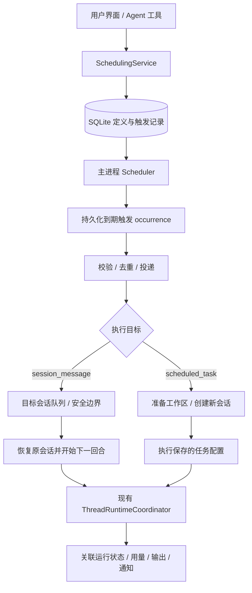

# Eco 本地定时消息与定时任务设计

实现后的功能、边界和验证见 [本地定时功能实现说明](scheduling-implementation.md)。本文保留调研与设计建议，未标注的建议不代表已经实现。

调研日期：2026-10-08。状态：保留的调研与设计稿；当前实现范围以实现说明为准。

用户已确认第一版只需本机执行。本文中的“唤醒”指启动 Agent 的下一回合，不指唤醒睡眠中的电脑。执行条件是电脑清醒且 Eco 主进程运行；关闭窗口但主进程仍运行可以继续调度，退出应用或系统睡眠时不能执行。

## 1. 建议与概念边界

建议在 Eco 主进程实现一个持久化调度器，向产品和 Agent 提供两类不同的能力。

| 能力 | 定时消息 / 会话唤醒 | 定时任务 |
| --- | --- | --- |
| 用户理解 | 到时在这个会话发送一条指令，继续这里的工作 | 到时执行一份保存的任务配置 |
| 执行目标 | 固定的现有 `threadId` | 每次运行创建新的主会话 |
| 上下文 | 目标会话执行时的最新上下文 | 保存的自包含指令、运行配置、项目和必要的任务状态 |
| 生命周期 | 依附于目标会话 | 独立于创建它的会话 |
| Agent 自主行为 | 在已授权工作中设置一次性唤醒，检查后决定是否继续等待 | 在当前工作范围内创建独立定时任务，自动保存当前会话 AgentCore 和模型 |
| 管理位置 | 会话中的“定时消息”面板 | 全局“定时任务”列表及运行历史 |
| 典型场景 | 五分钟后检查当前部署；明天继续这段调研 | 每天九点整理提交；每周检查依赖 |

**划分依据是执行目标、上下文和生命周期。一次性与周期性是另一个维度。** 明天只执行一次的独立代码检查仍是定时任务；每天在同一个研究会话检查进展仍是定时消息。不能用“有 cron 就是任务”“一次性就是消息”作为分类规则。

第一版定时消息先支持一次性 `after / at`，定时任务支持一次性 `at`、固定间隔 `interval` 和五字段 `cron`。未来可以给定时消息增加重复发送，继续保留上述边界。

本文将“定时消息”解释为到时提交给 Agent 并启动处理。只给用户弹通知的提醒是另外一种投递动作，第一版无需混进这两个 Agent 执行功能。

## 2. Codex 与 Claude 的公开设计

以下是官方文档确认的产品行为；不据此声称了解闭源产品的内部队列、数据库或容错实现。

| 产品能力 | 已确认的行为 | 对 Eco 的启发 |
| --- | --- | --- |
| Codex / ChatGPT 会话内定时 | 返回原聊天并使用已有上下文，支持分钟间隔和日/周安排 | 会话续跑是独立、正式的产品语义 |
| Codex / ChatGPT 独立定时 | 每次运行创建新聊天；本地项目可选原目录或隔离 worktree；支持高级 RRULE；运行结果集中管理 | 保存定义与每次运行分离，上下文和工作区配置属于定义 |
| Claude Code `/loop` 与 cron 工具 | 会话内调度；忙时等回合结束；重复的错过触发不会逐次补齐；动态 loop 可自行选择下一次等待并停止 | 会话唤醒应排队、合并并能结束 |
| Claude Code Desktop 本地定时 | 每次新建会话；配置指令、工作目录、模型、权限和 worktree；重启后保留；错过多次时有限补跑一次 | 本地定时的关键是运行管理和恢复规则 |

Codex 两种执行目标及工作区行为见 [OpenAI 官方定时任务文档](https://learn.chatgpt.com/docs/automations?surface=app)。Claude 会话内机制见 [Claude Code scheduled tasks](https://code.claude.com/docs/en/scheduled-tasks)，本地独立运行见 [Claude Code Desktop scheduled tasks](https://code.claude.com/docs/en/desktop-scheduled-tasks)。

Claude 另外有云端 Routines，每次创建新 session，并可组合时间、API、GitHub 触发；Cowork 的定时任务同样独立运行。第一版不需要这些云端能力，但可以借鉴“任务配置与触发器分离”。来源：[Claude Routines](https://code.claude.com/docs/en/routines)、[Cowork scheduled tasks](https://support.claude.com/en/articles/13854387-schedule-recurring-tasks-in-claude-cowork)。

这些文档和旧版本介绍存在差异，例如当前 Claude 会话调度文档描述了恢复和例外，不能照搬旧文章里“一律只在内存、退出即丢失”的说法。本文不把厂商的间隔、抖动或有效期参数当作 Eco 的要求。

**研究得到的设计判断：** “定时运行一个 session”抓住了执行环节。完整产品还需要保存任务定义、配置执行环境、记录每次触发和运行、处理忙碌与离线、管理权限和结果。session 应作为执行载体，而不是定时任务本身。

## 3. 本地架构



Scheduler 只处理时间和可靠投递，不调用模型理解“现在该做什么”。创建时确定执行目标，触发时严格执行已经保存的类型。

使用数据库中的 `nextFireAt` 查询到期定义，最近一个到期时间驱动短计时器，并用周期扫描校正。应用启动、系统恢复、时间变化、定义修改时重新检查。计时器用于减少延迟，数据库才是事实来源；无需为每条任务创建一个长期内存 timer，也无需第一版引入 Redis、云队列或系统 crontab。

### 3.1 定义、触发与实际执行分离

建议使用 `schedule_definitions` 和 `schedule_occurrences` 两张新表，运行继续关联 Eco 的既有会话与 run 数据。

```ts
type Trigger =
  | { type: "at"; at: string } // UTC 时间点；after 在创建时转换成 at
  | { type: "interval"; everySeconds: number; anchorAt: string }
  | { type: "cron"; expression: string; timezone: string };

type ScheduleDefinition = ScheduleBase & (
  | {
      kind: "session_message";
      target: { threadId: string };
      payload: { message: string; reason?: string };
      // 对自主唤醒关联等待链；普通用户消息不需要。
      wakeupChainId?: string;
    }
  | {
      kind: "scheduled_task";
      target: {
        workspaceId: string;
        workspaceMode: "local" | "worktree";
        baseRef?: string;
      };
      payload: { instructions: string; executionProfile: ExecutionProfile };
    }
);
```

这是概念类型，不是已存在的仓库 API。`ScheduleBase` 至少保存：定义 ID、版本、名称、触发器、启停状态、`nextFireAt`、有效期、错过触发策略、并发策略、创建来源和通知策略。来源由主进程从已认证请求与工具调用记录写入，包含创建者、创建会话、run、tool call；不能让模型填写一个字段来冒充用户授权。

`ExecutionProfile` 复用 Core 和现有 `ThreadRuntimeConfig`，用普通会话创建入口启动定时任务。Agent 创建时由宿主保存当前会话实际使用的 AgentCore 和模型；用户可在定时任务管理面板修改这两项，也可直接在面板手动创建任务。模型覆盖复用现有 `mainAgentModelOverride`；Core 有不同模型选择方式时沿用其现有字段。相关产品规则见第 11 节。密钥只保存引用，执行时向现有密钥存储读取。子代理的启动、恢复、取消、权限和计费沿用当前会话机制，不属于本次调度设计的改造范围。

每次 occurrence 保存：定义版本和执行快照、原定时间、实际接收/开始时间、稳定的投递 ID、状态、跳过/阻塞原因、关联会话与 run、重试尝试。不要在创建定时消息时提前把将来的内容送入当前 Agent 上下文；到期后才生成实际输入，之前显示定时卡片。

### 3.2 状态不能混用

- 定义状态：`active / paused / completed / cancelled`。一次性定义处理完后结束，但保留历史。
- 触发状态：`pending / queued / dispatched / skipped / expired / cancelled / failed / unknown`。`dispatched` 只表示已确认启动或接收，不能代表任务成功。
- 执行状态：复用现有 run 状态，并在调度视图映射“运行中、成功、失败、等待审批、等待用户、执行结果未知”。

处于等待审批/用户状态的执行仍占用该任务的运行名额。暂停定义只阻止未来触发；停止某个正在运行的任务需要单独取消 run。删除定义也要明确是否取消活跃 run，并保留运行历史。

## 4. 定时消息与 Agent 自主唤醒

Agent 需要“稍后继续”时，调用绑定当前主会话的一次性工具：

```json
{
  "tool": "schedule_wakeup",
  "arguments": {
    "after_seconds": 300,
    "reason": "等待部署结束",
    "message": "检查部署 123。结束则报告结果并停止等待；未结束则决定下次检查时间。"
  }
}
```

工具不接受任意目标 `threadId`、工作目录或“新建 session”选项；目标由调用上下文绑定。支持 `after_seconds` 或明确的 `at`，两者互斥。返回持久化 ID、解析后的实际时间、目标会话、执行类型和管理入口。只有提交数据库成功，才报告创建成功。

这个工具也可以承接用户通过自然语言要求在当前会话安排一次消息。实际创建入口始终如实记录为 `user_ui` 或 `agent_tool`；Agent 若表示它在执行用户的安排，另保存关联的用户消息 ID 和用途，校验该消息属于当前会话。这个用途标签不等于新的授权，不扩大权限，也不重置宿主预算；模型对用途的理解仍需评测。用户手动添加走同一个 SchedulingService，通过 UI 填写内容和时间。

### 4.1 一次性续约比自动永久循环更适合自主等待

到期 → 检查条件 → 已完成就结束 → 未完成时再安排一次唤醒。等待期间没有运行中的 Agent，不消耗等待回合，也不用让 shell `sleep` 占着会话。

同一个等待链默认只保留一条待触发的自主唤醒，新的安排原子替换旧的待触发条目。不同等待目标可以使用不同链；普通用户定时消息不受这条去重规则影响。

宿主为等待链设置明确的有限上限，覆盖有效期、唤醒次数、累计执行预算和最短等待间隔。建议初始限制为创建起 24 小时、最多 24 次唤醒、自主续约最短 60 秒，并允许用户显式调整；这是尚未经过使用数据验证的产品建议。UI 和工具返回必须显示限制。续约不能重置链的累计上限；宿主还要按会话/授权任务归集预算，不能通过改名、新建链或改用途标签绕过。达到上限后结束自动等待并显示原因。Agent 没有再次安排就结束等待，宿主不自动补一个隐含唤醒。

已有终端完成事件、后台任务结束事件可用时，直接用事件续跑；定时唤醒用于外部无法推送的状态或用户指定时间。第一版无需让所有等待都轮询模型。

### 4.2 到期投递规则

| 目标会话状态 | 建议行为 |
| --- | --- |
| 空闲 / 上一回合正常完成 | 恢复原 Core session，开始下一回合 |
| 正在运行 | 等当前回合结束，作为普通后续输入投递；不 steer、不打断 |
| 等待计划审批或阻塞性问题 | 保持等待并展示原因，不用定时消息越过人工决策 |
| 用户主动停止自动等待 | 取消对应自主唤醒链和它尚未投递的条目 |
| 用户暂停后续队列 | 保留待投递消息，等待恢复，仍检查有效期 |
| 归档 | 自主链停止；用户定时消息暂停并展示原因 |
| 删除 | 取消全部目标消息，不能重新创建原会话 |
| Core session 无法恢复 / 上次执行结果未知 | 显示需要处理的原因；不能悄悄启动空上下文来伪装续跑 |

“停止当前回合”不自动删除用户预先安排的所有未来消息，但必须停止 Agent 自主续约，避免停止后几分钟又自己跑起来。该意图要持久化；只检查当前后续队列是否为空不足以表达它。

到期和实际开始可以不同。面板应同时显示“原定 10:05、等待当前回合、10:12 开始”，不要显示“10:05 已执行”。

交互输入优先于自动唤醒，调度输入仍保留身份和投递顺序。创建时的 `expectedHistoryRevision` 只用于创建命令的并发校验，不能当作永久投递前提，否则后续正常聊天都会使消息失效。到期接受命令时在会话锁下读取最新 revision；历史回退/重写是否使原等待依据失效，另外按来源和目标校验。

### 4.3 上下文与来源

唤醒使用目标会话的最新上下文，不使用创建时整段历史的副本。保存具体对象和检查内容，如部署 ID、PR URL、构建 ID；不能只保存“继续刚才的任务”。历史回退/重写、目标替换或权限变化时，对自主唤醒执行重新校验并暂停失去依据的条目；不能仅因为出现了一条新用户消息就取消所有定时消息。

UI 标注“用户手动添加”“Agent 安排的消息”或“Agent 自主唤醒”，并显示创建来源及关联请求。对于 SDK 必须通过 user-input 接口才能启动回合的情况，外层仍保留实际来源，使用独立的运行时输入封装说明这是已保存的定时指令。Agent 自写的 message 是延续既有任务的数据，不得升级成 system 指令或新的用户审批；业务正文不能覆盖宿主提供的来源元数据。

## 5. 独立定时任务

定时任务保存的是一个可重跑的执行配方。每次 occurrence 创建新主会话、新 run，使用已保存的配置执行；`originThreadId` 只是创建来源，不是运行目标。删除创建它的聊天不删除任务。

### 5.1 指令、上下文与跨次状态

任务指令需要明确工作范围、数据来源、时间窗口、完成条件、输出位置和通知规则，例如：

> 检查 Eco 仓库从上次成功检查的提交到当前 origin/main 的变化，按模块生成摘要。写入本次运行产物；只有出现需要处理的问题才发桌面通知。没有新提交时记录“无变化”。

由当前会话生成任务时，抽取可独立执行的任务说明和必要背景，保留来源链接；不默认复制整段聊天，也不默认继承一个仍会变化的长 session。

跨次状态独立保存，例如 `lastSuccessfulCommit`、已处理条目 ID 或有界摘要，带版本和更新时间。游标只在对应工作确认成功后推进，失败不能让下次丢掉尚未处理的数据。确实需要无限期维护一段同样上下文的工作，应选会话调度；独立任务的执行记录本身不作为无限增长的默认记忆。

### 5.2 运行配置和工作区

创建或用户显式编辑时保存执行配置版本，运行记录保存解析后的快照。第一版不自动跟随来源会话或全局配置模板的后续修改。供应商、模型、MCP 或项目不可用就显示明确错误，不能静默换模型、降权限或换目录。

工作区选择需清楚：

- `local`：读取、分析当前工作目录时最直接；可能包含用户未提交的变化，运行记录应注明。
- `worktree`：需要自动修改代码时优先使用；显式指定基准分支/commit 及是否刷新远程。不能暗示 worktree 包含用户未提交内容。
- 非 Git 项目只能使用目录模式，显示真实能力；不伪装隔离。

相同目录存在其他写任务时，任务层面的“不并发”不足以避免文件冲突。Eco 的任务写操作应按工作目录串行，或选择独立 worktree；这不能约束用户在外部编辑器的修改，UI 必须体现实际工作区模式。

worktree 与该次运行关联。没有产物的运行可按保留规则清理；有未提交修改、未推送提交、待评审成果的运行需保留或先保存可恢复快照，不能因完成就直接删除。

### 5.3 忙碌、审批与通知

第一版同一定时任务不重叠执行，上一轮未结束时新时点记录为 `skipped(previous_run_active)`；不积压多份同样任务。建议后台默认并发为 1，交互工作优先，用户可按机器和额度调整。用户“立即运行”也遵守相同约束。

运行沿用 Eco 的工具权限和会话模式，不因由定时器启动而获得额外权限。需要审批或用户回答时进入“等待处理”，可以稍后继续，不能伪装完成。创建定时任务的明确用户请求已经授权安排该任务，不额外设计重复的创建确认；执行中的权限边界仍沿用现有机制。

保存通知策略：`all / actionable / errors_only / none`。普通报告按用户选择通知；监控类默认只在变化、完成、失败或需要用户处理时通知。即使无通知也保留完整运行记录，是否有发现与运行是否成功是两个独立字段。不能靠从模型最后一段文本猜测执行成功。

## 6. 时间、错过触发与恢复

### 6.1 时间语义

- `after`：相对于创建请求被主进程接受的时间，立即计算 UTC `at` 并落盘；重启不能重新等待一遍完整 delay。
- `at`：明确日期和时间点；保存原输入时区，展示解析结果。缺少日期或时区且无法从用户设置推断时要求补齐，不能默默改成下一个“猜测合理”的时点。
- `interval`：固定锚点加 `n × period`，如每 90 分钟；不能直接转为语义不同的 cron，也不以运行完成时重新计时导致漂移。
- `cron`：第一版五字段，带显式 IANA 时区，如 `Asia/Shanghai`。支持范围需要公布；不支持的表达式明确拒绝。创建时显示未来几个触发时间，让 Agent 和用户能核对。

`nextFireAt` 用 UTC。时区属于定义，用户修改系统时区后不自动改写已有任务。DST 的不存在时间和重复时间需要固定策略并验证解析库：建议不存在的时点跳过，重复本地时点执行一次。该策略是 Eco 建议，尚未验证具体依赖能否直接满足。

下一次触发基于原定时点计算，执行延迟不使周期漂移。第一版用户指定的时间不加隐藏 jitter；到期只保证进入投递流程，实际启动可能因忙碌、审批、离线而延迟。

### 6.2 本机错过触发

把 `misfirePolicy` 与 `expiresAt / maxLateness` 保存为结构化策略，不把是否补跑交给模型读提示词猜测。

| 类型 | 推荐默认策略 |
| --- | --- |
| 用户一次性定时消息 | 恢复时仍在有效期内就投递一次；超期标记过期并显示 |
| Agent 自主唤醒 | 等待链有效且仍属于当前目标才补一次；停止、过期、历史失效均不执行 |
| 周期性独立任务 | 只在有限补跑窗口内对最近一次时点补跑一次，其余合并记为错过 |
| 强时效任务 | `skip`：错过即跳过，继续未来时点 |

建议用户一次性消息及独立任务的默认最大迟到时间为原定时间后 24 小时；周期任务在最近 24 小时内只补最近一个时点。自主唤醒还必须受等待链总有效期限制。以上是第一版建议值，需显示并允许用户调整；强时效任务可选错过即跳过。失败重试、忙碌等待、系统离线补跑分别记录，不能混为同一种“再执行”。

## 7. 去重、取消和结果未知

本地调度也需要处理应用崩溃、重复扫描、双击创建和取消时点竞争。

1. 创建请求带幂等 `clientCommandId`；同一参数重复提交返回同一结果，参数不同明确报冲突。
2. 每个时点使用稳定键，例如 `scheduleId + scheduledFor`，数据库唯一约束保证只能创建一个 occurrence。定义修改后的同一时点不因此重复执行；手动运行另用独立请求 ID。
3. 事务中生成 occurrence、冻结定义版本、更新下次触发，并写入待投递记录。不要在事务中调用 SDK 或准备 worktree。
4. 投递关联稳定 `dispatchId / plannedRunId / messageId`，并记录 SDK 接收和 run 启动证据。运行时回调更新关联 occurrence，不靠 timer 回调返回值判断完成。
5. 崩溃后查既有会话、输入与运行记录：确认尚未投递才能重试；确认已投递就关联恢复；无法确认时标记 `unknown` 并要求处理，不能盲目重发。
6. 原子检查定义版本和取消状态。取消成功后尚未投递的条目不执行；已经启动则返回“已开始”并提供停止运行操作。暂停、编辑需要同步撤销旧版本未投递条目；已启动的运行继续使用冻结配置。

可靠边界是“每个触发有唯一记录、每次输入有身份、执行结果可核对”。不能承诺任意 shell 或外部 API 的 exactly-once 副作用。需要写外部系统的工作，还要利用该系统的幂等键或具体工作流的状态检查。第一次落地默认不自动重跑已开始后失败的整个 Agent 工作；用户重试会关联原 occurrence 和新的 attempt，明确可能存在既有副作用。

## 8. Agent 会不会搞混

会有选错工具的可能，尤其是同时暴露两个只有名字稍有不同的“创建定时任务”工具时。结构限制可以消除执行目标被隐式改变的问题，但不能证明模型永远理解正确。

### 8.1 工具分开，底层复用

| 工具族 | 模型可设置的内容 | 宿主固定的内容 |
| --- | --- | --- |
| `schedule_wakeup`、`list_wakeups`、`cancel_wakeup` | 本次消息、等待时间、已有链的续约 | 当前主会话、续跑语义、创建来源、预算限制 |
| `create_scheduled_task`、`list_scheduled_tasks`、`update_scheduled_task`、`pause_scheduled_task` | 自包含任务说明、触发器、项目等任务内容 | 创建时继承当前会话 AgentCore 和模型；后续内容更新保留已保存的执行配置；每次新建主会话 |

不把可选 `sessionId` 放进一个万能工具，通过“传了就 resume，没传就 new”切换语义。两个工具的参数 schema、文档、结果都写清楚执行目标；返回 `kind`、目标、下次时间、上下文方式，让创建结果可以直接复述和检查。

工具描述明确：

> schedule_wakeup：在这个会话安排一次后续输入，用于继续当前任务、稍后检查或用户指定的会话消息。继承该会话上下文。独立、长期重复任务请用 create_scheduled_task。

> create_scheduled_task：保存独立任务配置，在指定时点或周期创建新的主会话运行。自动使用当前会话的 AgentCore 和模型，无需选择；用户之后可在定时任务管理面板修改。指令必须自包含；不会延续当前聊天。需要稍后回到当前任务时用 schedule_wakeup。

取消/更新只接受属于该工具域的 ID；拿消息 ID 更新独立任务明确报错，不自动转类型。Agent 可管理的范围遵守现有会话工具授权策略；独立任务默认可暂停自身，但不允许通过自行改写配置来扩大权限或无限生成新任务。调度功能不新增子代理专用的唤醒、恢复或权限规则。

### 8.2 意图样例与默认规则

| 用户/Agent 表达 | 应选择 |
| --- | --- |
| “五分钟后再看看这个构建” | 当前会话唤醒 |
| “明天上午在这里继续讨论这个方案” | 当前会话定时消息 |
| “每天九点生成昨日提交报告” | 独立定时任务 |
| “明晚独立跑一次完整依赖检查” | 一次性独立任务 |
| “每隔十分钟继续看这个 PR，合并后结束” | 同一会话等待链，逐次续约 |
| “每周在这段研究里更新进展” | 同一会话周期消息；第一版未支持时明确告知，不能偷换独立任务 |
| “明天继续”且当前会话有明确未完成工作 | 当前会话消息；补齐未指定的时间 |
| “每天处理一下”且工作范围和上下文目标无法推断 | 询问关键缺项，不能暗中挑一种执行目标 |

长期、反复、相互独立的产出默认独立任务；围绕当前对象的后续检查默认会话唤醒。明确指向同一会话的要求优先于频率启发式。范围明确时直接安排，不为每个正常请求增加确认步骤。

### 8.3 要做真实评测

建立覆盖一次性/周期、同会话/独立、中文模糊表达、多目标、取消续约、工具 ID 混用的评测集。各个声明支持此能力的 Core 和常用大小模型分别执行真实 tool-call 路径，记录选型混淆矩阵、参数错误、需要澄清的比例；报告模型/版本和样本量，不只测 schema 通过率。

错误选型不得通过后端自动改成另一种功能来“成功”。测试还必须断言：会话消息不新建主会话，独立任务不复用来源会话，自主 message 不带新审批，取消链不会因重启恢复，预算不能被续约重置。产品上线前仍不能承诺零混淆。

## 9. 与 Eco 当前代码的接点和缺口

以下路径是本次只读核查得到的现有实现，并非已经具备上述定时能力。

| 当前接点 | 可复用部分 | 必须新增/调整的部分 |
| --- | --- | --- |
| `apps/desktop/src/main/conversation-v2-store.ts` | SQLite、消息接受、持久化后续队列、命令身份和检查点 | 定义/触发表、调度来源、运行关联、调度事件 |
| `apps/desktop/src/main/conversation-follow-up-command.ts` | 先保存命令再修改运行状态的边界 | 当前中断命令按结果未知处理且不重放；需要调度专用恢复和去重 |
| `apps/desktop/src/main/index.ts` 的 `enqueueThreadFollowUpCommand` | 后续消息保存与运行中的队列处理 | 当前主要接收 live 会话；默认可 steer，不能作为唯一的到期入口直接调用 |
| `apps/desktop/src/shared/thread-follow-up-drain.ts` | 空闲可 drain、安全边界、审批与暂停的阻塞判断 | 普通空闲会话的定时输入接受、自主链停止、来源与过期校验 |
| `apps/desktop/src/main/thread-follow-up-drain-scheduler.ts` | 同一会话 drain 合并，避免并发 drain | 时间调度需要单独服务；这个类不是时间 scheduler |
| `apps/desktop/src/main/conversation-command-dispatch.ts` | 稳定 dispatch/attempt ID 和启动确认思路 | 当前检查点域是 history/plan；新增 schedule 域，不借用错误的业务类型 |
| `apps/desktop/src/main/thread-runtime-coordinator.ts` | 三种 Core 的 start/continue/cancel 入口 | 目标恢复策略和统一调度执行上下文 |
| `apps/desktop/src/main/html-host-mcp-gateway.ts` 等内置网关 | 会话绑定鉴权、Eco MCP 工具注入模式 | 统一调度工具网关、域隔离和能力过滤 |
| `packages/shared/src/conversation-v2.ts` | 消息与 run 的跨端事件/投影契约 | 调度来源、定义/触发视图及必要新事件，Desktop/Mobile 同步升级 |

Claude SDK 适配层 `packages/runtime/src/claude-agent-sdk.ts` 当前已用显式 `nativeSdkTools` 避免预设暴露 CLI-only 调度工具。新增 Eco 调度时保持该边界，并核对实际可见工具：不能同时留下两套互不记录的 CronCreate/Eco 调度入口。Codex/Claude 原厂桌面端的调度界面不等于 Eco 使用的 SDK/App Server 已提供相同功能；调度定义由 Eco 统一管理，各 Core 只负责执行。

当前 `ConversationMessage`、后续队列没有完整的调度来源模型。原样复用 sendMessage 会把自主唤醒当普通 user 输入，因此来源保存、UI 呈现和运行时封装都是第一版必要工作。

建议把新业务放在 `scheduling-store.ts`、`scheduling-service.ts`、`scheduling-dispatcher.ts`、`scheduling-mcp-gateway.ts` 等独立模块，index 只装配。具体命名可按仓库惯例调整。

## 10. 第一版交付范围与验收

第一版范围：本机主进程与 SQLite；用户手动/自然语言一次性定时消息；Agent 一次性自主唤醒链；一次性和周期性独立任务；Agent 创建任务继承当前会话 AgentCore 和模型；管理面板手动创建、修改 AgentCore 与模型；新会话执行；显式工作区及配置；暂停、取消、立即运行、运行历史；有限离线补跑与结果未知处理。

后续能力：同会话周期消息、更丰富的日历规则、外部事件触发、任务间依赖。第一版不需要先建一个通用 DAG 工作流引擎；保留独立的 trigger 类型即可。

推荐实现顺序：

1. 先实现定义、触发、事务去重、时间解析和重启恢复，把投递目标作为显式类型。
2. 接通会话定时输入：空闲续跑、运行中排队、停止链、来源封装、UI 管理。
3. 接通独立任务：创建会话、固定配置、工作区、并发与执行状态关联。
4. 暴露两个工具族，并同步跨端契约，验证各 Core 的工具可见性和执行差异；不支持的 Core 明确显示能力缺口。

必要验收覆盖：

- 应用重启后定义仍在；after 不重新起算；系统恢复时按明确策略补一次或跳过。
- 同时扫描、重复提交、创建后立刻取消、修改到期时间，都不会重复产生运行。
- 正在运行的会话不会被定时消息打断；空闲且没有页面打开的会话能续跑。
- 用户停止后自主链不再醒来；用户预设的未来消息仍可查询和管理。
- 上一轮等待审批时下一轮独立任务不会又启动；状态与原因可以查看。
- 持久化成功但 SDK 接收结果不明的崩溃窗口，不会被当作成功或盲目重发。
- 新运行配置不可用明确失败；原会话无法恢复不伪装续跑；未支持的周期消息不转换成独立任务。
- 时区、固定间隔、cron 的下一次时间、跨天和 DST 行为符合公布策略。
- 各 Core 的真实调度行为与意图评测均有结果记录。

本文只交付调研与设计。尚未选定时间解析依赖、验证建议的默认限制数值或实现上述状态恢复；这些是实施时需完成的项目，不属于已验证能力。

## 11. 定时任务的创建入口与执行配置

本节按用户确认的规则设计：Agent 自主创建定时任务时沿用当前会话的 AgentCore 和模型；用户可以在定时任务管理面板修改运行的 AgentCore 与模型，也可以直接在面板手动创建任务。执行沿用现有会话机制。

### 11.1 两个创建入口

| 入口 | 执行配置来源 |
| --- | --- |
| Agent 工具创建 | 宿主自动读取调用会话实际使用的 AgentCore、模型及有效运行配置，保存到新任务 |
| 管理面板手动创建 | 用户填写名称、任务指令、时间规则、项目/工作目录，并选择 AgentCore 和模型 |

Agent 创建工具不提供 AgentCore、模型或供应商的选择参数，不让模型猜测应该用哪种执行配置。宿主读取实际生效的配置，包括模型覆盖；不能只读取全局默认或模板中的原始模型。工具成功后返回已保存的 AgentCore、供应商、模型和下次运行时间。

用户手动创建不需要来源会话，来源记录为 user_ui；Agent 创建记录为 agent_tool，并保留来源会话和调用记录。两个入口使用同一任务存储与执行服务，形成同一种定时任务。

例如当前聊天使用模型 A，Agent 创建的每日摘要任务初始也使用模型 A；用户在管理面板将任务改为便宜的模型 B，之后任务使用 B，当前聊天继续使用 A。

### 11.2 管理面板

管理面板支持新建任务、查看/编辑指令与时间规则、选择 AgentCore 和模型、暂停/恢复、取消、立即运行及查看运行历史。复用现有会话的 AgentCore 与模型选择器，保存前校验所选组合及现有运行配置是否兼容。

用户切换 AgentCore 时，模型候选随之更新；原模型不兼容时需要重新选择，不能把不兼容的旧选择直接保存。配置处理沿用现有新会话创建流程，不新增子代理专用规则。

用户保存修改后，只影响尚未开始的后续运行；已经启动的会话仍使用它启动时的配置。按既有定义版本规则撤销旧版本尚未投递的记录，保留修改前后的历史。

### 11.3 配置保存与执行

概念结构继续复用现有类型：

```ts
type ExecutionProfile = {
  coreKind: CoreKind;
  runtimeConfig: ThreadRuntimeConfig;
};
```

实际实现复用现有创建会话所需的 Core 配置字段。ThreadRuntimeConfig 已包含运行配置、模型覆盖、会话模式和用户选择的集成。采用 Eco 模型路由的 Core 复用 mainAgentModelOverride；其他 Core 沿用其现有模型字段和校验流程。

“沿用当前会话”只发生在 Agent 创建任务的时刻。保存后任务持有自己的配置，来源会话后来切换 AgentCore、模型或全局默认，不自动改变该任务。每次触发用任务当时已保存的配置创建新会话。

Agent 后续更新任务说明或时间时，保留任务已保存的 AgentCore 和模型，不能再次从调用会话覆盖用户在面板中的选择。运行中的任务同样不会因更新内容而切换执行配置。

供应商、模型、AgentCore 或配置不可用时，报告具体原因并记录运行失败或等待处理，不能自动换回来源会话模型来伪装成功。任务卡片显示已保存的执行配置，运行历史显示本次实际使用的 AgentCore、供应商、模型、状态和现有会话费用。

### 11.4 定时消息保持原会话语义

定时消息继续原会话，沿用该会话执行时的有效配置，与普通后续消息相同。第一版不增加每条定时消息单独选择 AgentCore 或模型的能力。用户希望用便宜模型定期独立执行时，在任务管理面板配置独立定时任务。

### 11.5 本次新增验收

- Agent 创建任务自动保存当前会话实际生效的 AgentCore 和模型，包含模型覆盖；工具无需这些参数。
- 来源会话或全局默认后续修改，不改变已保存的任务配置。
- 用户能在管理面板修改任务的 AgentCore 和模型，之后运行使用修改值。
- Agent 更新任务内容和时间，不覆盖用户已保存的执行配置。
- 用户不依赖已有聊天，也能在面板手动创建和运行任务。
- 修改配置不影响已启动的会话；不兼容的 Core/模型组合不能保存。
- 执行配置不可用明确报错；任务卡片和运行历史中的配置可核对。
- 定时消息继续原会话，定时任务走现有新会话流程，不改写子代理机制。

### 11.6 会话消息默认轻量，完整规则收进高级设置

默认创建定时消息只需要正文和发送时间，并且只发送一次。默认 1 小时后发送，主表单直接显示可编辑的时间／延迟输入，可在「延迟发送」与「指定时间发送」间切换。展开或收起高级设置不隐藏时间输入，也不自动转换或冻结时间模式。名称不再必填，列表使用消息首行。周期、时区、补跑窗口和预览保留在「高级设置」中；收起设置不丢弃已经选好的规则。日常独立的重复工作继续使用定时任务。

一次性消息成功进入普通会话消息队列后移除其待发送配置，cards 和搜索不再保留已发消息的安排；会话消息本身显示「定时消息」标签。内部去重和恢复回执保留。未投递或投递失败的消息保留明确的状态原因。立即发送消耗原定时间，避免再发一次。

这一调整取代前文的一次性消息保留在管理界面中的建议；实际能力和验证见 [实现说明](./scheduling-implementation.md)。
