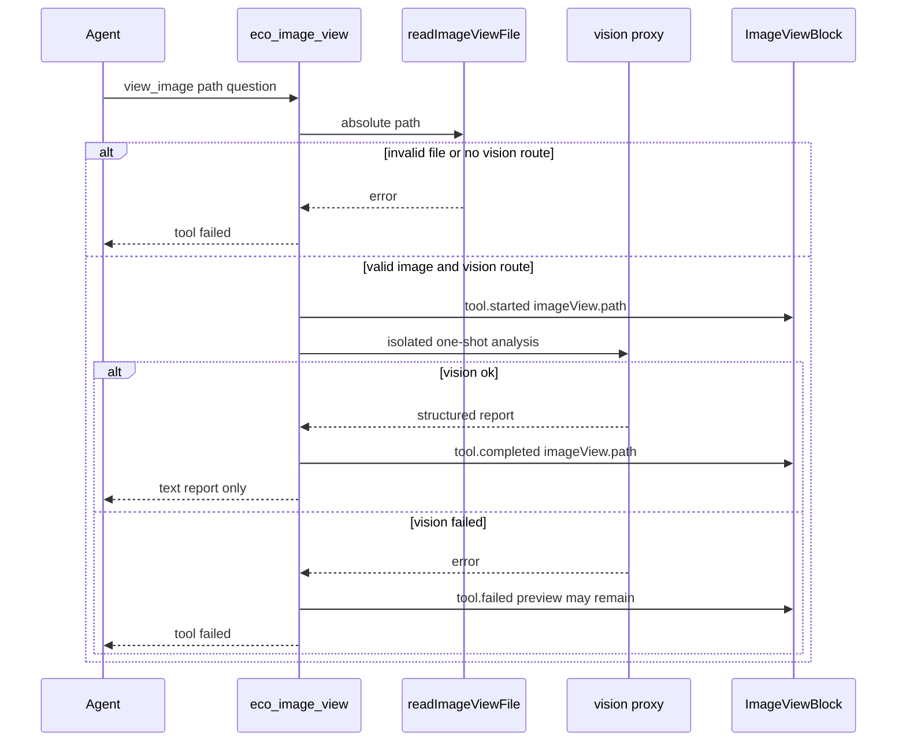

# 默认看图工具设计

**Status:** accepted  
**Date:** 2026-08-14

## 背景

Eco 已有两条与「看图」相关、但互不相通的能力：

1. **用户贴图拦截**（`resolvePromptImagesForMainContext`）：用户消息带图片附件时，宿主拉起 `role: vision` 一次性分析，主 Agent 只收到 `<vision_analysis>` 文本。原图不进主上下文。Agent 不能主动调用这条路径。
2. **Codex 原生 `view_image`**：Agent 可调用的 Codex 内置工具。协议 item 为 `imageView`（`{id, path}`）。Eco 将其投影为 Feed 上的 `ViewImage`，由 `ImageViewBlock` 按路径读本地文件做预览。像素进入 Codex 自己的模型上下文，不走 Eco 视觉模型和结构化报告。Claude / Pi 没有对等内置工具。

看图不应做成浏览器 / 生图那种可开关集成。它是默认能力：始终可用，Composer 无开关。

## 目标

1. 三个 runtime（Claude / Pi / Codex）都有一条 Agent 可主动调用的 Eco 看图工具。
2. 工具结果在 Desktop 与 Mobile Feed 复用现有 ImageView 卡片（预览 + 灯箱），不新做结果 UI。
3. 用户贴图拦截保持现状：自动分析、主 Agent 只收文本报告、Feed 仍是看图子代理卡片。
4. 视觉请求计费记为 `role: vision`。Agent 主动看图不发子代理生命周期卡片。
5. 该工具默认自动放行，不走 `create_image` 式确认卡，也不跟 `bashReviewMode` 绑死。

## 非目标

- 把看图做成 `INTEGRATION_IDS` 中的可开关集成。
- 关掉或拦截 Codex 原生 `view_image`（关不掉；两条路径并存）。
- 把用户贴图的内存附件改写成磁盘文件再走 ImageView。
- 把视觉分析正文铺在 ImageView 卡片上。
- 视觉失败时把原图塞进主 Agent 上下文。
- 为看图新建审批策略或 Composer 开关。

## 架构

两条路径互不替代：

| 路径 | 触发 | Agent 得到 | Feed |
|------|------|------------|------|
| 用户贴图拦截 | 消息附件 | `<vision_analysis>` 注入主 prompt | 看图子代理卡片 + 贴图预览 |
| Eco `view_image` | Agent 调 MCP | tool result 文本报告 | ImageView 卡片 |
| Codex 原生 `view_image` | Codex 内置工具 | 图片进入 Codex 主模型上下文 | 现有 ImageView（Eco 不拦截、不补跑视觉模型） |

同一张图在 Codex 上可能出现两张 ImageView 卡片（原生一次、Eco 一次）。提示词引导优先用 Eco 工具，但不保证原生不被调用。

## 组件

### MCP：`eco_image_view` / `view_image`

- 注入方式对齐生图 MCP（stdio 前端 + 本机 control HTTP），但**不**读 `integrationsEnabled`，**不**进 `INTEGRATION_IDS`。
- 三个 runtime 只要能跑 Agent，就注入该 server。
- 全名：`mcp__eco_image_view__view_image`。
- 入参：
  - `path`（必填）：本地绝对路径
  - `question`（可选）：这一眼要回答什么；缺省则按用户当前任务做结构化观察
- Claude SDK `allowedTools` **包含**该工具（与生图相反：生图故意从 `allowedTools` 去掉以强制确认卡）。

### 读文件

复用 `readImageViewFile`：绝对路径、常规文件、非符号链接、≤ 20MB、PNG/JPEG/GIF/WebP。相对路径、目录、符号链接、远程执行环境 Desktop 读不到的文件一律失败，不猜测、不改写路径。失败码与现有 ImageView 错误文案一致。

读盘失败时不渲染 ImageView，只走普通 tool failed。

### 视觉调用

复用贴图拦截的视觉管线，不新造模型路由：

- 会话 `visionModel` → 否则主模型（planner / 首条路由）
- `supportsImageInput === false`：失败，不静默改走纯文本
- 有界 one-shot：隔离 system prompt、`max_tokens: 1600`、无工具、图片经 runtime proxy 注入
- 报告格式与现有 `VISION_SYSTEM_PROMPT` 相同（Overview / Per-image observations / Task-relevant details / Uncertainties）

### Feed 投影

现有 `ImageViewBlock` 只认 `metadata.tool.imageView.path`。今天只有 Codex 原生 `imageView` item 会填这个字段。

实现必须让 Eco `view_image` 的 `tool.started` / `tool.completed` 带上同样的 `imageView.path`：

- Codex：`emitMcpToolEvent` 在识别 `eco_image_view` / `view_image` 后从 MCP arguments 取 `path`
- Claude / Pi：对应 stream adapter 从 tool input 取 `path`
- Desktop `thread-run-projection-view` 已有投影；Mobile activity feed 已按同一 metadata 渲染。两边都要有覆盖 MCP 工具名的测试，不能只测原生 `ViewImage`

读盘成功且视觉路由可用（含图片输入）之后才发 `tool.started`（「正在查看」）；视觉结束后 `tool.completed`（「已查看」）。分析正文不出现在卡片上。视觉 HTTP / 解析失败时预览可留在卡片上，错误写在工具失败态。路由缺失或 `supportsImageInput === false` 时不发 ImageView started。

`iconForToolName` / `formatToolDisplayLabel` 将 Eco 看图工具归为 image，中文标签与原生看图一致（查看图像），避免显示 raw MCP 名。

### 权限

默认 allow：

- Claude：`allowedTools` 包含该工具；permission handler 对该工具名直接 allow
- Codex：审批桥识别 Eco 看图工具名后放行
- Pi：不进 execution approval
- Ask / Plan：只读，与 Read 一样可用

不新增确认卡，不读取 `bashReviewMode` 来决定是否询问。`bashReviewMode: always` 时 `view_image` 仍自动 allow；`create_image` 仍要确认。

缺口：Codex 若在更底层按「未允许的 MCP」拦截，Eco 没有会话开关可关。实现须把该 server 的工具纳入 Codex 自动放行集合并覆盖测试；测不到则在实现记录里标明，不假装已关掉底层门控。

### 计费与生命周期

Agent 主动看图：

- proxy 请求打 `role: vision` billing headers，用量记为看图
- **不**发 `agent.started` / `agent.stopped`，不出现看图子代理 tab
- 需要 billing `agentId` 时使用内部 stamp（例如 `vision:<threadId>:<uuid>`），仅用于用量归因，不投影为子代理卡片

用户贴图拦截保持现有子代理生命周期（卡片、并发闸、missionKey `prompt-images:N`）。

### 主 Agent 提示

始终追加简短说明（非集成开关文案）：

- 看本地图像时使用 `mcp__eco_image_view__view_image`
- 传入绝对路径；tool result 是结构化视觉报告，不是像素
- Codex 上不要依赖原生 `view_image` 来代替 Eco 工具（无法禁止原生）

## 错误处理

| 情况 | Agent | Feed |
|------|-------|------|
| 相对路径 / 非绝对路径 | tool failed | 无 ImageView |
| 符号链接 / 非文件 / 过大 / 非支持格式 | tool failed，现有 ImageView 错误码语义 | 无 ImageView |
| 文件不存在或远程环境 Desktop 读不到 | tool failed | 无 ImageView |
| 视觉模型明确不支持图片 | tool failed，说明是视觉模型或主模型不支持 | 无 ImageView |
| 视觉 HTTP / 解析失败 | tool failed，不把原图塞进主上下文 | 预览可保留，失败态 |
| 无视觉路由 | tool failed（与贴图拦截「缺少可用的模型路由」同类） | 无 ImageView |

## 测试

先写失败用例，再实现。至少覆盖：

1. 注入：不依赖 `integrationsEnabled`；Claude / Pi / Codex 配置都包含 `eco_image_view`。
2. 适配器：Codex `mcpToolCall` 与 Claude/Pi tool 事件从 `path` 填 `imageView`；Desktop 与 Mobile Feed 渲染现有 ImageView，而不是未知 MCP 条。
3. 权限：`bashReviewMode: always` 时 `view_image` 自动 allow；同条件下 `create_image` 仍要确认。
4. 成功：合法 PNG → 视觉报告仅出现在 tool result；主 prompt 无 `data:image` / 原图。
5. 失败：相对路径、符号链接、非图片、`supportsImageInput: false` → tool failed，不渲染 ImageView，不把图塞进主上下文。
6. 贴图拦截回归：无附件不启动看图子代理；有附件仍注入 `<vision_analysis>`。
7. Codex 原生 `imageView` item 投影保持不变。

## 实现落点（指导，非任务拆分）

- `apps/desktop/src/shared/`：工具名常量、prompt append、与 `image-generation.ts` 平行的识别函数
- `apps/desktop/src/main/`：MCP gateway（对照 `image-generation-mcp-gateway.ts`）、三个 runtime 的始终注入、视觉调用从 `resolvePromptImagesForMainContext` 抽出可复用函数
- `packages/runtime/src/codex-event-adapter.ts` 与 Claude/Pi stream adapters：MCP/tool 事件填 `imageView`
- `apps/desktop/src/shared/activity-display.ts`、`activity-log.ts`：标签与 icon
- `apps/desktop/src/main/index.ts`：Claude permission / Codex 审批桥自动 allow
- Desktop / Mobile 投影与 Feed 测试

抽出视觉调用时，贴图拦截的对外行为必须保持：无附件短路、有附件隔离分析、主 prompt 只追加 `<vision_analysis>`。
