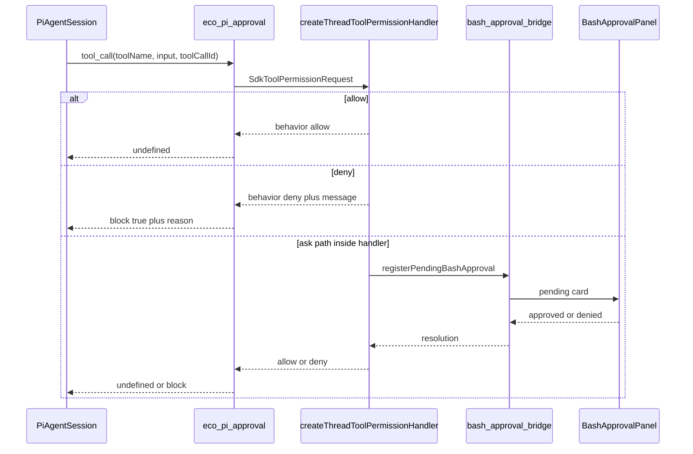

# PI Agent 工具审批设计

**Status:** accepted  
**Date:** 2026-08-14

## 背景

PI Core（`@earendil-works/pi-coding-agent`）官方不提供内置 permission popup，文档要求宿主用 extension 的 `tool_call` 自行门控。Eco 此前将 `PI_CORE_CAPABILITIES.toolApproval` 标为 `unsupported`，内置 `bash` / `read` / `write` / `edit` 与 MCP 工具在无人工确认时直接执行。现已改为 `toolApproval: "eco"`，经 `eco-pi-approval` 桥接到与 Claude 同一套确认卡。

Claude 与 Codex 已共用宿主审批产品面（`BashApprovalRequest`、`bash-approval-bridge`、`BashApprovalPanel`、`bashReviewMode`），但 Core 入口不同：Claude 由 Eco `toolPermissionHandler` + `tool-confirmation` 主动门控；Codex 由 app-server JSON-RPC 请求经 `codex-approval-bridge` 写入同一队列。

## 目标

1. PI Agent 工具执行前接入 Eco 工具审批，与 Claude/Codex 共用同一套审批卡与待审队列。
2. 决策语义对齐 Claude：Eco 先策略（allow / ask / deny），需要时再弹卡；`bashReviewMode` 的 `always` / `auto` / `allow_all` 对 PI 生效。
3. Capability 诚实标注：`toolApproval: "eco"`（非 PI native）。

## 非目标

- Plan 审批（PI 仍无 plan mode）。
- PI 原生 `ctx.ui.confirm` / RPC `extension_ui_request` 桥（与 Eco UI 重复）。
- 照搬社区 `permission-gate` 危险命令正则作为主策略。
- Ambient 社区 extension 自动发现（继续 `noExtensions: true`，仅 Eco 注入）。
- 新建第三套审批 UI。

## 社区依据

| 来源 | 结论 |
|------|------|
| PI README / security | 无内置审批；自行用 extensions 建确认流 |
| 官方 `permission-gate.ts` | `on("tool_call")` → block；`!hasUI` fail-closed |
| 官方 `protected-paths.ts` | `tool_call` 硬拒敏感路径写入 |
| OpenClaw | 执行前 hook：`block` 或 `requireApproval`，审批由宿主完成 |

Eco 以 `bindExtensions({ mode: "rpc" })` 运行且未注入 `uiContext`，社区 TUI confirm 不可用；采用 OpenClaw 同构的宿主桥接。

## 架构

### 入口形态

对齐 **Claude**：在 PI `tool_call` 中调用与 Claude 相同的 `createThreadToolPermissionHandler(threadId)`（或其可注入等价回调），将 PI 事件映射为 `SdkToolPermissionRequest`，再根据 `SdkToolPermissionDecision` 返回 PI 的 `{ block, reason }` 或放行。

不对齐 Codex JSON-RPC 入口（PI 无 app-server）。

### 落盘产品面

与 Claude/Codex **同一套**：

- `registerPendingBashApproval` / `resolveBashApproval`
- `BashApprovalPanel` + 活动流 `bash_approval.*`
- 线程 `bashReviewMode`；`auto` 走现有 `reviewThreadToolApproval`

## 拦截面

| 类别 | 工具 | 行为 |
|------|------|------|
| 内置 shell | `bash` | Eco bash / 执行确认策略 |
| 内置文件系统 | `read` / `write` / `edit`（及 handler 已识别的 filesystem 工具名） | Eco filesystem 确认策略 |
| 内置其它 | `grep` / `find` / `ls` | 默认放行，除非现有 Claude handler 已覆盖 |
| MCP / 集成 | browser open、image generation（与 Claude 同名判断） | 复用现有 browser / image handlers |
| 子代理 | 子 `AgentSession` 同样注入 extension | 同一 `threadId` 审批队列 |
| Agent 委派 | `Agent`（eco-pi-agent） | 不单独审批委派本身；子会话工具仍门控 |

## 决策映射

| Eco `SdkToolPermissionDecision` | PI `tool_call` 返回 |
|---------------------------------|---------------------|
| `{ behavior: "allow" }` | `undefined`（放行；可选就地 mutate `event.input` 若 handler 返回 `updatedInput`） |
| `{ behavior: "deny", message }` | `{ block: true, reason: message }` |
| deny + interrupt | `{ block: true, reason, terminate: true }`（仅当 Claude 路径同样 interrupt） |

策略失败或 handler 抛错：fail-closed → block（与 PI 官方「`tool_call` 错误即 block」一致）。

## 接线

1. **新模块**（建议）：`packages/runtime/src/pi-tool-approval.ts`  
   - `createEcoPiToolApprovalExtensionFactory({ onToolPermission })`  
   - 注册 `pi.on("tool_call", …)`  
   - 仅依赖回调，不依赖 Electron

2. **Driver**：[`pi-coding-agent-driver.ts`](../../../packages/runtime/src/pi-coding-agent-driver.ts)  
   - 若提供 `toolPermissionHandler`，注入名为 `eco-pi-approval` 的 extension factory

3. **Desktop**：[`pi-runtime-run.ts`](../../../apps/desktop/src/main/pi-runtime-run.ts) / 子代理 host  
   - 传入 `createThreadToolPermissionHandler(threadId)`（与 Claude 运行路径共享）

4. **Capability**：`PI_CORE_CAPABILITIES.toolApproval = "eco"`

5. **文档 / i18n**：去掉「PI 不接工具审批」表述；标明审批为 Eco 桥接、与 Claude 入口同构、与 Codex 共用 UI

## 明确缺口（实现时不得用兜底掩盖）

- **Mobile**：桌面复用 pending bash RPC 即可 theoretically 工作；若 Mobile 对 PI 线程未验证，必须在实现/测试中标为未验证缺口，不得声称全端已支持。
- **并行 tool**：PI 对同消息多 tool 顺序 preflight；审批串行等待。不改变该语义。
- **MCP 非 browser/image 工具**：首版仅覆盖 Claude handler 已覆盖的门控；其余 MCP 工具若 Claude 也不拦，PI 同样不拦。扩大范围需另开需求。

## 验证

- runtime：extension 对 allow / deny / ask→deny 的 `tool_call` 结果单测（mock handler）
- desktop：PI 线程 `bashReviewMode=always` 下 bash 弹出同一 `BashApprovalPanel`；拒绝后工具不执行且有 `bash_approval.*` 事件
- `allow_all`：不弹卡、工具执行
- 子代理 bash 审批归同一 thread 卡片
- `getCapabilities()` → `toolApproval: "eco"`
- 文档与设置文案不再写「不接工具审批」

## 自检

- 无 TBD / 双方案悬空：选定 Claude 入口 + 共用 BashApproval 产品面
- 范围单一：仅工具审批，不含 plan / PI TUI
- 与 Claude/Codex「同 UI、不同入口」事实一致
